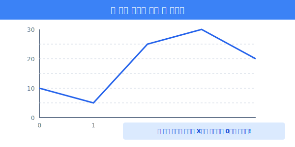
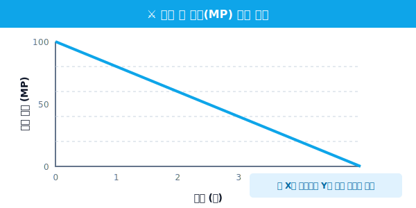
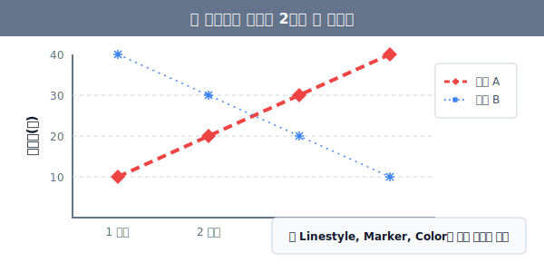

## 5.1.2 가장 기초적인 선 그래프 (Line Plot) 그리기

데이터 시각화의 첫걸음은 가장 단순하고 직관적인 **선 그래프(Line Plot)**를 그려보는 것입니다. 선 그래프는 데이터가 시간에 따라 어떻게 변하는지, 즉 **추세(Trend)**를 파악하는 데 가장 탁월한 차트입니다.

### ① 선 그래프 그리는 원리

> **[비유로 이해하기]**
> 밤하늘의 별자리를 그리는 것과 같습니다. 데이터 좌표(x, y)에 점을 콕콕 찍고, 그 점들을 순서대로 하나의 실로 쭉 이어주는 과정이 바로 선 그래프입니다.

가장 단순한 코드로 직선을 한 번 그어보겠습니다.

```python
import matplotlib.pyplot as plt

# X좌표를 따로 주지 않고 Y 좌표 리스트만 주면, 
# X좌표는 자동으로 0, 1, 2... 순서대로 부여됩니다.
plt.plot([10, 5, 25, 30, 20])

# 지금까지 도화지에 그렸던 그림들을 모니터에 출력!
plt.show()
```




**[출력 원리 해석]**
위 코드는 `(0, 10)`, `(1, 5)`, `(2, 25)`, `(3, 30)`, `(4, 20)` 지점에 보이지 않는 점을 찍고 파란색 실선으로 이어줍니다. V평수나 매출액의 증감을 보여줄 때 흔히 쓰입니다.

---

### ② X축과 Y축 짝지어 그리기 (게임 캐릭터 마나 추이)

이번에는 X축에 명확한 시간(`time`)을, Y축에 변화하는 마나(`mp`)를 넣어보겠습니다. 그리고 그래프에 제목(`title`)과 축 이름(`xlabel`, `ylabel`)표표도 달아줍니다.

```python
import matplotlib.pyplot as plt

# 한글 깨짐 방지 부적
plt.rcParams['font.family'] = 'Malgun Gothic'
plt.rcParams['axes.unicode_minus'] = False

# 1. 데이터 준비 (시간, 현재 MP)
time = [0, 1, 2, 3, 4, 5]
mp = [100, 80, 60, 40, 20, 0]

# 2. X축 시간과 Y축 마나 대응하여 선 그리기
plt.plot(time, mp)

# 3. 그래프 설명표 부착
plt.title("전투 중 마나(MP) 고갈 추이")
plt.xlabel("시간 (초)")
plt.ylabel("남은 마나 (MP)")

# 4. 그림 출력
plt.show()
```



**[출력 결과 (예상)]**
우하향하는 직선이 그려지며, 가로축에는 "시간 (초)", 세로축에는 "남은 마나 (MP)"라는 라벨이 예쁘게 달리게 됩니다. 

---

### ③ 선 그래프 꾸미기 (스타일링의 3요소)

Matplotlib 장인은 붓의 크기, 물감의 색상, 붓의 터치 방식을 모든 것을 세밀하게 조정할 수 있습니다. 


`plt.plot()` 함수에 다양한 인자를 넘겨주어 선의 모양을 바꿀 수 있습니다.

- **`color` 또는 `c`**: 선의 색상 (예: `r`=빨강, `b`=파랑, `g`=초록)
- **`marker`**: 점의 모양 (예: `o`=동그라미, `^`=세모, `s`=네모, `d`=다이아몬드, `*`=별)
- **`linestyle` 또는 `ls`**: 선의 종류 (예: `-`=실선, `--`=파선, `:`=점선, `-.`=1점쇄선)
- **`linewidth` 또는 `lw`**: 선의 두께 (숫자)

**두 개의 선을 각기 다른 스타일로 그리기:**

```python
import matplotlib.pyplot as plt

# 첫 번째 선: 빨간색(r), 굵게(lw=3), 점선(--), 다이아몬드 마커(d)
plt.plot([1, 2, 3, 4], [10, 20, 30, 40], 
         color='red', linestyle='--', marker='d', linewidth=3, label='매출 A')

# 두 번째 선: 파란색(b), 얇게(lw=0.5), 쩜쩜쩜(:), 별 모양 마커(*)
plt.plot([1, 2, 3, 4], [40, 30, 20, 10], 
         color='blue', linestyle=':', marker='*', linewidth=0.5, label='매출 B')

plt.title('스타일이 적용된 2개의 선 합치기')
plt.xlabel('분기')
plt.ylabel('매출액(억)')

# 어떤 선이 수입 A/B인지 구별해주는 '범례'를 구석에 표시합니다.
plt.legend()
plt.show()
```



> **🔥 코딩 고수의 꿀팁: 포맷 문자열 축약**
> 색상, 마커, 선종류 세 가지는 너무 자주 쓰여서 하나로 축약할 수 있습니다.
> `plt.plot(x, y, 'ro--')` 라고만 적으면 파이썬이 알아서 **r(빨간색) + o(동그라미 마커) + --(파선)** 으로 해석해서 그려줍니다!

선 그래프 외에 점만 흩뿌리는 **산점도**, 기둥을 세우는 **막대그래프** 등은 Round 2에서 Seaborn과 함께 다루겠습니다. 다음 장에서는 이런 수많은 그래프들을 한 화면에 바둑판처럼 예쁘게 배치하는 **Figure와 Subplot(서브플롯) 분할 기법**을 배웁니다.