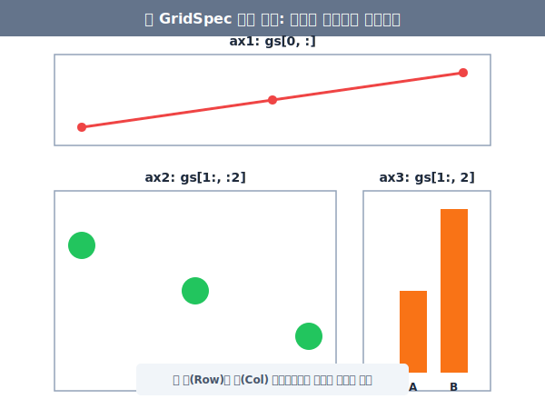
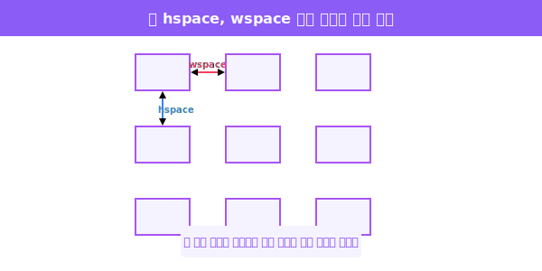
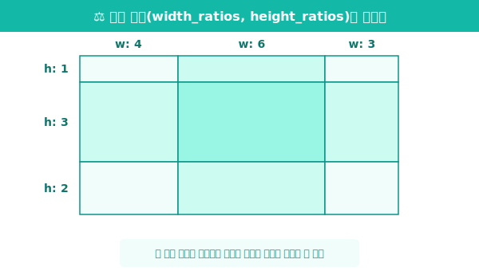

## 5.1.4 GridSpec을 사용한 비대칭(테트리스) 레이아웃

앞서 배운 `plt.subplots(2, 2)`는 화면을 2행 2열로 아주 바를 정(正)자로 공평하게 쪼갭니다.
하지만 현실의 데이터 분석 보고서 대시보드를 생각해보면, **"위쪽에는 전체 가로를 관통하는 커다란 메인 요약 차트를 두고, 아래쪽에는 조그맣게 3개의 세부 차트를 배치하고 싶다"** 와 같은 비대칭적인 요구사항이 빈번히 발생합니다.

이때 구원투수로 등장하는 것이 바로 **`GridSpec` (그리드 스펙)** 입니다.


### ① GridSpec 기본 사용법 (슬라이싱 병합)

> **[비유로 이해하기]**
> 모눈종이에 격자를 그어둔 뒤, 파이썬의 핵심 문법인 **리스트 슬라이싱(`:`)**을 사용해 "1행의 1~3열 칸의 벽을 터서 하나로 합쳐주세요!" 라고 컴퓨터에게 명령하는 것과 똑같습니다.

```python
import matplotlib.pyplot as plt
from matplotlib.gridspec import GridSpec

# 전체 도화지 준비
fig = plt.figure(figsize=(8, 6))

# 1. 3행 3열짜리 모눈종이(GridSpec)를 하나 도화지 위해 투명하게 선언합니다.
gs = GridSpec(3, 3)

# 2. 첫째 행(row=0), 모든 열(col=:)을 차지하는 거대한 서브플롯 추가
ax1 = fig.add_subplot(gs[0, :])
ax1.set_title("ax1: gs[0, :]")
ax1.plot([1, 2, 3], [10, 20, 30], color='red')

# 3. 2~3행(row=1:), 1~2열(col=:2)을 차지하는 정사각형 서브플롯 추가
ax2 = fig.add_subplot(gs[1:, :2])
ax2.set_title("ax2: gs[1:, :2]")
ax2.scatter([1, 2, 3], [3, 2, 1], color='green', s='100')

# 4. 2~3행(row=1:), 마지막 열(col=2)을 차지하는 세로로 긴 서브플롯 추가
ax3 = fig.add_subplot(gs[1:, 2])
ax3.set_title("ax3: gs[1:, 2]")
ax3.bar(['A', 'B'], [5, 10], color='orange')

# 레이아웃 정리 및 출력
plt.tight_layout()
plt.show()
```



이 코드를 실행하면 위의 그림과 정확히 일치하는, **위쪽에 널찍한 선 그래프, 좌하단에 커다란 산점도, 우하단에 좁은 막대그래프**가 완벽하게 맞물려 들어가는 대시보드 구조가 완성됩니다.


---

### ② 칸 사이의 여백 조절하기 (hspace, wspace)

테트리스 블록들(서브플롯들)이 너무 다닥다닥 붙어 있어서 보기 싫다면, 모눈종이 자체를 정의할 때 `hspace` (위아래 빈칸 여백)와 `wspace` (좌우 빈칸 여백) 인자를 주면 됩니다.

```python
# 블록 상하 간격을 0.5비율로 넓히고, 좌우 간격은 0.3으로 띄웁니다.
gs = GridSpec(3, 3, hspace=0.5, wspace=0.3)
```




---

### ③ 칸들의 폭/높이 비율을 임의로 다르게 주기 (width_ratios)

슬라이싱으로 여러 칸을 합치는 방법도 있지만, 애초에 모눈종이를 그릴 때부터 "가로 3칸을 쪼개는데 그 넓이 비율을 4 : 6 : 3 비율로 쪼개라!" 라고 불균형하게 나눠버릴 수도 있습니다.

```python
# 가로 비율을 4:6:3, 세로 비율을 1:3:2 로 쪼개는 GridSpec
widths = [4, 6, 3]
heights = [1, 3, 2]

gs = GridSpec(3, 3, width_ratios=widths, height_ratios=heights)

# 이렇게 하면 gs[0, 0] 하나만 차지하더라도 면적이 들쭉날쭉해집니다!
```




> **🔥 코딩 고수의 꿀팁: 서브플롯 안의 서브플롯 (Nested Gridspec)**
> 실전에서는 `GridSpec` 안의 특정 블록을 지목해서 다시 그 안을 쪼개는 `subgridspec(2, 3)` (현미경으로 확대해서 다시 세포 분열하기) 기법도 존재합니다. 이처럼 Matplotlib을 잘 다루게 되면, 아무리 복잡하게 생긴 논문용 차트나 주식 화면 대시보드라도 똑같이 구현해낼 수 있습니다!

다음 장에서는 이렇게 정교하게 배치된 그래프들의 색온도나 스타일(눈금, 글꼴)들을 일괄적으로 고급스럽게 바꾸어주는 **Styling 방법론**에 대해 학습합니다.