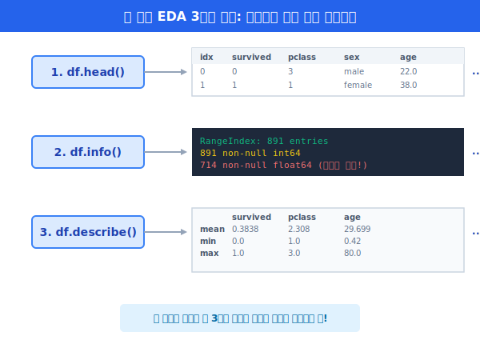

# 5.2.2 초기 데이터 탐색 (EDA: Exploratory Data Analysis)

> 💾 **[실습 파일 다운로드]**
> 본 강의의 전체 실습 코드를 직접 실행해 볼 수 있는 주피터 노트북 파일입니다. 아래 링크를 클릭하여 다운로드 후 VS Code에서 열어보세요.
> - [📥 eda_practice.ipynb 파일 다운로드](./eda_practice.ipynb) (클릭 또는 마우스 우클릭 후 '다른 이름으로 링크 저장')

## 타이타닉 데이터셋이란?
가장 유명한 해난 사고인 `titanic`(타이타닉) 데이터셋을 메모리로 불러오겠습니다. 데이터를 처음 받으면 **절대로 무작정 그래프부터 그리지 않습니다.** 데이터가 어떻게 생겼는지 파악하는 탐색(EDA) 과정이 선행되어야 합니다.


## 실습 파일 로딩
```python
import seaborn as sns

# 타이타닉 데이터를 표(DataFrame) 형태로 불러옵니다.
df = sns.load_dataset('titanic')
```

## [실습 1] 1단계: `df.head()` - 서류 봉투 살짝 열어보기
수백만 줄의 데이터를 한 번에 화면에 띄우면 컴퓨터가 멈춰버립니다. 

`.head()`는 상위 5개의 줄만 살짝 뽑아서 이 표가 어떤 컬럼(속성)들로 이루어져 있는지 파악하는 첫 번째 관문입니다.

```python
print(df.head())
```
**[출력 확인: 표의 형태 파악]**
```text
   survived  pclass     sex   age  sibsp  parch     fare embarked  class  \
0         0       3    male  22.0      1      0   7.2500        S  Third   
1         1       1  female  38.0      1      0  71.2833        C  First   
2         1       3  female  26.0      0      0   7.9250        S  Third   
```
- `survived`: 생존 여부 (0: 사망, 1: 생존)
- `pclass`: 객실 등급 (1등급, 2등급, 3등급)
- `sex`, `age`: 성별, 나이

## [실습 2] 2단계: `df.info()` - 엑스레이 (결측치 검사)
표의 껍데기를 보았다면, 이번엔 엑스레이를 찍어 뼈에 금이 간 곳(결측치)이 없는지, 데이터 종류가 문자인지 숫자인지를 확인해야 합니다.

```python
df.info()
```
**[출력 확인: 결측치와 타입]**
```text
<class 'pandas.core.frame.DataFrame'>
RangeIndex: 891 entries, 0 to 890
Data columns (total 15 columns):
 #   Column       Non-Null Count  Dtype   
---  ------       --------------  -----   
 0   survived     891 non-null    int64   
 1   pclass       891 non-null    int64   
...
 3   age          714 non-null    float64 
```
> **💡 탐정의 단서**: 총 탑승객(RangeIndex)이 891명인데, `age`(나이) 컬럼은 `714 non-null`이라고 나옵니다. 즉, 177명의 나이 데이터가 누락(결측치, NaN)되었다는 뼈아픈 진실을 그래프를 그리기 전에 미리 알 수 있습니다!

## [실습 3] 3단계: `df.describe()` - 숫자의 통계적 요약
나이표나 요금 등 숫자로 된 데이터의 평균, 최소, 최댓값, 하위/상위 분포를 한눈에 수치 요약해주는 함수입니다.

```python
print(df.describe())
```
**[출력 확인: 요약 통계량]**



```text
         survived      pclass         age        fare
count  891.000000  891.000000  714.000000  891.000000
mean     0.383838    2.308642   29.699118   32.204208
min      0.000000    1.000000    0.420000    0.000000
50%      0.000000    3.000000   28.000000   14.454200
max      1.000000    3.000000   80.000000  512.329200
```
> **💡 탐정의 단서**: `survived`의 평균(mean)이 `0.38`이라는 뜻은 전체 탑승객의 약 38%만 구조되었다는 슬픈 사실을 나타냅니다. 나이의 최댓값(max)은 80세, 최솟값은 0.42(신생아)라는 것도 단 한 줄의 명령어로 알아냈습니다.