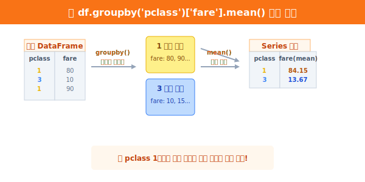

# 5.2.3 시각화를 결정짓는 2가지 데이터

> 💾 **[실습 파일 다운로드]**
> 본 강의의 전체 실습 코드를 직접 실행해 볼 수 있는 주피터 노트북 파일입니다. 아래 링크를 클릭하여 다운로드 후 VS Code에서 열어보세요.
> - [📥 variable_practice.ipynb 파일 다운로드](./variable_practice.ipynb) (클릭 또는 마우스 우클릭 후 '다른 이름으로 링크 저장')

데이터 탐색(EDA)을 마쳤다면, 수많은 데이터 컬럼(열)들을 보고 머릿속으로 두 가지 부류로 데이터를 나눌 줄 알아야 합니다. 

## 변수 타입
이 두 가지를 구분하지 못하면, **"어떤 그래프를 그려야 할지"** 를 전혀 결정할 수 없게 됩니다.


## 범주형 변수 (Categorical Variable)

> **특징**: "평균을 내는 것이 의미가 없고, 종류별로 `몇 개`인지 **빈도수(Count)**를 셉니다."

범주형 변수는 사물이나 사람의 상태, 그룹, 종류를 나누는 **명찰**과 같습니다.
- **문자열 형태**: 성별(`sex`), 탑승 항구(`embarked`), 혈액형(A/B/O/AB), 과일 종류(사과/배/포도)
- **숫자 형태(코드)**: 생존 여부(`survived`의 0과 1), 좌석 등급(`pclass`의 1, 2, 3) 
    *(1등급과 2등급의 평균을 내서 1.5등급을 만드는 것은 의미가 없습니다)*

### [실습 1] 판다스로 범주형 변수 탐색하기 (`value_counts()`)
그래프를 그리기 전, 판다스에서 `value_counts()` 함수를 쓰면 `그룹별` 인원수를 셀 수 있습니다.

```python
import seaborn as sns
df = sns.load_dataset('titanic')

# 승객들의 남/녀 비율 빈도수를 세어봅니다.
print(df['sex'].value_counts())
```

**[출력 확인]**
```text
male      577
female    314
Name: sex, dtype: int64
```
- 타이타닉 호에는 남성이 577명, 여성이 314명 탑승했습니다. (이 데이터는 나중에 **막대그래프**나 **파이 차트**로 그리기 딱 좋습니다)

---

## 수치형 변수 (Numerical Variable)

> **특징**: "더하고, 빼고, **평균**을 내는 것이 아주 중요합니다."

수치형 변수는 실제로 자로 재거나 측정할 수 있는 연속된 진짜 **숫자**들입니다.
- 나이(`age`), 탑승 요금(`fare`), 온도, 키, 몸무게 등

### [실습 2] 판다스로 수치형 변수 탐색하기 (평균과 분포)
앞서 배운 `describe()` 같은 요약 함수나, 조건부 평균 계산 기능이 아주 유용하게 쓰입니다.

```python
# 전체 승객 탑승 요금(fare)의 평균 가격
print("전체 평균 요금:", df['fare'].mean())

# 각 객실 등급별(pclass) 탑승 요금(fare)의 평균 가격 비교!
print(df.groupby('pclass')['fare'].mean())
```

**[출력 확인]**



```text
전체 평균 요금: 32.204

pclass
1    84.154687  (1등급은 매우 비쌈!)
2    20.662183
3    13.675550
Name: fare, dtype: float64
```

이와 같이 **[범주형 변수 + 범주형 변수]**, **[수치형 변수 + 범주형 변수]**, **[수치형 변수 + 수치형 변수]** 조합을 어떻게 사용하느냐에 따라 우리가 앞으로 그릴 `Seaborn` 마법사의 그래프 마법 주문(함수)이 완전히 달라지게 됩니다. 

다음 장에서는 본격적으로 Seaborn 안에서 가장 기본적인 통계 그래프인 **히스토그램(Histogram)**과 빈도수 차트를 하나 연습삼아 맛보겠습니다.