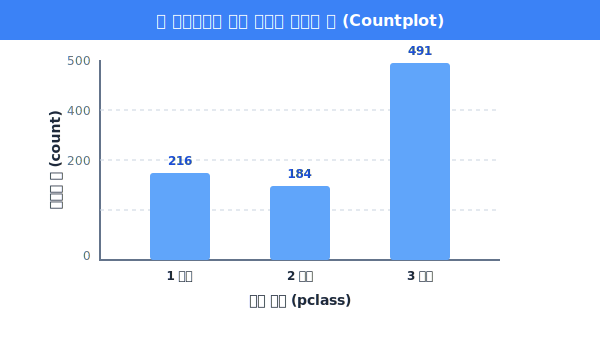
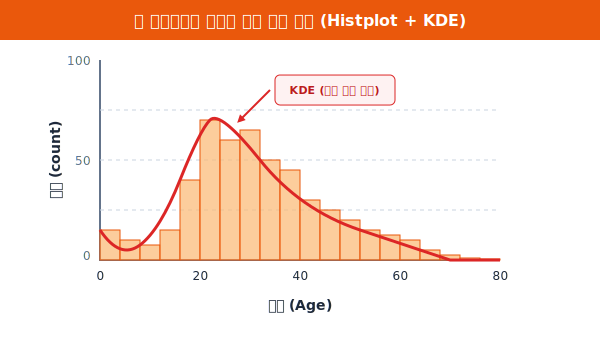

# 5.2.4 Seaborn 첫 그래프 기초

> 💾 **[실습 파일 다운로드]**
> 본 강의의 전체 실습 코드를 직접 실행해 볼 수 있는 주피터 노트북 파일입니다. 아래 링크를 클릭하여 다운로드 후 VS Code에서 열어보세요.
> - [📥 seaborn_graph_practice.ipynb 파일 다운로드](./seaborn_graph_practice.ipynb) (클릭 또는 마우스 우클릭 후 '다른 이름으로 링크 저장')

변수의 타입을 완벽하게 이해했다면, 본격적으로 Seaborn 마법사에게 그래프를 주문할 차례입니다. 

## 빈도와 분포
초보자들이 가장 많이 헷갈리는 두 가지 그래프인 **Countplot(카운트플롯)**과 **Histplot(히스토그램)**을 타이타닉 데이터에 적용해 보겠습니다.


---

## [실습 1] 범주형 데이터 전용: `sns.countplot()`

> **용도**: "1등급, 2등급, 3등급칸에 탄 사람이 각각 **몇 명**이야?"

`countplot`은 막대그래프의 일종으로, 지정한 **범주형(글자, 등급, 종류)** 변수 안에 들어있는 생존여부, 좌석 등급 같은 데이터들의 빈도수(Count)를 막대의 높이로 표현해 줍니다. 

```python
import seaborn as sns
import matplotlib.pyplot as plt

df = sns.load_dataset('titanic')

# 도화지 크기 설정 (안 해도 되지만, 예쁘게 보기 위해 추가)
plt.figure(figsize=(6, 4))

# Seaborn 마법 지팡이 휘두르기: "데이터 df의 'pclass(객실 등급)' 열을 카운트해서 막대로 그려라!"
sns.countplot(data=df, x='pclass')

plt.title("타이타닉호 객실 등급별 탑승객 수")
plt.show()
```



**[출력 원리 해석]**
코드 한 줄만 실행하면, `value_counts()`로 일일이 세어볼 필요 없이 1등급, 2등급, 3등급 자리에 솟아오른 세 개의 막대가 화면에 예쁘게 그려집니다.

---

## [실습 2] 수치형 데이터 전용: `sns.histplot()`

> **용도**: "탑승객들의 **나이 분포**가 대충 어떻게 되는데? 20대가 많아, 60대가 많아?"

`histplot`은 히스토그램으로, **연속된 숫자(수치형)** 데이터를 일정한 구간(Bin)으로 잘게 쪼갠 뒤, 해당 구간에 속하는 데이터의 개수를 다닥다닥 붙어있는 막대로 그려줍니다. 산의 지형도처럼 데이터가 어디에 **몰려 있는지(분포)**를 보여줍니다.

```python
plt.figure(figsize=(6, 4))

# Seaborn 마법 지팡이 휘두르기: "데이터 df의 'age(나이)' 열 분포도를 부드러운 곡선(kde=True)과 함께 그려라!"
sns.histplot(data=df, x='age', kde=True, bins=20)

plt.title("타이타닉호 탑승객 연령 분포")
plt.show()
```



**[출력 원리 해석]**
`bins=20` 옵션은 태어난 지 0살부터 80세 노인까지의 데이터 범위를 20개 구간으로 등분하라는 뜻입니다. `kde=True` 옵션을 켜면 막대들의 꼭대기를 감싸고 흐르는 멋진 빨간색 등고선(KDE 밀도 추정 곡선)이 막대그래프 위에 부드럽게 얹혀서 그려집니다.

---

## 🚨 결론: 초보자 절대 주의사항!

- `sns.histplot(x='pclass')` (X) : 좌석 등급은 숫자로 적혀 있지만 의미상 범주형이므로 막대가 이상하게 그려집니다. `countplot`을 쓰세요!
- `sns.countplot(x='age')` (X) : 나이는 12.5세, 13세 등 끝없이 다양하므로 카운트플롯을 그리면 바늘처럼 수백 개의 얇은 막대가 그려져 컴퓨터가 버벅거립니다. `histplot`을 쓰세요!

이 감각만 익히면 여러분도 이제 본격적인 데이터 분석가입니다! 5.3장부터는 드디어 두 가지 이상의 데이터 열(X축, Y축)을 동시에 비교하는 **산점도(Scatter Plot), 선 그래프(Line Plot), 막대 그래프(Bar Plot)**의 마법을 배웁니다.