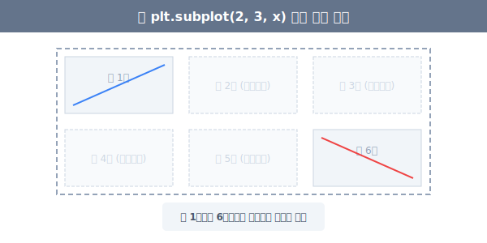
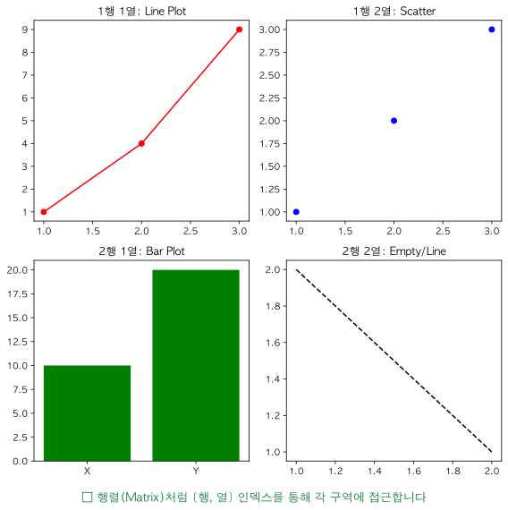

# 5.3.1 도화지(Figure)와 액자(Ax) 구조 완벽 해부

데이터 시각화를 하다 보면 한 화면에 산점도, 선 그래프, 막대그래프를 동시에 여러 개 띄워놓고 비교하고 싶을 때가 있습니다. 이를 위해 Matplotlib이 그래프를 그리는 **공간 구조(Hierarchy)**를 완벽하게 이해해야 합니다.

> 💾 **[실습 파일 다운로드]**
> 본 강의의 레이아웃 분할 실습 코드를 직접 실행해 볼 수 있는 주피터 노트북 파일입니다. 
> - [📥 figure_subplot_practice.ipynb 파일 다운로드](./figure_subplot_practice.ipynb) (클릭 또는 마우스 우클릭 후 '다른 이름으로 링크 저장')

## Figure, Axes, Axis의 계층 구조

> **[미술학원 비유로 이해하기]**
> - **`Figure` (피규어)**: 이젤 위에 올려놓은 거대한 하나의 **'전체 캔버스(종이)'** 입니다.
> - **`Axes` (액시즈/서브플롯)**: 캔버스 안에 펜으로 그린 사각형 **'스케치북(구역)'** 하나하나를 말합니다. 그래프 4개를 그렸다면 Axes 객체도 4개가 됩니다.
> - **`Axis` (액시스)**: 각 스케치북 구역 안에 십자선으로 긋는 **'X축, Y축 눈금선'** 입니다.

아래 구조도는 이 세 가지 필수 객체가 어떻게 포함 관계를 가지는지 명확히 보여줍니다.


---

## 격자(Grid) 구조로 서브플롯 분할하기

캔버스(`Figure`) 영역을 2행 2열처럼 쪼개어 각각의 구역(`Axes`)에 다른 그래프를 그리는 기법을 **서브플롯(Subplot)**이라고 합니다. 

과거의 방식과 최근 실무 방식의 두 가지가 존재합니다.


## [실습 1] 방식 1: `plt.subplot` (절차적, 과거 방식)
`plt.subplot(행, 열, 칸번호)` 를 호출하여 "지금부터 n번째 방에 들어간다~" 라고 선언한 뒤 그래프를 그립니다.

```python
import matplotlib.pyplot as plt

# 가로 9인치, 세로 4인치의 거대한 캔버스(Figure) 준비
plt.figure(figsize=(9, 4))

plt.subplot(2, 3, 1) # 2행 3열의 1번 방에 진입
plt.plot([1, 2], [1, 2])     # 1번 방에 선 그리기

plt.subplot(2, 3, 6) # 갑자기 2행 3열의 6번 방으로 이동
plt.plot([1, 2], [2, 1])     # 6번 방에 선 그리기

plt.show()  # 2, 3, 4, 5번 방은 텅 빈 채로 출력됩니다.
```

**[코드 설명]**
- `plt.figure(figsize=(9, 4))`로 전체 도화지 크기를 설정합니다.
- `plt.subplot(2, 3, 1)`을 통해 2행 3열의 격자 중 첫 번째 칸을 활성화합니다.
- 바로 이어서 그리는 `plt.plot()`은 활성화된 첫 번째 칸에만 그려집니다.




## [실습 2] 방식 2: `plt.subplots` (객체지향, 현대 실무 표준 ★)
**가장 추천하는 방식**입니다. 캔버스(`fig`)와 모눈종이 구역 리스트(`axes`)를 한 번에 생성하여 배열 `[행, 열]` 인덱스로 깔끔하게 접근합니다.

```python
import matplotlib.pyplot as plt

# fig는 전체 캔버스, ax는 2x2 크기의 Axes 배열(리스트)입니다.
fig, ax = plt.subplots(2, 2, figsize=(8, 8)) 

# 원하는 모눈종이 칸(ax[행, 열])을 정밀하게 지정해서 그립니다.
ax[0, 0].plot([1, 2, 3], [1, 4, 9], 'ro-')
ax[0, 0].set_title("1행 1열: Line Plot")

ax[0, 1].scatter([1, 2, 3], [1, 2, 3], color='blue')
ax[0, 1].set_title("1행 2열: Scatter")

ax[1, 0].bar(['X', 'Y'], [10, 20], color='green')
ax[1, 0].set_title("2행 1열: Bar Plot")

ax[1, 1].plot([1, 2], [2, 1], 'k--')
ax[1, 1].set_title("2행 2열: Empty/Line")

# [핵심 꿀팁] 서브플롯 간에 텍스트가 겹치지 않게 자동으로 간격을 넓혀줍니다!
plt.tight_layout() 
plt.show()
```

**[코드 설명]**
- `fig, ax = plt.subplots(2, 2)`: 전체 도화지(`fig`)와 2x2 형태의 각 칸 객체 배열(`ax`)을 한 번에 생성합니다.
- `ax[0, 0].plot(...)`: 배열의 인덱스를 통해 특정 칸에 직접 접근하여 그래프를 그립니다.
- `plt.tight_layout()`: 각 칸의 그래프와 글자가 겹치지 않도록 여백을 자동으로 조정합니다.




> **🔥 코딩 고수의 꿀팁: `tight_layout()`**
> 서브플롯을 여러 개 만들다 보면 그래프끼리 따닥따닥 붙어서 서로의 숫자와 제목(Title)이 겹쳐 거미줄처럼 보일 때가 많습니다. 출력 직전 마지막 줄에 `plt.tight_layout()` 한 줄만 호출해주면 AI가 알아서 보기 좋게 여백을 띄워줍니다!

이어지는 다음 장에서는 모눈종이를 2x2처럼 규칙적인 격자뿐만 아니라, **"위쪽 방은 작게, 아래쪽 방은 엄청 크게"** 내 마음대로 테트리스처럼 쪼갤 수 있는 고급 레이아웃 `GridSpec`에 대해 알아봅니다.