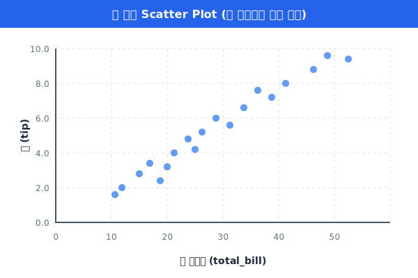
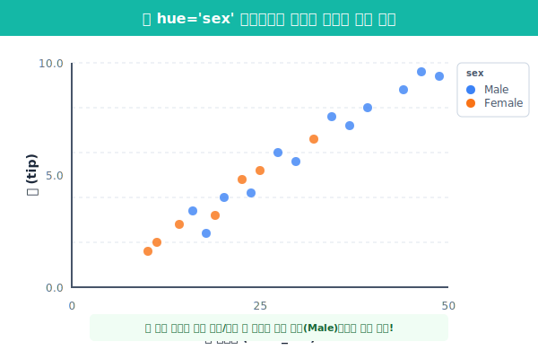
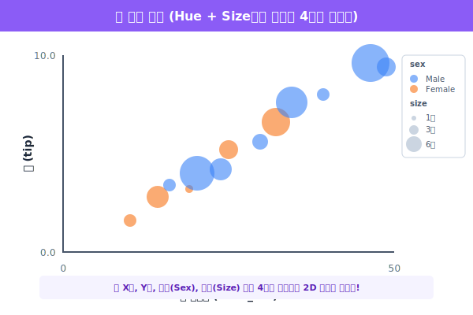

## 5.3.1 산점도 (Scatter Plot)와 고차원 매핑

### ① 산점도의 존재 이유 (두 수치형 데이터의 관계)

> **용도**: "내가 식당에서 밥을 **많이** 먹으면(총 청구액), 웨이터에게 주는 **팁(Tip)**도 그만큼 **많아질까?**"

이런 단순한 궁금증을 해결하려고 할 때, 두 개의 **수치형(연속된 숫자)** 변수 간의 **상관관계(Correlation)**를 시각적으로 확인하기 위해 허공(좌표 평면)에 점을 콕콕 찍어서 그리는 그래프가 바로 산점도입니다.

- 점들이 우상향(↗)으로 퍼져 있다면 = **양(+)의 상관관계** (밥을 많이 먹을수록 팁도 많이 준다!)
- 점들이 우하향(↘)으로 퍼져 있다면 = **음(-)의 상관관계** 
- 점들이 마구잡이로 흩어져 있다면 = **무상관** (관계가 전혀 없다)

### ② Seaborn의 `scatterplot` 기본 그리기

식당 팁 데이터를 불러와서, `total_bill`(총 청구 요금)과 `tip`(팁) 사이의 관계를 점으로 찍어보겠습니다.

```python
import seaborn as sns
import matplotlib.pyplot as plt

# 팁(tips) 데이터셋 소환!
tips = sns.load_dataset('tips')

plt.figure(figsize=(6, 4))
sns.set_theme(style="darkgrid") # 그래프 배경을 세련된 회색 모눈종이로 변경

# X축에는 청구 요금, Y축에는 팁을 지정하여 점 찍기
sns.scatterplot(data=tips, x='total_bill', y='tip')

plt.title("총 청구액과 팁의 관계")
plt.show()
```



**[출력 원리 해석]**
실행해 보면 점들이 전체적으로 ↗ 방향으로 형성되어 "아, 요금이 높을수록 팁도 많이 주는 경향이 있구나!"라는 것을 알 수 있습니다. 하지만 이 그림은 온통 **한 가지 색깔의 파란 점**들뿐입니다.

---

### ③ `hue`: Seaborn 최고의 마법 (3차원 정보 파악)

기존 파이썬 Matplotlib으로 남성과 여성의 점 색깔을 다르게 칠하려면, 남성 데이터와 여성 데이터를 따로 분리(필터링)해서 `plt.scatter()`를 두 번 호출하고 막대한 코딩을 해야 했습니다.

하지만 Seaborn에서는 **`hue` (색조)** 라는 마법의 파라미터 하나로 이 고통이 단번에 끝납니다!


`hue`에 방금 전 5.2.3장에서 배웠던 **범주형 데이터(남자/여자, 흡연/비흡연, 요일 등)** 열 이름을 적어주면 끝납니다.

```python
plt.figure(figsize=(7, 5))

# hue='sex' 단 하나를 추가했습니다!
sns.scatterplot(data=tips, x='total_bill', y='tip', hue='sex')

plt.title("총 청구액과 팁 (성별 구분)")
plt.show()
```



**[출력 원리 해석]**
마법처럼 그래프가 그려집니다! 남성은 파란색 점, 여성은 주황색 점으로 찍히며, 우측 상단에 자동으로 **친절한 범례(Legend)**까지 만들어집니다. 우리는 평면 2D 화면에 X(요금), Y(팁), 색깔(성별)이라는 **3차원 정보**를 눈앞에 펼친 것입니다.

> **💡 데이터 탐정의 시선**
> 색깔을 칠하고 보니, 아주 극단적으로 "엄청나게 많은 요금을 내고 팁을 10달러씩 날리는 호탕한 부자 손님들" 공간(그래프 가장 우측 상단)에 찍힌 점들은 거의 대다수가 **파란 점(남성)**이라는 숨겨진 진실을 발견할 수 있습니다!

---

### ④ 더 나아가기: 점의 크기(`size`)와 버블 차트

점의 색상을 바꿀 수 있다면, 점의 **크기**도 바꿀 수 있지 않을까요? `size` 매개변수에 데이터 열을 주면, 그 값의 크기에 비례하여 점의 크기 자체가 풍선(버블)처럼 커집니다.

```python
# size='size' : 식사에 참여한 총 인원수(1명~6명)에 비례해서 점의 굵기를 다르게!
# sizes=(20, 200) : 점 크기를 최소 20픽셀에서 최대 200픽셀 사이로 스케일링!
sns.scatterplot(data=tips, x='total_bill', y='tip', hue='sex', size='size', sizes=(20, 200), alpha=0.6)
```



이처럼 산점도 하나만으로도 `x`, `y`, `hue`, `size`를 총동원하여 **무려 4가지 속성의 데이터를 2D 도화지 한 장에 압축해서 폭격**하는 것이 데이터 시각화의 진정한 묘미입니다! 다음 장에서는 시간의 흐름을 보여주는 **선 그래프(Line Plot)**를 배웁니다.