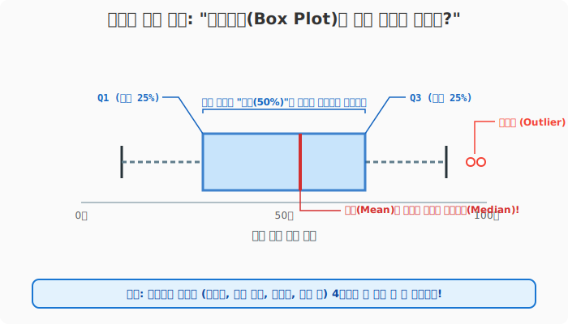
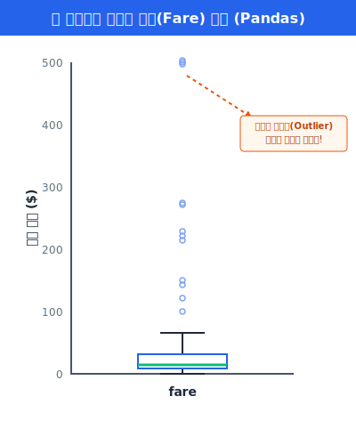
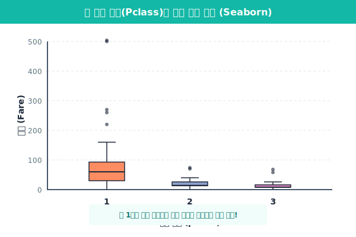

# 5.4.1 상자그림 (Box Plot) 완벽 해부

> 💾 **[실습 파일 다운로드]**
> 본 강의의 전체 실습 코드를 직접 실행해 볼 수 있는 주피터 노트북 파일입니다. 아래 링크를 클릭하여 다운로드 후 VS Code에서 열어보세요.
> - [📥 box_plot_practice.ipynb 파일 다운로드](./box_plot_practice.ipynb) (클릭 또는 마우스 우클릭 후 '다른 이름으로 링크 저장')

기본 통계 차트를 모두 익혔다면, 이제 데이터 분석의 중급 과정인 "분포 구조(데이터가 어떻게 퍼져있는가)"를 파악할 차례입니다. 그중에서도 **상자그림(Box Plot)**은 실무 데이터 전처리 과정에서 가장 먼저, 가장 많이 사용되는 핵심 스캐너입니다.

## 상자그림 대체 어떻게 읽나요? (구조 해부)

초보자들이 모양만 보고 가장 당황하는 그래프가 바로 상자그림입니다. 상자그림은 막대그래프처럼 단순 평균을 보는 것이 아니라, 데이터를 크기 순서대로 1등부터 꼴등까지 줄을 세운 뒤 상위권/중위권/하위권으로 잘라보는 그래프입니다.



> **[실전 꿀팁]: 4개의 가위질 (사분위수)**
> - 수많은 사람의 시험 점수가 있을 때, 이를 딱 4등분 합니다.
> - **Q1 (하위 25%)**: 못 본 학생들의 기준
> - **Q2 (중앙값)**: 딱 정가운데(50등) 학생의 점수 (주의: 전체 평균과 다릅니다!)
> - **Q3 (상위 25%)**: 잘 본 학생들의 기준
> - 상자(Box)의 크기 자체가 Q1부터 Q3까지의 거리이므로, 상자가 넓을수록 학생들 점수 차이가 크다는 뜻입니다.

---

## [실습 1] 판다스(Pandas) 기초 상자그림 그리기

타이타닉 승객 요금(`fare`)으로 상자그림을 한번 그려 결측치나 이상한 값이 없는지 확인해 봅시다.

```python
import seaborn as sns
import matplotlib.pyplot as plt

df = sns.load_dataset('titanic')

# Pandas 내장 함수를 사용해 간단하게 X레이를 찍어볼 수 있습니다.
df['fare'].plot.box(figsize=(5, 5))
plt.title("타이타닉 탑승객 요금(Fare) 분포")
plt.show()
```



**[출력 원리 해석]**
위 코드를 실행하면 아래쪽 바닥(0달러 근처)에 납작하게 상자가 붙어있고, **수백 개의 동그란 점들(o) 기둥**이 저 멀리 500달러 하늘 위까지 뻗어있는 이상한 그림을 보게 됩니다.

---

## 이상값(Outlier) 사냥꾼, Boxplot!

바로 저 수염 바깥으로 벗어난 수많은 동그라미 점들이 **이상치(Outlier)**입니다. 대부분 승객은 50달러 미만을 냈는데(박스 위치), 소수의 초부유층 귀족들만 500달러라는 천문학적인 요금을 지불하고 가장 좋은 1등석 특실을 샀음을 상자그림 단 하나로 "사냥해" 낼 수 있습니다. 이 점들은 나중에 통계 모델을 만들 때 모델을 고장 내는 주범이 되므로 제거하거나 수정하게 됩니다.

---

## [실습 2] Seaborn으로 다채로운 그룹 비교하기

Seaborn의 놀라운 힘을 다시 사용할 시간입니다! 객실 **등급별(범주형 데이터)**로 요금 분포 차이가 어떻게 다른지 `x`와 `y`만 던져주면 알아서 3방향의 상자그림을 나란히 그려줍니다.

```python
plt.figure(figsize=(8, 5))

# x: 등급별로 그룹을 쪼갠다, y: 분포를 볼 요금 데이터
sns.boxplot(data=df, x='pclass', y='fare', hue='pclass', palette='Set2')

plt.title("객실 등급에 따른 요금 상자그림")
plt.show()
```



**[출력 원리 해석]**
- **1등급**: 박스 크기가 위아래로 어마어마하게 넓습니다. (같은 1등급 안에서도 가성비 티켓과 VVIP 티켓 가격 차이가 수십 배 난다는 뜻입니다.)
- **3등급**: 박스가 바닥에 찰싹 달라붙어 있습니다. (가난한 서민들은 요금 차이랄 것 없이 모두 저렴한 동일 요금을 냈습니다.)

이처럼 상자그림 하나면 (중앙값, 상/하위 기준선, 데이터의 퍼진 정도, 이상값) 4가지를 한 방에 알 수 있습니다. 다음 장에서는 이런 상자그림과 찰떡궁합인 막대 모양 분포도, **히스토그램의 심화 과정**을 배웁니다.