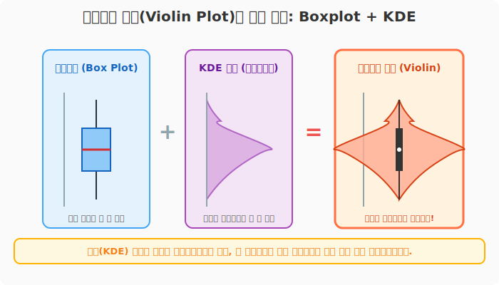
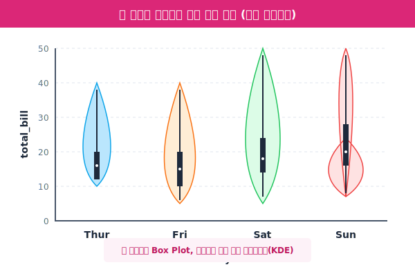
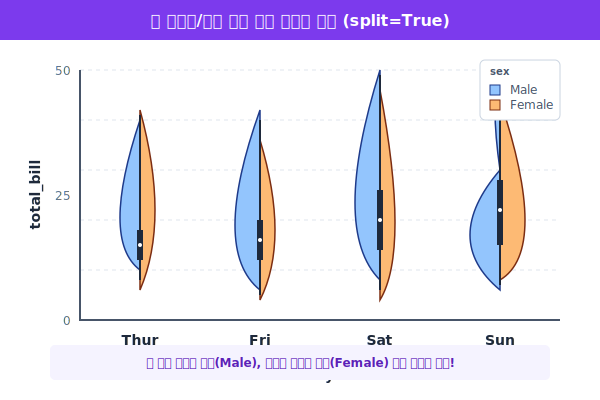

# 5.4.2 바이올린 플롯 (Violin Plot)과 데이터 대칭해부

> 💾 **[실습 파일 다운로드]**
> 본 강의의 전체 실습 코드를 직접 실행해 볼 수 있는 주피터 노트북 파일입니다. 아래 링크를 클릭하여 다운로드 후 VS Code에서 열어보세요.
> - [📥 violin_plot_practice.ipynb 파일 다운로드](./violin_plot_practice.ipynb) (클릭 또는 마우스 우클릭 후 '다른 이름으로 링크 저장')

상자그림(Box Plot)과 히스토그램(KDE 곡선)의 장점만을 뽑아 하나로 합친 **궁극의 분포 차트**가 바로 바이올린 플롯입니다. 그래픽 형태가 마치 현악기인 바이올린을 꼭 닮았다고 하여 붙여진 이름입니다.

## 바이올린 플롯의 탄생 비밀

> **용도**: "상자그림은 요약만 해주니까 진짜 데이터가 어떻게 우글거리는지(밀도) 안 보여. 히스토그램이랑 합쳐서 한 번에 볼 수 없을까?"



바이올린 플롯의 한가운데를 자세히 보면 까만색 얇은 선과 점이 있습니다. 이것이 5.4.1장에서 배운 **미니 상자그림(Box Plot)**입니다. 하얀 점이 중앙값(Median)을 의미합니다. 

그리고 그 뼈대를 중심으로 양옆으로 거대하게 뻗어나온 호리병 모양의 굴곡이 바로 5.4.2장에서 배운 **히스토그램의 KDE 곡선**입니다. 데이터가 뚱뚱하게 뭉쳐있는 곳일수록 바이올린의 허리 통이 두꺼워집니다.

---

## [실습 1] Seaborn으로 바이올린 연주하기

`tips` 데이터를 불러와서, 요일(`day`)마다 손님들이 요금(`total_bill`)을 얼마나 내고 가는지 분포를 비교해 보겠습니다.

```python
import seaborn as sns
import matplotlib.pyplot as plt

tips = sns.load_dataset('tips')

plt.figure(figsize=(8, 5))

# x: 비교할 그룹(요일), y: 분포를 볼 숫자(요금)
sns.violinplot(data=tips, x='day', y='total_bill', palette='pastel')

plt.title("요일별 레스토랑 결제 요금 분포 (바이올린 플롯)")
plt.show()
```



**[출력 원리 해석]**
- 목요일(Thur)이나 금요일(Fri)의 바이올린은 아래쪽(10~20달러)이 뚱뚱하고 위쪽 꼬리가 짧습니다. 즉, 가볍게 점심이나 저녁을 먹고 가는 가성비 손님이 많다는 뜻입니다.
- 일요일(Sun)의 바이올린은 목이 길게 위(40~50달러)까지 쭉 뻗어 있습니다. 주말을 맞아 가족 단위로 외식하며 플렉스(과소비)를 한 손님들의 데이터가 포착된 것입니다.

---

## [실습 2] 바이올린 최고의 마법: `split=True` (등 맞대기)

바이올린 플롯이 그 어떤 차트보다 빛을 발하는 순간은, **"단 두 개의 그룹(예: 남성/여성)"**을 비교할 때입니다. 바이올린은 기본적으로 양쪽이 데칼코마니처럼 똑같은 모양 대칭입니다. 여기서 착안하여, 왼쪽에는 남성의 반쪽을, 오른쪽에는 여성의 반쪽을 붙이는 사기적인 기술이 가능합니다.

```python
plt.figure(figsize=(8, 5))

# hue='sex' (성별로 쪼갠다)
# split=True (바이올린을 반으로 갈라 등과 등을 맞대어 붙인다!)
sns.violinplot(data=tips, x='day', y='total_bill', hue='sex', split=True, palette='muted')

plt.title("요일/성별 요금 분포 한눈에 비교하기")
plt.show()
```



**[출력 원리 해석]**
그래프를 실행해 보면, 각 요일마다 남성(파란색) 반쪽과 여성(초록색) 반쪽이 서로 등을 맞대고 하나의 기괴하지만 아름다운 바이올린을 형성합니다. 이를 통해 단순히 요일별 비교를 넘어, 같은 요일 안에서도 "토요일에는 남성 결제액 분포가 월등히 위쪽으로 치솟아 있다"는 초고차원적인 3D 데이터를 단 한 장의 시각화로 깔끔하게 증명해 낼 수 있습니다.

다음 장에서는, 데이터 분석의 모든 대단원 마침표를 찍어줄 **관계 행렬 (Pair Plot)과 히트맵 (Heatmap)**을 배웁니다.