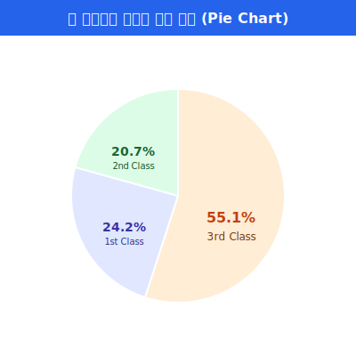
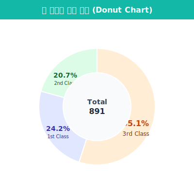

## 5.4.3 파이 차트 (Pie Chart) 한계탈출

파이 차트는 전체 데이터(100%) 중에서 특정 범주(그룹)가 차지하는 **비율(상대적 크기)**을 동그란 피자 조각처럼 나누어 보여주는 그래프입니다. 선거 득표율이나 시장 점유율을 나타낼 때 뉴스에서 아주 흔하게 봅니다.

### ① Matplotlib으로 파이 차트 그리기

타이타닉 요금 등 연속된 숫자는 파이 차트로 그릴 수 없습니다. "1등급 몇 명, 2등급 몇 명"처럼 딱 떨어지는 범주형 빈도수 데이터가 필요합니다.

```python
import matplotlib.pyplot as plt
import seaborn as sns

# 1. 빙점(빈도) 데이터 구하기
df = sns.load_dataset('titanic')
class_counts = df['pclass'].value_counts()
print(class_counts)
# 3등급: 491명, 1등급: 216명, 2등급: 184명
```

직접 세어낸 `class_counts` 데이터를 `plt.pie()`에 집어넣습니다.

```python
plt.figure(figsize=(5, 5))

# labels: 조각 옆에 붙을 이름, autopct: 조각 안에 그릴 백분율(%) 계산 포맷
plt.pie(class_counts, 
        labels=['3rd Class', '1st Class', '2nd Class'], 
        autopct='%.1f%%', 
        colors=['#FFCCBC', '#C5CAE9', '#C8E6C9'],
        startangle=90, # 12시 방향부터 시작
        wedgeprops={'edgecolor': 'white', 'linewidth': 2}) # 조각 사이 흰색 선

plt.title("타이타닉 승객 등급 비율")
plt.show()
```



---

### ② 치명적 단점: "우리 뇌는 각도를 구별하지 못한다"

파이 차트는 예뻐 보이지만, 현대 데이터 과학자와 시각화 전문가들이 입을 모아 **"가능하면 쓰지 말라"**고 경고하는 그래프 1순위이기도 합니다.


> **🚨 왜 파이 차트를 피해야 할까요?**
> 인간의 눈과 뇌는 '길이'나 '높이'의 차이는 기가 막히게 잘 잡아내지만(막대그래프), 원에서 잘라낸 조각의 **'각도' 나 '면적'의 미세한 차이를 비교하는 데는 아주 둔감**합니다.
> - A(31%)와 B(33%) 조각이 나란히 있으면, 누가 더 큰지 육안으로 구별하기 힘듭니다.
> - 조각의 개수가 5개를 넘어가면 그래프가 지저분해져서 쓰레기와 다름없어집니다.

---

### ③ 대안: 도넛 차트 (Donut Chart)

그래도 예쁜 디자인 때문에 꼭 원형 비율 그래프를 써야 한다면, 가운데 구멍을 뚫어 덜 답답해 보이는 **도넛 차트**를 쓰는 것이 최근의 UI/UX 디자인 트렌드입니다.

파이 차트를 그리고, 그 한가운데에 배경색과 똑같은 작은 원을 하나 그려 덧씌우는 꼼수로 도넛을 만듭니다.

```python
plt.figure(figsize=(5, 5))

# 1. 파이 차트 먼저 그리기
plt.pie(class_counts, labels=['3rd', '1st', '2nd'], autopct='%.1f%%', colors=['#FFCCBC', '#C5CAE9', '#C8E6C9'])

# 2. 하얀색 원(도넛 구멍)을 만들어 도화지 한가운데 좌표(0,0)에 올리기
centre_circle = plt.Circle((0,0), 0.60, fc='white')
fig = plt.gcf() # 현재 도화지 가져오기
fig.gca().add_artist(centre_circle) # 도화지에 구멍 원 그리기

plt.title("모던한 도넛 차트 (Donut Chart)")
plt.show()
```



비율 시각화까지 마쳤다면, 방대한 데이터를 단 한 장의 컬러 지도로 압축해서 보여주는 피날레, **상관관계 폭격기 히트맵(Heatmap)**의 세계로 떠나봅시다!