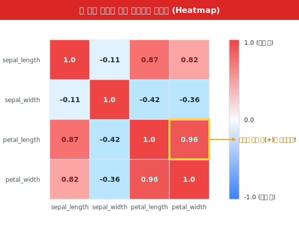
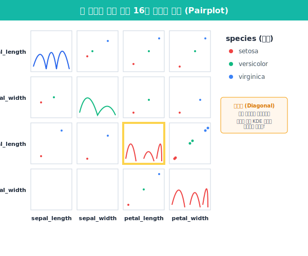

## 5.5.2 상관관계 시각화 끝판왕

데이터 분석에서 가장 짜릿한 순간은 "A가 오르면 B도 오르더라!" 같은 숨겨진 데이터 간의 연관성(상관관계)을 밝혀내는 순간입니다. 열(피처)이 десятки 개가 넘어가는 실무 데이터셋에서 이를 일일이 산점도로 그리는 것은 불가능하므로, 우리에겐 `Heatmap`과 `Pairplot`이라는 궁극의 무기가 필요합니다.

### ① 상관계수와 히트맵 (Heatmap)의 마법

두 데이터가 얼마나 끈끈하게 연결되어 있는지를 나타내는 수치를 **상관계수(-1 ~ +1)**라고 합니다.
- **+1에 가까울수록**: 강력한 비례 (수학 점수와 과학 점수)
- **-1에 가까울수록**: 강력한 반비례 (놀이공원 방문객 수와 비 오는 날씨)
- **0에 가까울수록**: 아무 상관 없음 (고양이의 몸무게와 다음 날 주식 가격)


판다스의 `corr()` 함수로 구한 거대한 숫자 행렬을, Seaborn의 `heatmap`에 집어넣는 순간 지루한 숫자들이 **아름다운 온도 지도**로 탈바꿈합니다! 차가운 파란색, 뜨거운 빨간색으로 그 관계를 한눈에 볼 수 있습니다.

```python
import pandas as pd
import seaborn as sns
import matplotlib.pyplot as plt

# 붓꽃(iris) 데이터 로딩
iris = sns.load_dataset("iris")

# 1. 꽃받침(sepal)과 꽃잎(petal)의 길이/너비 상관계수 계산
corr_iris = iris.corr(numeric_only=True)

plt.figure(figsize=(7, 5))
# 2. 히트맵 그리기 (annot=True는 네모 칸 안에 실제 숫자를 써줌)
# cmap='coolwarm' (차가운 파란색부터 뜨거운 빨간색까지)
sns.heatmap(corr_iris, annot=True, cmap='coolwarm', vmin=-1, vmax=1)

plt.title("붓꽃 부위별 크기 상관관계 히트맵")
plt.show()
```



**[출력 원리 해석]**
대각선 영역은 무조건 자기 자신과의 비교이므로 뜨거운 빨간색(1.0)이 나옵니다. 
우리가 주목해야 할 곳은 다른 변수들이 교차하는 지점입니다. 예를 들어 `petal_length`(꽃잎 길이)와 `petal_width`(꽃잎 너비)가 교차하는 칸의 수치가 **+0.96**으로 매우 붉게 타오르고 있다면, "꽃잎이 긴 붓꽃은 무조건 너비도 넓다"라는 강력한 생물학적 규칙을 컴퓨터가 수식 없이 알아낸 것입니다.

---

### ② 융단 폭격: 산점도 행렬 `sns.pairplot()`

히트맵이 색깔로 직관적인 느낌을 준다면, `pairplot`은 그냥 데이터 안에 있는 모든 수치형 열 조합을 다 가져와서 싹 다 산점도로 그려버리는 "무차별 융단 폭격" 그래프입니다. 데이터 탐색 초기(EDA) 단계에서 가장 많이 사용되는 필살기입니다.

```python
# 붓꽃 품종(species)별로 색깔을 다르게(hue) 칠해서 모든 조합 그리기!
sns.pairplot(iris, hue='species', palette='husl', markers=["o", "s", "D"])
plt.show()
```



**[출력 원리 해석]**
코드는 단 한 줄이지만, 화면에는 무려 16장(4x4)의 화려한 차트가 생성됩니다.
- **대각선**: 자기 자신과의 공간이므로 산점도 대신 5.4.2장에서 배운 **분포 곡선(KDE)**이 그려집니다. 품종별(종류별)로 봉우리가 3개 떨어져 나온 것을 볼 수 있습니다.
- **나머지 공간**: 두 열 사이의 관계를 나타내는 **산점도**가 그려집니다. 특정 산점도에서 특정 색깔(품종)의 점들이 저 멀리 혼자 동떨어져 있다면, 바로 그 두 개의 열이 해당 품종을 분류하는 핵심 키(Key) 변수라는 뜻입니다!

---

### 🎓 피날레: 데이터 분석가의 실전 마인드셋

축하합니다! 당신은 지금까지 약 15종류의 시각화 무기를 손에 넣었습니다.

1. 데이터를 받으면 `df.info()`, `df.describe()`로 **엑스레이**를 찍고 결측치를 확인한다.
2. 수많은 열을 보며 **"범주형 데이터"**인지 **"수치형 숫자 데이터"**인지 두뇌로 먼저 분별한다.
3. 무조건 `pairplot()`과 `heatmap()`을 냅다 던져서, 어떤 변수들끼리 연관성이 높은지 1차 융단 폭격을 가한다.
4. 연관성이 짙어 보이는 주요 변수들을 핀셋으로 뽑은 뒤, 
   - 갯수 차이가 핵심이면 **Countplot / Barplot**
   - 시간에 따른 추세가 핵심이면 **Lineplot**
   - 상/하위 점수 차이와 이상값(Outlier)이 핵심이면 **Boxplot**과 **Violin Plot**을 우아하게 그려낸다.

이것이 실리콘밸리 데이터 엔지니어부터 전 세계 AI 연구원들이 사용하는 불변의 진리이자 프로세스입니다. 이제 여러분의 데이터를 직접 시각화해 볼 시간입니다!