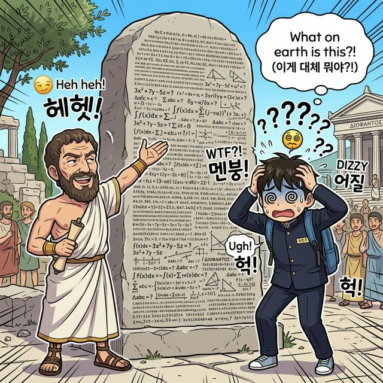
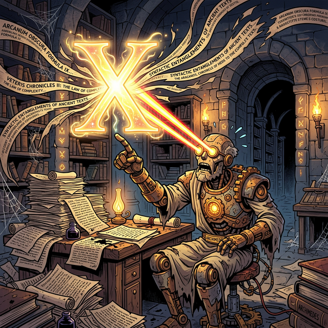
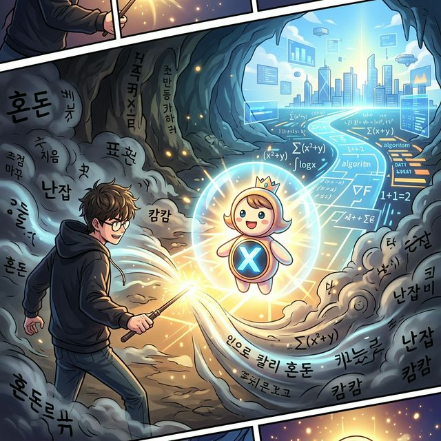
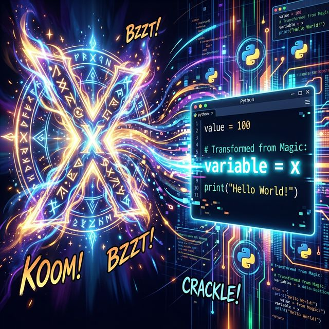

# 4.1.0 산술에서 대수학으로: 미지의 문자 'x'의 등장

## 학습목표
AI 딥러닝과 코딩을 관통하는 거대한 행렬과 텐서의 개념은 사실 아득한 과거 중학교에서 포기했던 "방정식의 $x$" 하나에서 출발했습니다. 

손가락으로 셈을 하던 산술의 시대를 넘어, 모르는 값을 기호로 치환하는 '대수학(Algebra)'의 혁명적 탄생 배경을 직관적으로 되새깁니다.

---

## 💡 TL;DR (1분 핵심 요약): 대수학 혁명

1. **산술의 족쇄 ⛓️**: $2 + 3 = 5$ 처럼 눈에 보이는 뻔한 숫자만 다루는 것은 한계가 있었습니다. 과거 수학자들은 모르는 값을 글이나 말로 길게 설명하느라 시간을 허비했습니다.
2. **미지의 치환 마법 🪄**: 프랑스의 철학자 데카르트 등이 널리 퍼뜨린, "아직 모르는 숫자 덩어리 전체를 그냥 짧은 영어 알파벳 **$x, y, z$** 하나로 퉁쳐서 부르자!"라는 발상이 수학과 코딩의 역사를 바꿨습니다.
3. **대수학 (Algebra) ✖️**: 숫자를 대신하여 문자를 가지고 노는 학문. 이 문자 치환 기술이 없었다면 코딩의 `변수(Variable)` 개념도, 오늘날 넘파이의 다차원 연산도 태어날 수 없었습니다.

---

## 1. 디오판토스의 묘비 미스터리

만약 여러분 앞의 숫자들이 항상 투명하게 답을 보여준다면 우리는 고생할 필요가 없었을 겁니다. 

그런데 우리의 일상은 그렇지 않습니다. 

고대 그리스의 수학자 디오판토스의 묘비에는 그의 나이를 맞혀보라는 기괴한 퍼즐이 적혀있습니다.
> "그의 일생의 1/6은 소년기였고, 1/12이 지나서 수염이 났으며, 1/7이 지나서 결혼했고, 5년 뒤 아들이 태어났으나, 아들은 아버지 일생의 절반만 살고 죽었고, 그는 4년을 더 슬퍼하다 세상을 떠났다."


> 고리타분한 고대 수학자가 거대한 돌덩이 묘비에 빽빽한 문자 퍼즐을 보여주자, 멘붕에 빠져 머리를 쥐어뜯는 모습

이 복잡한 문장을 산술 로직으로 풀려면 머리에 쥐가 납니다. 

하지만 디오판토스 본인이 창시한 **"모르는 값(내 전체 나이)을 어떤 문자 하나로 몰빵해서 묶어 버리자!"** 라는 아이디어를 쓰면 아주 우아한 조립식 레고가 됩니다.

---

## 2. 미지의 문자 'x'의 강림 (변수의 탄생)

모르는 아버지의 전체 나이를 마법의 문자 **$x$** 로 선언하는 순간, 복잡했던 인생살이가 깔끔한 기계 부품들로 쪼개집니다.

*   소년기: $\frac{1}{6}x$
*   청년기: $\frac{1}{12}x$
*   총각기: $\frac{1}{7}x$
*   아들 수명: $\frac{1}{2}x$
*   여백의 년도 수: $5 + 4 = 9$년

이 부품들을 모두 이어 붙이면, 결국 자신의 전체 수명인 $x$ 와 똑같아진다는 완벽한 균형(등식)이 탄생합니다.

$$
\frac{1}{6}x + \frac{1}{12}x + \frac{1}{7}x + 5 + \frac{1}{2}x + 4 = x
$$


> 웹툰 비유: 컴컴한 석실 안에서 골머리를 앓던 덥수룩한 고대 로봇 학자가 갑자기 깨달음을 얻고 눈에서 레이저를 뿜습니다. 그의 손가락 끝에서 웅장하게 빛나는 거대한 마법의 알파벳 'X'가 허공에 떠오르며 복잡한 텍스트들을 싹 다 한 글자로 집어삼킵니다.

이 식 하나가 뜻하는 바는 큽니다. 

## 3. 조작의 시대

모르는 값을 추적하기 위해 구불구불한 언어의 동굴을 걷는 대신, $x$라는 아바타(인형)를 세워놓고 그 아바타 주변의 안개를 하나씩 걷어내는 **'조작의 시대'**가 열린 것입니다.


> 2D 웹툰 비유: 어두운 고대 텍스트의 동굴 속에서, 가슴에 'X' 문자가 빛나는 귀여운 아바타 인형이 서 있습니다. 한 학생이 아바타 주변의 짙은 안개를 마법처럼 걷어내어 밝고 명확한 길을 여는 연출 장면


---

## 4. 변수(Variable)의 탄생: 파이썬과 수학의 기초적 사고

파이썬을 비롯한 모든 프로그래밍 언어의 심장인 **변수(Variable)**는 수학적 사고에서 유래했습니다. 


> 고대 석판에서 뿜어져 나온 마법의 문자 'X'가 디지털 공간을 가르며 파이썬 네온 코드 블록 `variable = x` 로 화려하게 트랜스포메이션하는 홀로그램 연출 장면

### 수학의 상상력, 코딩의 현실이 되다
수학에서 기호 $x$를 사용하는 핵심 이유는 **"아직 값이 무엇인지 모르더라도 논리의 뼈대를 미리 세울 수 있다"**는 데에 있습니다. 

파이썬의 변수 선언 역시 본질적으로 똑같은 철학을 따릅니다.
코딩을 할 때 당장 사용자 입력이나 외부 데이터가 무엇인지 몰라도, `user_age`, `total_price` 같은 변수(이름)들을 활용해 거대한 프로그램의 조작 제어 흐름을 미리 구축할 수 있습니다.

```python
# 파이썬에서 변수는 알 수 없는 데이터를 미리 담아 조작하기 위한 '마법의 상자'입니다.
x = 100
y = x + 50
print("결과:", y)
```

**"미지의 값에 이름(변수)을 부여하면 조작할 수 있다."** 
이 단순하고도 강력한 대수학의 사상이 없었다면 파이썬의 변수 개념도, 수억 개의 데이터를 통째로 텐서 변수 하나에 담아 한 번에 연산하는 넘파이(Numpy)의 다차원 배열 구조도 결코 세상에 나올 수 없었을 것입니다.

이제 다음 장에서는 이 $x$를 가운데 두고 어떻게 양쪽 팔 저울을 맞춰나가는지 직관적인 등식의 세계로 진입해 보겠습니다.
