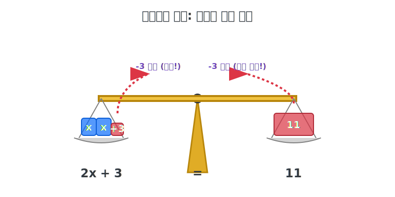

# 1.1 방정식의 영혼: 등식의 성질과 양팔 저울

## 학습목표
일차방정식을 기계적인 공식 암기로 푸는 것이 아니라, 완벽하게 균형이 맞는 황금 양팔 저울의 수평을 유지하며 직관적으로 미지수 $$x$$의 무게를 역산해 내는 논리적 흐름을 체화합니다.

---

## 💡 TL;DR (1분 핵심 요약): 등식과 양팔 저울

1. **방정식은 저울이다 ⚖️**: 중간에 있는 등호(`=`) 기호는 "왼쪽 접시와 오른쪽 접시의 무게(값)가 100% 동일하게 균형을 맞추고 있다"는 뜻입니다.
2. **등식의 절대 성질 🧱**: 저울이 수평을 유지하고 있을 때, **양쪽에 똑같은 무게의 추를 동시에 더하거나, 빼거나, 곱하거나, 나누어도** 절대 저울은 기울어지지 않습니다.
3. **이항 (Transposition) 🔄**: 한쪽 접시에 있는 숫자를 반대쪽 접시로 휙 넘기는 마법입니다. 대신 공짜는 없고 반드시 **부호(더하기는 빼기로)가 반대로 뒤집히는 통행료**를 냅니다.

---

## 1. 우주가 무너져도 밸런스를 지켜라

방정식의 등호(`=`)를 프로그래머들은 "오른쪽 값을 왼쪽에 넣어라(할당 연산자)"로 많이 사용하지만, 수학에서 본연의 의미는 **양팔 저울의 수평 눈금**입니다. 

방금 전 디오판토스의 나이를 맞히는 복잡한 식 대신, 과일 가게의 아주 심플한 1차 방정식 수평 저울을 상상해 보시죠.

**$$2x + 3 = 11$$**

*   **왼쪽 접시 (좌변)**: 수박 2통($$2x$$)과 3kg짜리 금속 추가 올려져 있습니다.
*   **오른쪽 접시 (우변)**: 11kg짜리 거대한 금속 추가 묵직하게 올라가 있습니다.
*   가운데 저울침은 미동도 없이 완벽한 일직선(수평)을 유지하고 있습니다.

우리의 유일한 목표는 오직 "수박 1통($$x$$)의 순수 무게는 몇 kg인가?"를 알아내는 것입니다.

---

## 2. 밸런스를 부수지 않고 포장지 벗기기

저항하는 미지수 $$x$$ 주변에 붙어 있는 쓰레기 더미(숫자들)를 등식의 성질을 이용해 아주 교묘하게 다 벗겨버리는 액션 로그를 따라가 보겠습니다.

*(SVG 다이어그램: 황금 양팔 저울 위에 $$2x$$ 블록과 $$+3$$ 블록이 $$11$$ 블록과 수평을 이룬 첫 화면. 다음 씬에서 양쪽 접시에서 $$-3$$ 만큼의 작은 조각이 동시에 똑같이 날아가($$2x = 8$$) 수평이 유지되는 직관적 애니메이션 구조)*

1. **상수 버리기 (똑같이 빼기)**: 왼쪽 접시에 있는 3kg 짜리 추가 눈엣가시입니다. 수박만 남기기 위해 왼쪽에서 $$3$$을 확 빼버립니다. 
저울이 왼쪽으로 기우뚱하겠죠? 안 됩니다! 밸런스를 지키기 위해 즉시 오른쪽 접시에서도 똑같이 $$3$$을 깎아냅니다.
$$2x + 3 - 3 \quad = \quad 11 - 3$$
결과: $$2x = 8$$ (수박 2통은 결국 8kg이구나!)

2. **계수 분할하기 (똑같이 나누기)**: 난 수박 2통이 아니라 "1통"이 궁금합니다. 왼쪽 짐을 반으로 쪼갭니다(2로 나눔). 우주의 밸런스를 위해 오른쪽 8kg 파펜도 정확히 반으로 쪼갭니다.
$$2x \div 2 \quad = \quad 8 \div 2$$
결과: $$x = 4$$

**정답! 수박 한 통의 순수 질량은 4kg 이었습니다.**

방정식을 푸는 것은 어지러운 수식 놀음이 아니라, **아바타 $$x$$를 고립시키기 위해 눈치 보며 살살 폭탄을 양쪽에 동시 투하하는 정밀 철거 작업**에 불과합니다.

이 조작의 즐거움도 잠시, 사과만 팔던 장수에게 포도($$y$$)라는 새로운 변수가 들어오면 우리는 새로운 위기를 맞이합니다. 식 하나로는 수평을 맞출 수 없는 '연립'의 세계 02장에서 그 교차점을 쏴 맞춰보겠습니다.
