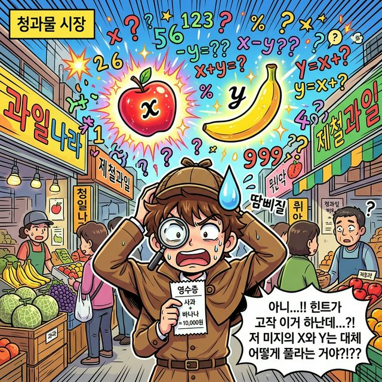
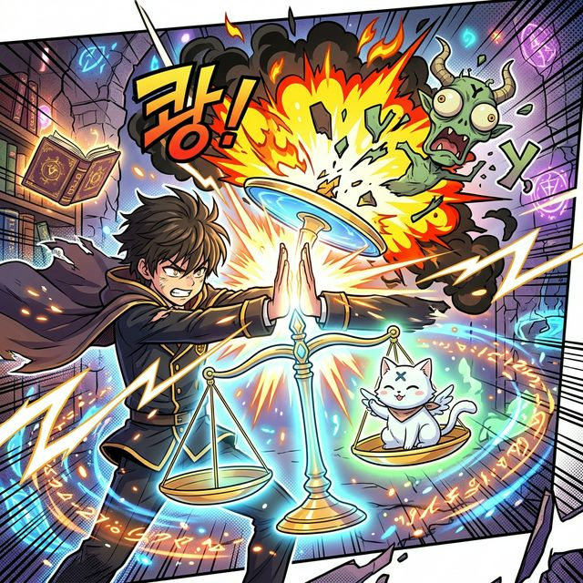
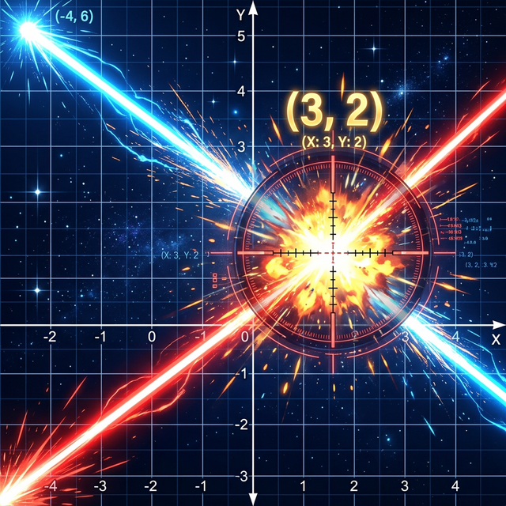

# 1.2 식이 늘어난다! 연립 일차방정식과 그래픽 교차점

## 학습목표
변수가 2개 이상일 때 필연적으로 다가오는 한계를 깨닫고, 왜 연립방정식이 반드시 변수의 개수만큼 식을 필요로 하는지 원리를 이해합니다. 그리고 단순한 수식 풀이를 넘어, 기하학의 그래프 위에서 두 직선이 충돌하는 "유일한 교차점"을 구하는 과정과의 미친 듯한 연관성을 시각적으로 뚫어냅니다.

---

## 💡 TL;DR (1분 핵심 요약): 연립과 교차점

1. **하나로는 모자라 😭**: 사과($x$) 한 개와 배($y$) 한 개를 샀더니 5천 원이다 ($x + y = 5000$). 이 정보 하나만으로는 절대 사과 하나의 가격을 콕 집어 찍어낼 수 없습니다. 변수가 2개면 단서(식)도 2개가 필요합니다.
2. **소거법의 마법 ✂️**: 수평이 맞는 두 개의 다른 저울 식을 आपस 위아래로 쾅! 합체시키거나 빼버려서, 거추장스러운 한 놈($y$)을 아예 무대 밖으로 날려버리는 전략(가감법)을 사용합니다.
3. **교차점을 쏴라 🎯 (기하학)**: 파이썬 코딩에서 이 식 2개를 차트 화면에 2D 그래프 선분 두 개로 그리면, 서로 크로스하며 충돌(Cross)하는 바로 그 유일한 X 표식 "별(교차점)의 좌표"가 내가 풀었던 정답 $x$ 와 $y$ 값과 동일하게 나옵니다.

---

## 1. 셜록 홈즈와 부족한 단서

수박 하나만 팔 때는 세상이 평화로웠습니다. 그런데 이제 과일 바구니에 바나나($y$)가 추가되었습니다.
당신은 과일가게에서 쪽지 하나를 발견합니다.

**$x + y = 5$** (사과 하나랑 바나나 하나의 합은 5천 원)

사과는 얼마일까요?
1천원? 2.5천원? 4천원? 답이 수십 가지로 무한 번식합니다. 변수(미지수)가 두 개로 늘어났는데 단서인 식은 한 개뿐이라면, 우리는 하나의 절대적인 진리를 영원히 찾아낼 수 없습니다.

*(웹툰 비유: 과일 가게에서 사과($x$)와 바나나($y$) 변수들이 둥둥 떠다니고 수많은 물음표가 폭발하자 단서가 하나밖에 없어 당황하며 땀을 흘리는 셜록 홈즈의 모습)*

그때, 바닥에서 또 다른 영수증 단서를 발견합니다!
**$2x - y = 4$** (사과 두 개에서 바나나 하나를 뺀 가격 차이는 4천 원)

이제 변수 2명($x, y$)과, 그들을 잡을 단서 식 2개 세트가 연합(연립)했습니다. 이들이 바로 그 유명한 **연립 일차방정식** 입니다.

---

## 2. 변수 아바타 죽이기 (가감법 폭파)

수학자들은 꾀를 냈습니다. "둘 다 동시에 신경 쓰려니 머리가 터질 것 같아. 둘 중 만만한 놈 하나($y$)를 골라 폭파시켜 버리자!"

두 저울의 양팔을 위아래로 한 덩어리로 통째로 더해보는 마법입니다.
$$
\begin{align*}
 (x + y) &= 5 \\
+ \quad (2x - y) &= 4 \\
\hline
3x + 0 &= 9 
\end{align*}
$$

어머나! 기적같이 위쪽의 $+y$와 아래쪽의 $-y$가 서로 상쇄되어 영원히 소멸(Delete)해 버렸습니다. 변수 $x$ 하나만 남은 평화로운 1차 방정식 세상($3x = 9$)으로 회귀했고, 우린 곧바로 **$x = 3$** 이라는 열쇠를 손에 쥡니다.

*(웹툰 비유: 마법사 학생이 두 개의 양팔 저울을 위아래로 강력하게 합체시키자, 성가신 '$y$' 몬스터가 펑! 하고 연기처럼 폭발해 사라지고 평화로운 '$x$' 아바타만 남는 즐거운 액션 씬)*

따라서, $y = 2$가 도미노처럼 풀립니다.

---

## 3. 대수학과 기하학의 위대한 크로스오버 (교차점)

방금 문자를 지워가며 풀었던 답 **($x=3, y=2$)**. 
수학 천재 데카르트는 이 고루한 수식 풀이를 컴퓨터 화면 격자 좌표계(2D 기하학)로 뜯어옮기는 기염을 토합니다.

함수 파트에서 배우듯, 식 $x + y = 5$ 는 좌표평면에 무수한 점들이 모여 만들어진 **기울어지는 파란색 대각선 그래프**를 그립니다.
마찬가지로 $2x - y = 4$ 도 **급격히 꺾여 올라가는 빨간색 대각선 그래프**를 긋습니다.

*(웹툰 비유: 화면 좌측 상하단 모서리에서 거대한 파란색 레이저 빔 선과 빨간색 레이저 빔 선이 우주 공간 좌표계(모눈종이)를 가르며 발사됩니다. 이 두 레이저 빔 선이 정확히 X자로 쾅! 하고 충돌하며 폭발하는 교차 스팟 좌표에 조준경이 박히는데, 그 좌표가 황금빛 글씨로 **(3, 2)** 라고 깜빡입니다.)*

여러분이 머리를 싸매며 "식을 푼다"라는 행동은, 사실 거대한 드론 스캐너가 되어 화면상의 **두 레이저 선분이 정확히 충돌하는 치명적인 단 한 점(교차점)**을 찾는 위대한 레이더 색출 작업과 200% 완벽히 같은 의미였습니다.

이 놀라운 충돌 점을 넘어서, 이제 우리는 일직선이 아닌 활처럼 아름답게 휘어지는 이차 함수 곡선(포물선)의 폭격 궤도, $x^2$ 의 세계로 등반을 준비합니다.
