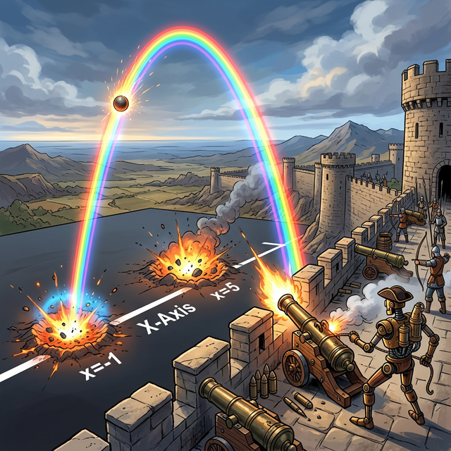
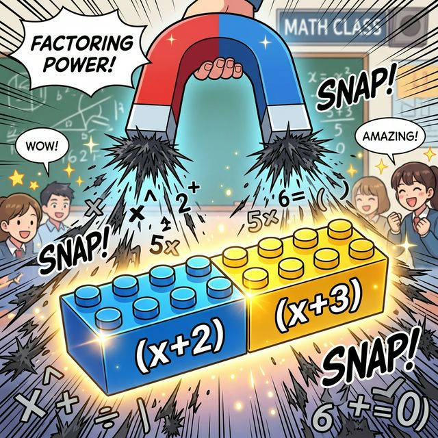

# 1.3 우주의 거대한 무기: 포물선 곡선 (이차방정식과 파라볼라)

## 학습목표
대수학의 차수가 2차($x^2$)로 상승하면서 왜 일직선의 단순함이 우주적인 '포물선(Parabola)' 궤적으로 휘어지는지, 기하학적 의미를 폭넓게 깨닫습니다. 나아가 이차방정식의 해(근)를 찾는 행위가, 날아가는 포탄이 X축 평지(지면)와 충돌하는 '명중 좌표 스캔'과 완전히 동일하다는 놀라운 파이썬 융합 시뮬레이션을 상상해 봅니다.

---

## 💡 TL;DR (1분 핵심 요약): 2차원 공간의 휨

1. **제곱($x^2$)의 마법 🌀**: 변수 $x$ 스스로를 두 번 곱하는 순간, 똑바로만 가던 선분(일차함수)은 더 이상 버티지 못하고 유연하게 아래로 쳐졌다가 다시 치솟는 U자형 곡선(포물선)으로 진화합니다.
2. **해(근) = 바닥 충돌점 💥**: 이차방정식 $x^2 + 5x + 6 = 0$ 을 푼다는 것은, 날아가는 포물선(대포알 궤적) 덩어리가 수평 지층인 **X축 선(고도 높이가 $0$인 지점)**과 정확히 쾅! 하고 구멍을 뚫고 지나가는 충돌 크레이터 좌표(근 2개)를 찾아내는 레이더 측정 작업입니다.

---

## 1. 포물선(Parabola): 뉴턴 역학의 궤적

인류가 사과나 바나나 한두 개를 더듬거리고($x$), 널빤지를 똑바로 자르던 시절을 넘어, 투석기나 대포알을 하늘로 쏴 올리기 시작하면서 수학자들의 머리가 아파옵니다.

공중으로 높이 발사된 폭탄 쇳덩이는 하늘 위로 영원히 일직선으로 날아가지 않고 반드시 아래로 휘어지며 떨어집니다(중력의 법칙). 이 아름답고 공포스러운 **날아가는 탄환의 궤적**을 기록한 수식이 바로 이차식($ax^2 + bx + c$)이고, 우리는 이를 **포물선(Parabola)**이라고 경외합니다.

*(웹툰 비유: 중세 시대 로봇 대포병(갈릴레오 룩) 성벽 위에서 장엄하게 2차 함수 $y = -x^2 + 4x + 5$ 궤도식을 발사합니다. 빛나는 포탄 스피어가 허공을 완벽한 거꾸로 된 U자 궤적으로 가르며, X축이라고 적힌 평원 바닥면을 향해 무지개처럼 꽂혀 충돌하는 장면. 바닥 충돌점에서는 "크레이터 발견! x = 5, -1" 알림이 반짝입니다.)*

여러분이 물리 엔진을 만들거나 게임(Angr* Bird 등)을 코딩할 때, 물체가 땅으로 떨어지는 모션을 넣으려면 이 이차함수의 공식을 1초에도 화면 픽셀 스크린에 60번씩 파이썬 프레임으로 때려 넣어야 합니다.

---

## 2. 인수분해: 복잡한 궤도를 일격에 압축하기

그런데 이 $ax^2 + bx + c = 0$ 이라는 식 덩어리를 어떻게 풀어낼까요? 너무 복잡해서 한눈에 $x$ 값이 떠오르지 않습니다.

앞선 00장에서 잠시 언급했던 마법의 블록 조립 공법, **인수분해 (Factorization)**가 등장합니다.
너저분하게 퍼져 있는 철가루 전개식 $x^2 + 5x + 6$ 을 강력한 논리의 자석으로 뭉쳐서, 꽉 낀 쌍둥이 블록 **$(x + 2)(x + 3)$** 형태로 기적처럼 단정하게 압축 조립(변환)해 버리는 기법입니다.

*(웹툰 비유: 거대한 말굽자석이 어지럽게 흩어진 철가루와 수식 기호들을 강력하게 끌어당기자마자, 허공에서 아주 깔끔하고 빛나는 두 개의 조립식 레고 블록 $(x+2), (x+3)$ 으로 딱! 소리를 내며 합체되는 통쾌한 장면)*

이제 방정식은 극단적으로 우아해집니다.
**$(x + 2)(x + 3) = 0$**

이 식이 성립(진리)하려면, 둘 중 하나가 `0`이 되는 폭탄 데미지를 맞으면 무조건 상대도 연쇄 폭발하여 전체가 폭발(`=0`)합니다.
따라서 이 포물선 대포알이 바닥($y=0$)을 뚫고 쳐박히는 해(충돌 크레이터 점 좌표)는 손쉽게 **$x = -2$** 와 **$x = -3$** 두 발이라는 결론을 역산해 냅니다.

---

## 3. 이차방정식을 넘어 "무한 차원"의 세계로 (차원 폭발)

이처럼 차수가 높아질수록(2차 포물선, 3차 S자 궤도, 4차 W자 궤도...) 우리는 더 복잡한 물리 궤적을 예측하는 신에 가까운 무기를 손에 쥐게 됩니다. 

하지만 여전히 문자의 개수($x$ 1개)는 초라합니다. 실제 우리가 다뤄야 할 주식 시장, 내일의 날씨, 수만 개의 영상 픽셀들은 $x_1, x_2, x_3 ... x_{10000}$ 로 우글거리는 무한 차원의 변수 괴물들입니다.

*(웹툰 비유: 거대한 다차원 공간 포털이 열리며 $x_1, x_2, \dots, x_{999}$ 등 수백만 마리의 빛나는 변수 몬스터들이 끝없이 쏟아져 나오자, 조그만 $x$ 캐릭터가 덜덜 떨며 올려다보는 압도적이고 장엄한 스케일의 컷씬)*

이 통제 불능의 변수($x_n$)들의 더미를 어떻게 해야 컴퓨터(Numpy)가 이해할 수 있는 아름다운 엑셀 아파트 격자 단지로 쓸어 담고 한 방에 곱셈 폭격기로 전멸시킬 수 있는지, 드디어 그 위대한 **'행렬(Matrix)로의 전이'** 마지막 연륙교 장(Bridge Chapter)에서 확인해 보겠습니다.
