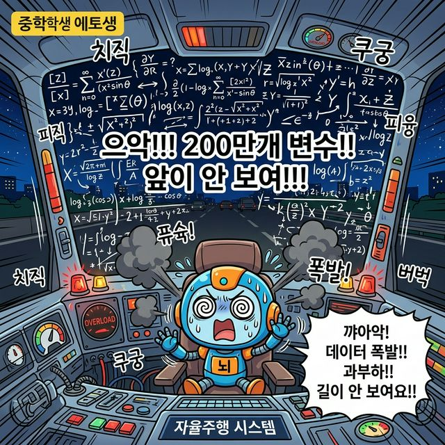
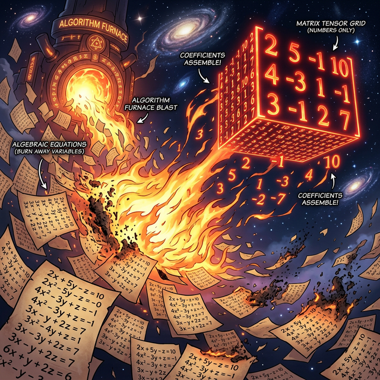
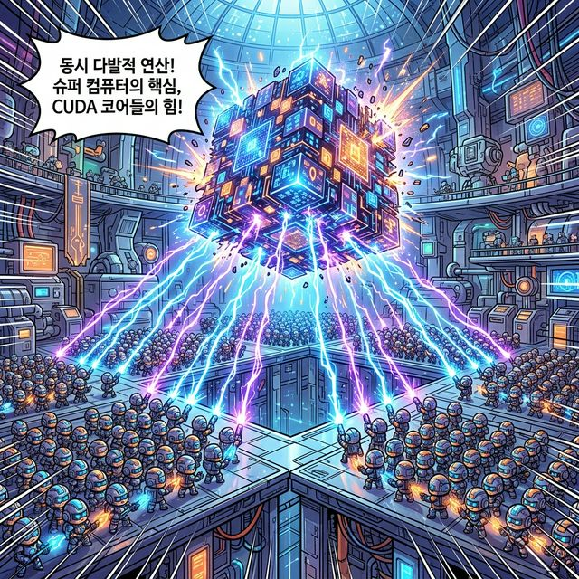

# 1.4 방정식이 폭발할 때, 행렬이 강림하다 (Numpy 브릿지)

## 학습목표
지금까지 배운 $x, y, z$의 단출한 방정식 스토리가, 변수가 기하급수적으로 늘어나는 `AI 딥러닝`과 `코딩`의 시대로 확장되며 어떻게 붕괴 직전에 이르는지 절감합니다. 

그리고 그 붕괴하는 수만 개의 텍스트 수식을 구원하기 위해 "거추장스러운 $x, y$ 껍데기는 버리고 알맹이 숫자(계수)만 아파트로 옮겨버리자"는 직관적이고 필연적인 **행렬(Matrix)** 탄생의 순간을 목격합니다.

---

## 💡 TL;DR (1분 핵심 요약): 행렬 진화의 필연성

1. **손글씨의 파멸 🖋️**: 변수(미지수)가 수백, 수만 개로 늘어나는 초거대 연립방정식은 사람이 평생 써도 풀지 못하는 종이 낭비의 극치입니다. 컴퓨터조차 $3x_1 + 5x_2 ...$ 처럼 일일이 변수 메모리 주소를 타고 루프명령을 돌면 속도가 미치도록 느려져(과부하) 터집니다.
2. **숫자만 남기자 (탈피 현상) 🐍**: 변수($x$)들은 어차피 줄에 맞춰 서 있다는 법칙을 발견한 인류는, 그 위치 체계를 믿고 식별용 $x, y, z$ 알파벳은 과감히 버린 뒤 오직 파워 숫자인 **계수**들만 빼내어 거대한 네모칸(Tensor Array) 안에 줄여 세우기 시작했습니다.
3. **Numpy 행렬 공장의 문 앞 (Next Chapter!) 🚀**: 이 거대한 숫자들의 직사각형 덩어리를 바로 **'행렬(Matrix)'**이라고 부르며, 이것들이 서로 어떻게 부딪히고(내적) 덧대어져(스칼라배) 파이썬 Numpy 위에서 마법진을 그리는지 다음 단원(`02. [사전학습] 행렬과 벡터`)에서 본격적으로 뜯어봅니다.

---

## 1. 100만 개의 미지수 $X$, 대수학의 종언

과일 가게의 장부에서 연립 일차방정식을 쓰던 시절을 지나, 오늘날 딥러닝 자율주행 회사의 시각 데이터 시스템 센터로 훌쩍 점프를 뛰어보시죠.

### 이미지 픽셀과 변수
당신의 자동차 AI가 내일 길을 건널 보행자 스팟을 예측하려면, 단지 사과 개수($x$)와 포도 개수($y$)를 묻지 않습니다. 

자동차에 달린 카메라 센서는 **HD 화질(1920 X 1080)** 스크린을 모니터링합니다. 

이는 한 프레임 스크린당 무려 **200만 개의 변수 $x_n$ (픽셀 밝기 수치)** 가 동시에 얽히고설켜 쏟아져 들어온다는 뜻입니다.

이 200만 개의 미지수가 서로 상호작용하는 다항식을 종이에 적어볼까요?

$$
3.2x_1 + 0.5x_2 - 1.2x_3 \; ... \; + 4.1x_{2073600} = 99.2
$$
$$
-1.1x_1 + 2.7x_2 + 0.0x_3 \; ... \; - 0.2x_{2073600} = 12.5
$$
$$
... \text{(이런 줄이 100만 줄 있음)} ...
$$

### 반복문의 한계
이것을 전통적인 중학교 컴퓨터 교과서의 `for 문`으로 돌리면서, 배열을 순서대로 하나씩 루프 탑승하여 $x_{17500}$과 $y_{900}$을 찾고 더하고를 반복한다면, 자동차 AI는 길 가는 강아지를 인식하는 데 30년이 걸릴지도 모릅니다. 

데이터 텍스트(알파벳) 덩어리와 느려터진 루프 처리 방식이라는 **'방정식 체계의 한계 상황'** 즉, 붕괴에 직면했습니다.

> 자율주행 자동차의 두뇌 역할을 하는 귀여운 AI 로봇이 도로를 보려 하지만, 시야 스크린에 200만 개의 복잡한 미지수와 수식이 에러 창처럼 폭주하여 로봇 머리에서 빙글빙글 연기가 피어오르는 멘붕 상황

---

## 2. 껍데기 벗기기와 숫자 아파트 입주 (행렬 강림)

수학자들과 컴퓨터 구조 엔지니어들은 기가 막힌 아이디어를 냈습니다.

### 행렬의 탄생

"야, 잠깐만. 이 수만 개의 방정식 줄을 가만히 내려다보니 어차피 1 열은 항상 $x_1$ 자리, 2열은 언제나 $x_2$ 자리잖아?" 

거대한 깨달음입니다. 

변수 문자의 위치 서열 체계가 확고하다면, 더 이상 무식하게 매 줄마다 $x_1, x_2, \dots$ 라는 거추장스러운 알파벳 껍데기를 일일이 달아줄 필요가 없는 것입니다!

**"모든 알파벳 껍데기 기호($x$)는 찢어서 쓰레기통에 폐기하라. 오직 살아남은 엑기스(숫자/계수)들만 네모난 `[ ]` 방벽 안쪽, 아파트 호수에 맞춰 정렬 입주시켜라!"**

> 수백만 줄의 빽빽한 연립방정식 파피루스가 허공에 펄럭이고 있습니다. 거대한 용광로 불꽃(알고리즘)이 확 지나가자, 종이 위의 $x, y, z, ...$ 문자 껍질들이 불타 후드득 벗겨져 재가 되어 사라지고, 오직 붉게 달아오른 '숫자(계수)'들만이 허공에 남아 대규모의 정렬된 블록 큐브(행렬 Tensor) 단지로 압축 조립되며 찬란히 빛나는 극적인 장면.

### 수식을 행렬로 간소화
이 방정식의 해체와 정제 과정을 거쳐, 텍스트의 숲에서 벗어나 엄청나게 콤팩트하고 무시무시한 수치들의 네모난 타일 격자 덩어리, 즉 **행렬(Matrix)**이 지구상에 강림한 것입니다.

---

## 3. 다차원 텐서와 행렬 팩토리로 (Next Step)

이 행렬 타일 세트를 손에 쥔 우리는 이제 완전히 새로운 '대량 학살 연산 무기'를 쓰게 됩니다. 

### 병렬 연산과 행렬
데이터 수백만 개를 모아서 던져주면, 그래픽 카드(GPU) 보드 위 수만 명의 노동자(CUDA Core)가 행렬 덩어리를 가져다가 한 큐에 동일한 자리에 동시에 벼락(병렬 덧셈/곱셈)을 내리치며 연산을 폭파해 버립니다.

> 거대하고 웅장한 첨단 공장에서 수만 명의 작은 미니언 로봇 노동자들(GPU CUDA 코어)이 오와 열을 맞춰 서서, 거대한 행렬 데이터 블록을 향해 동시에 일제히 번개 마법을 쏘아 연산을 순식간에 끝내버리는 통쾌한 스펙터클 장면

### 다차원 텐서와 행렬 팩토리
우리가 이제 파이썬에서 만날 **Numpy(넘파이)**는, 바로 이 거대한 행렬 아파트 건물을 클릭 한 번에 찍어내고 부숴버리는 최강의 건설 로봇 `ndarray` (다차원 배열) 기체를 지원하는 엔진입니다.

긴급 여정이었습니다. 방정식과 포물선의 역사에서 살아남은 숫자 덩어리들이 세운 격자 도시, 대망의 **제2장. 행렬의 구조와 선형 변환 마법진**(`02_math_matrices`)으로 위풍당당하게 넘어가 봅시다!
