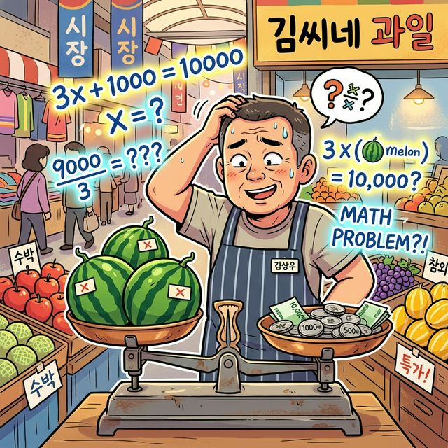
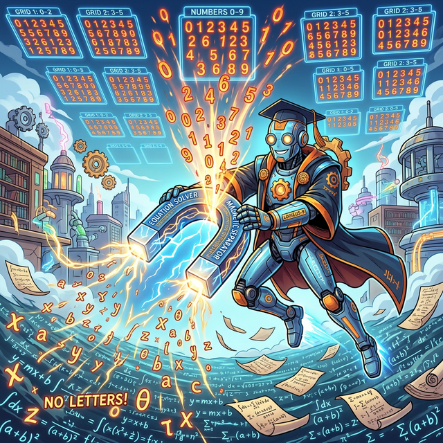
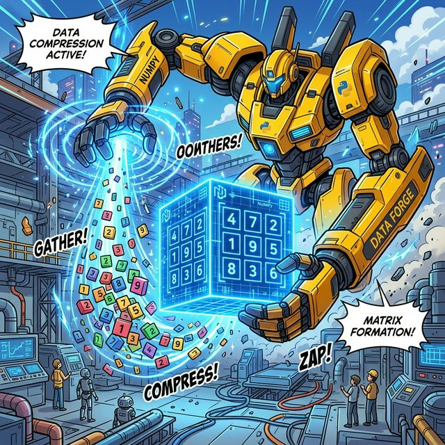

# 1.0 왜 갑자기 행렬인가? (방정식의 한계)

## 학습목표
본 장에서는 "왜 데이터 과학과 파이썬 코딩을 배우는데 갑자기 수학 시간에 포기했던 '행렬' 그림이 튀어나오는가?"에 대한 근본적인 의문을 해결합니다. 중학교 때 배웠던 1차 방정식과 다항식의 계산에서 출발하여, 변수의 개수가 기하급수적으로 늘어나는 AI 시대에 왜 **'행렬(Matrix)'**이라는 거대한 숫자 아파트가 필연적으로 발명될 수밖에 없었는지 직관적인 비유로 깨우칩니다.

---

## 💡 TL;DR (1분 핵심 요약): 행렬의 탄생 배경

1. **방정식의 한계 💥**: 사과($x$) 한 개의 가격을 구할 땐 방정식 $2x = 1000$으로 충분했지만, 마트의 수십만 개 상품의 변동성을 모두 $x, y, z, a, b...$ 문자로 써 내려가는 건 불가능한 노가다입니다.
2. **숫자만 빼내기 (행렬의 탄생) 🏢**: 복잡한 식에서 귀찮은 문자 껍데기($x, y$)를 싹 다 벗겨버리고, 오직 알맹이인 **'계수(숫자)'**들만 직사각형 모양의 표(아파트)에 가지런히 입주시켜 통째로 연산하기 시작한 것이 바로 행렬입니다.
3. **Numpy와 AI 🤖**: 이런 행렬 덩어리를 사람 손이 아닌 컴퓨터로, 그것도 수백만 번의 충돌 연산을 0.1초 만에 해치우는 파이썬의 궁극적인 무기가 바로 우리가 배울 **Numpy(넘파이)**입니다.

---

## 1. 수박 장수와 1차 방정식의 추억

우리가 중학교 시절 처음 만난 대수학, 즉 **방정식(Equation)**은 정말 위대했습니다. 손가락을 꼽아가며 찍어서 맞히던 시절을 끝내고, 모르는 값을 미지의 문자 **$x$** 로 둔 다음 양팔 저울의 균형을 맞추듯 해답을 끄집어내는 매직이었죠. 

*(웹툰 비유: 시장의 수박 장수가 양팔 저울에 수박과 숫자를 올리며 머리를 긁적이고, 허공에는 수학 방정식이 떠다니는 모습)*

*   "수박 3통이랑 천 원짜리 파 1단을 샀더니 만 원이 나왔네? 수박 한 통($x$)은 얼마지?"
*   $3x + 1000 = 10000$ 
*   **답: $x = 3000$**

이처럼 내가 알아내야 할 미지수가 한 개($x$)이거나 두 개($x, y$)일 때, 인류는 종이와 펜만으로 충분히 세상을 예측할 수 있었습니다. (연립방정식)

> **[돌아보기]** 일차방정식과 미지수 $x$의 아름다운 활약이 기억나지 않는다면 [수학이야기: 미지의 엑스(x)를 향한 추리](/math_story/11_linear_equations/)를 가볍게 읽어보세요.

---

## 2. 변수 폭발: AI 시대의 절망적인 노가다

하지만 세상이 복잡해졌습니다. 여러분이 단순한 과일 장수가 아니라, 쿠팡이나 아마존의 "전국 물류 데이터 센터장"이라고 상상해 보세요. 

*(웹툰 비유: 거대한 물류 센터에서 수많은 미지수 $x_1, x_2, \dots$ 들이 토네이도처럼 몰아치자 센터장이 머리를 쥐어뜯으며 절망하는 장면)*

내일 당장 서울 시내 1,000만 명의 고객이 어떤 물건을 살지 예측하려면, 고려해야 할 변수(미지수)가 몇 개쯤 될까요? 
*   $x_1$: 고객의 나이
*   $x_2$: 어제 검색한 단어
*   $x_3$: 오늘 비가 올 확률
*   ...
*   $x_{50000}$: 방금 본 유튜브 썸네일 색상

이 5만 개의 변수가 서로 얽히고설켜 수백만 개의 연립방정식을 만들어냅니다. 이걸 옛날 방식으로 종이에 쓴다면 아래와 같은 끔찍한 모습이 될 것입니다.

$$
3.2x_1 + 0.5x_2 - 1.2x_3 \, ... \, + 4.1x_{50000} = 99.2
$$
$$
-1.1x_1 + 2.7x_2 + 0.0x_3 \, ... \, - 0.2x_{50000} = 12.5
$$
$$
... \text{(이런 줄이 100만 줄 있음)} ...
$$

이걸 사람이 풀기는커녕, 식을 받아 적다가 수명이 다 끝날 지경입니다. 
우리는 깨달았습니다. **"아... 매번 $x_1, x_2, x_3$ 같은 문자(껍데기)를 일일이 적어주는 건 우주급 낭비구나!"**

---

## 3. 껍데기를 벗겨라! 숫자 아파트의 건설 (행렬의 탄생)

수학자들은 꾀를 냈습니다. 식을 여러 개 적다 보니, 어차피 변수들의 순서($x_1, x_2, x_3...$)는 항상 똑같은 줄에 있다는 걸 발견한 거죠. 

> "그럼 귀찮게 맨날 $x, y, z$ 쓰지 말고, 껍데기는 과감하게 벗겨 쓰레기통에 버려버리자! 대신 그 앞에 붙어있는 핵심 알맹이, 즉 **숫자(계수)들만 네모난 괄호 `[ ]` 방 안에 예쁘게 줄 세워서 입주시키자!**"

복잡한 방정식에서 숫자만 쏙~ 빼서 아파트에 층층이 정렬한 결과물! 이것이 바로 **행렬(Matrix)**의 위대한 탄생입니다.

*(웹툰 비유: 수만 개의 $x, y, z$ 문자들이 둥둥 떠다니는 복잡한 수식의 바다. 한 수학자(또는 로봇)가 거대한 자석을 들고 그 수식들 위를 지나가자, 거추장스러운 영어 알파벳들은 후드득 떨어져 버리고 오직 엑기스인 '숫자'들만 빨려 올라와 네모난 아파트 창문(표) 칸칸마다 자기 자리를 찾아 쏙쏙 박히는 모습입니다.)*

방정식이란 텍스트의 숲에서 벗어나, 데이터를 엑셀 표와 같은 2차원 그리드(Grid)에 가둬놓는 순간, 인류는 드디어 **'숫자 덩어리 전체'**를 한 번에 더하고 곱하는 초대량 폭격 스킬을 얻게 되었습니다.

---

## 4. 인수분해와 텐서, 그리고 Numpy

중학교 때 배운 **'인수분해'**를 기억하시나요? 복잡하게 흩어진 식 $x^2 + 5x + 6$ 을 깔끔하게 조립식 부품 $(x+2)(x+3)$ 으로 묶어내어 복잡성을 낮추는 기술이었습니다. 

이 행렬(Matrix) 역시 딥러닝과 코딩의 세계에서는 **수만 개의 흩어진 데이터를 하나의 $M$ 이라는 거대한 블록 장난감으로 묶어버리는 궁극의 인수분해 장치**입니다.

*(웹툰 비유: 파이썬 Numpy 로봇이 흩어진 숫자 데이터 블록들을 강력한 에너지로 끌어모아 하나의 거대하고 빛나는 텐서(행렬) 메가 블록으로 압축 조립하는 역동적인 모습)*

그리고 파이썬 세계에서는 이 거대한 아파트(다차원 배열, Tensor)를 짓고, 허물고, 서로 부딪혀 곱연산을 시키는 중장비 크레인이 바로 **`Numpy (넘파이)`** 패키지입니다.

자, 이제 귀찮은 방정식 문자는 버려두고, 오직 숫자들의 격자무늬 체스판, 행렬 세계의 문을 본격적으로 열어보겠습니다.
