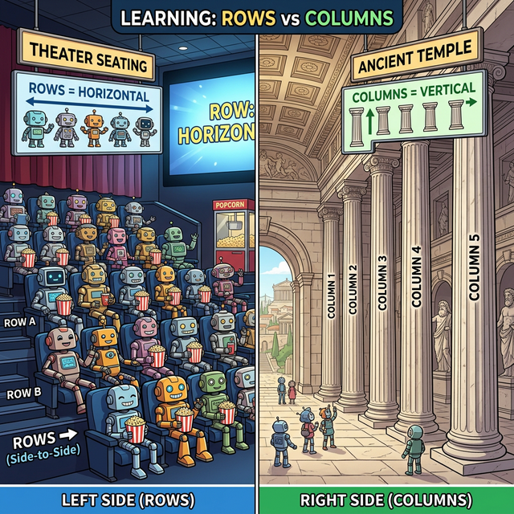

# 1.1 데이터베이스 격자 타일링: 행렬의 구조

## 학습목표
본 장에서는 엑셀 표나 극장 좌석표처럼 일상에서 너무나 당연하게 사용해 왔던 직사각형 데이터 배치가, 파이썬 Numpy 배열의 근간이 되는 **Matrix(행렬)** 구조임을 직관적으로 익힙니다. 수학적 표기법인 행(Row)과 열(Column)의 방향을 절대 헷갈리지 않는 암기법을 배웁니다.

---

## 💡 TL;DR (1분 핵심 요약): 행렬의 구조

1. **행렬 (Matrix)**: 수형도나 텍스트 한 줄이 아니라, 가로와 세로 두 방향(2차원)으로 숫자를 가지런히 정렬해 놓은 직사각형 박스 묶음입니다.
2. **행 (Row, 가로줄)**: 극장에서 나와 옆 사람이 나란히 앉아 있는 "가로" 줄입니다. (왼쪽에서 오른쪽으로)
3. **열 (Column, 세로줄)**: 건물을 받치는 웅장한 기둥(Column)처럼 위에서 아래로 떨어지는 "세로" 줄입니다.
4. **$$m \times n$$ 행렬**: 가로줄이 $$m$$개, 세로 기둥이 $$n$$개 있는 아파트 단지의 크기(Shape)를 의미합니다.

---

## 1. 엑셀 표가 곧 수학의 행렬이다

우리에게 행렬은 사실 전혀 낯선 외계의 개념이 아닙니다. 학교 시간표, 카페의 메뉴판, 주식 창의 시세표, 그리고 직장인들의 영혼이 담긴 **엑셀(Excel)** 스프레드시트 그 자체가 완벽한 수학적 '행렬'입니다.

앞선 챕터에서 방정식을 예쁘게 묶어내기 위해 숫자를 박스 안에 가뒀다고 했죠? 수학자들은 이 박스를 대괄호 `[  ]` 로 감싸서 표현하기로 약속했습니다.

아래는 3명의 학생(A, B, C)이 국어, 영어 점수를 받은 성적표를 행렬로 변신시킨 모습입니다.

**[일상의 표]**

| 학생 | 국어 | 영어 |
| :--- | :--- | :--- |
| A | 90 | 85 |
| B | 70 | 95 |
| C | 80 | 80 |

**[수학자의 스웨그: 행렬 변신!]**

$$
\begin{bmatrix}
90 & 85 \\
70 & 95 \\
80 & 80
\end{bmatrix}
$$

거추장스러운 글씨(학생 이름, 과목명)는 모두 투명망토로 가려버리고, 순수한 '알맹이 데이터(숫자)'만 앙상하게 남겨 놓은 기하학적 형태. 이게 바로 행렬 구조의 본질입니다.

---

## 2. 절대 헷갈리지 않는 마법의 단어: 행(Row)과 열(Column)

행렬을 다룰 때(특히 나중에 파이썬 넘파이 코딩을 할 때) 전 세계 수많은 초보자를 좌절시키는 가장 큰 장벽은, **어느 쪽이 행(가로)이고 어느 쪽이 열(세로)인지 헷갈린다는 것**입니다.

이것만 외우면 평생 헷갈리지 않습니다.

*(웹툰 비유: 거대한 2D 극장 좌석표가 펼쳐져 있습니다. 
[가로 방향(행, Row)] 사람들은 팝콘을 들고 왼쪽에서 오른쪽으로 쭉 나란히 붙어 앉아 가로줄을 쳐다봅니다. "몇 째 줄(행)에 앉으셨나요?"
[세로 방향(열, Column)] 반대편에는 고대 그리스 신전의 우뚝 솟은 거대한 대리석 '기둥(Column)'들이 위에서 아래로 수직으로 박혀서 튼튼하게 건물을 받치고 있습니다.)*

*   **행 (Row)**: 가로줄입니다. 글씨를 쓸 때 왼쪽에서 오른쪽으로 써 내려가는 흐름입니다. (영화관 가로 좌석)
*   **열 (Column)**: 세로줄입니다. 서양 건축물에서 지붕을 위아래로 쾅! 받치고 있는 거대한 대리석 기둥(Column)을 떠올리세요. 수직 방향입니다.

그래서 위 성적표 행렬은 "가로줄이 3개, 세로 기둥이 2개" 서 있으므로 **$$3 \times 2$$ 행렬 (3 by 2 Matrix)** 이라고 부릅니다. 파이썬 Numpy 에서는 이 숫자의 생김새를 `.shape` (모양) 속성으로 똑같이 `(3, 2)` 라고 출력해 줍니다.

---

## 3. 원소(Element)의 지정 주소 (아파트 호수 찾기)

행렬 안의 수많은 숫자들 중 특정 데이터 하나를 딱 집어내려면 어떻게 할까요? 아파트 주소와 똑같습니다. "몇 층인지(가로행)" 먼저 말하고, "몇 호인지(세로열)"를 나중에 말합니다.

보통 행렬의 이름은 대문자 알파벳 **$$A$$** 등으로 멋지게 부르고, 그 안에 사는 꼬마 원소들은 소문자 **$$a$$** 에 구석 번호(밑수)를 달아 부릅니다.

$$
A = \begin{bmatrix}
a_{11} & a_{12} & a_{13} \\
a_{21} & a_{22} & a_{23}
\end{bmatrix}
$$

*   $$a_{23}$$ (에이 이삼): 위에서부터 2번째 층(2행)에 살고, 왼쪽에서부터 3번째 칸(3열)에 사는 원소의 고유 주소입니다. 절대 $$a$$의 23승이나 23번째라는 뜻이 아닙니다!

이 주소 체계(Index)가 곧 파이썬 배열에서 원하는 데이터를 칼같이 슬라이싱(추출)해 내는 핵심 기술로 직결됩니다.

이제 틀을 잡았으니 다음 장에서 이 아파트 단지들을 서로 쾅쾅 충돌시켜 파괴하거나 합체시키는 '연산'의 세계로 진입해 봅시다!
