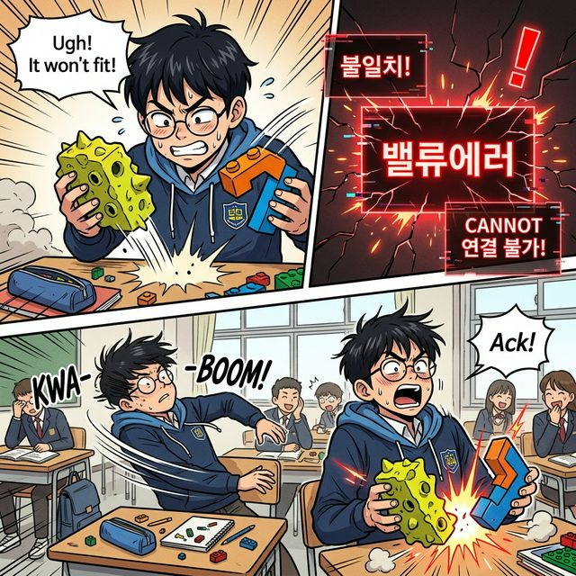

# 4.2.2 같은 픽셀끼리의 병합: 행렬의 덧셈과 뺄셈

## 학습목표
본 장에서는 형태가 똑같은 두 개의 행렬이 서로 만났을 때, 어떻게 융합하고 파괴되는지 알아봅니다. 

파이썬 넘파이 연산의 가장 직관적인 기초 모델을 투명도 셀로판지의 비유를 통해 쉽게 이해합니다.

---

## 💡 TL;DR (1분 핵심 요약): 덧셈과 뺄셈

1. **덧셈과 뺄셈의 절대 원칙 ⚖️**: 행렬의 덧셈과 뺄셈은 형제끼리만 가능합니다. 즉 두 행렬의 **완벽한 크기(Shape)가 100% 동일할 때만** 계산이 허락됩니다.
2. **끼리끼리 연산 (Element-wise) 👬**: 첫 번째 칸은 첫 번째 칸끼리, 마지막 칸은 마지막 칸끼리. 오직 동일한 집 주소(동일한 위치의 원소)에 살고 있는 숫자들끼리만 정직하게 합치고 뺍니다.

---

## 1. 셀로판지 겹치기 (덧셈의 시각화)

행렬의 덧셈은 초등학교 미술 시간에 했던 **투명한 셀로판지 두 장을 겹쳐보는 것**과 완전히 똑같습니다. 

투명판 A에 그려진 왼쪽 위 모서리 그림과 투명판 B에 그려진 왼쪽 위 모서리의 색깔이 딱 겹쳐서 새로운 색을 만들어내듯, 행렬도 정확히 **"같은 자리에 있는 숫자들"끼리 더해줍니다.** 
> 프로그래밍에서는 이를 Element-wise 연산이라고 부릅니다.

$$
A = \begin{bmatrix}
1 & 2 \\
3 & 4
\end{bmatrix}, \quad
B = \begin{bmatrix}
10 & 20 \\
30 & 40
\end{bmatrix}
$$

### 덧셈

이 두 행렬을 더하면 어떻게 될까요? 

위 식에서 1(1행 1열)은 같은 자리의 10과 부딪힙니다.

$$
A + B = \begin{bmatrix}
1 + 10 & 2 + 20 \\
3 + 30 & 4 + 40
\end{bmatrix} = \begin{bmatrix}
11 & 22 \\
33 & 44
\end{bmatrix}
$$

정말 쉽고 직관적이죠? 

뺄셈도 완전히 동일하게 같은 자리끼리 빼면 그만입니다.

> 빛의 마법학원 학생들이 붉은 숫자가 적힌 마법 셀로판지와 푸른 숫자가 적힌 셀로판지를 공중에서 완벽하게 딱 겹쳐보자, 같은 자리에 있던 숫자들이 새로운 보라색의 더 큰 숫자로 변하며 웅장하게 발광하는 아름다운 시각적 묘사

---

## 2. 규격이 맞지 않는 블록의 비극 (ValueError)

만약 아래처럼 레고 블록의 아다리가 맞지 않는, 크기가 다른 두 행렬을 억지로 더하려고 시도한다면 어떻게 될까요?

$$
\begin{bmatrix}
1 & 2 \\
3 & 4
\end{bmatrix} + \begin{bmatrix}
10 \\
20
\end{bmatrix} = ?
$$

오른쪽 행렬에는 2열 자리에 더해줄 숫자가 붕 떠버려서 없습니다. 

### 뺄셈

> 학생이 억지로 이가 맞지 않는 기괴한 모양의 레고 블록(서로 다른 크기의 행렬) 두 개를 강제로 끼워 맞추려고 온 힘을 다해 충돌시키자, 블록들이 부들부들 떨며 날카롭게 거부 반응을 일으키고 공중에 새빨간 'ValueError' 경고 홀로그램이 번쩍 뜨는 재난 상황

짝이 맞지 않으니 수학적으로 **이 계산은 "정의되지 않는다(불가능하다)"** 라고 쿨하게 기각해버립니다.

상남자 파이썬 구조인 Numpy에 이 계산을 시도하면 가차 없이 치명적인 붉은색 에러 메시지를 뿜어냅니다.
`ValueError: operands could not be broadcast together with shapes (2,2) (2,1)`

> 나중에 넘파이 심화과정에서, 이 불가능한 연산을 마법처럼 가능하게 만들어버리는 은총인 '브로드캐스팅(Broadcasting)' 기술을 배우게 되니 지금은 상식적인 선언만 기억해 둡니다.

---

## 3. 디지털 이미지 센서의 픽셀 병합 원리

우리가 스마트폰으로 HDR(명암 최적화) 사진을 찰칵 찍을 때, 내부에서는 미친 듯한 속도로 이 행렬의 덧셈이 일어납니다.

핸드폰 카메라는 찰나의 순간에 세 장의 사진을 연속으로 찍습니다.
1. 매우 어둡게 찍힌 사진 픽셀 배열 행렬 (A)
2. 중간 밝기로 찍힌 사진 픽셀 배열 행렬 (B)
3. 매우 밝게 찍힌 사진 픽셀 배열 행렬 (C)

우리의 사진은 1920 x 1080 크기의 거대한 픽셀(숫자) 점들로 이루어진 거대한 행렬 덩어리입니다. 

스마트폰의 내장 그래픽 코어는 이 거대한 세 개의 형태가 똑같은 행렬들을 순식간에 `A + B + C` 로 각 픽셀 자리별로 덧셈 병합하여, 우리가 육안으로 보는 가장 완벽한 한 장의 아름다운 최종 사진 출력물(Result Matrix)로 모니터에 뿌려주는 것입니다.

> 스마트폰 내부 렌즈의 코어에서, 선글라스를 낀 아주 쿨한 AI 디자인 로봇 시스템이 너무 어두운 행렬판과 너무 밝은 행렬판 3개를 빠른 속도로 강하게 겹쳐 압축 기계로 꽉 짓누르자마자, 완벽한 궁극의 초고화질 예쁜 HDR 결과 사진(Matrix) 하나가 쏙 하고 뽑혀 무지개빛을 뿜는 화려한 아트

행렬의 덧셈은 이토록 강력하고 병렬적인 힘을 지니고 있습니다.
