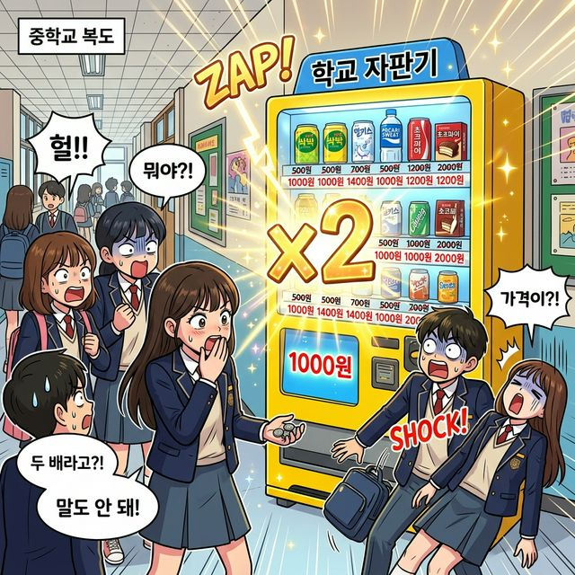
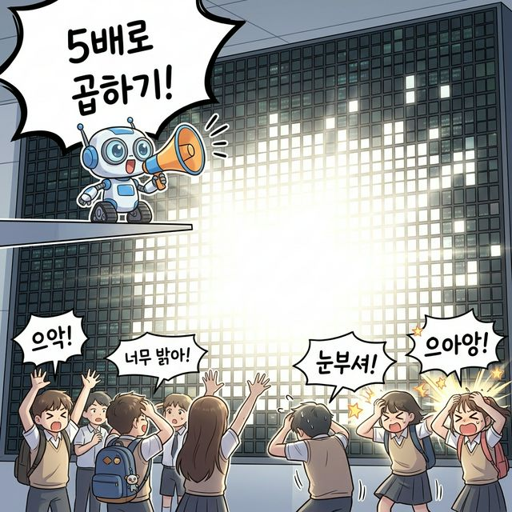

# 1.3 행렬의 실수배 (스칼라 곱)

## 학습목표
본 장에서는 공간 전체를 일괄 축소하거나 확대시키는 일명 `스칼라(Scalar)`의 개념을 배웁니다. 

행렬 덩어리에 단순 숫자 하나를 던졌을 때 어떤 폭발적인 화면 스케일 변화가 일어나는지 직관적인 비유로 깨우칩니다.

---

## 💡 TL;DR (1분 핵심 요약): 실수배

1. **스칼라 (Scalar) 📏**: 방향은 없고, 단순히 덩치를 키우는 '크기'만을 가진 `숫자`를 말합니다. (예: $2$배, $-0.5$배, $100$ 등 단순 숫자)
2. **전체 버프 마법 ⚡**: 거대한 행렬 앞마당에 스칼라 상수 $k$배를 곱해주면, 괄호 안의 일부 요소만 커지는 게 아니라 **모든 방에 살고 있는 모든 숫자가 빠짐없이 평등하게 $k$배만큼 일괄 스케일 아웃(팝업)** 해버립니다.

---

## 1. 500원짜리 자판기 음료의 일괄 인상 

세상에서 가장 쉬운 스칼라 곱셈(실수배)을 상상해 볼까요? 

편의점에 진열된 수많은 상품의 가격표가 적힌 행렬 데이터가 있다고 가정해 봅시다.

$$
A (\text{음료 행렬}) = \begin{bmatrix}
 콜라: 1000 & 사이다: 800 \\
 쥬스: 1200 & 생수: 500
\end{bmatrix}
$$

그런데 전 세계적인 엄청난 인플레이션이 터쳐서 편의점 본사에서 "우리가 파는 모든 음료수 가격을 당장 **2배**로 올려!"라는 무전이 내려왔습니다. 

> 평범한 중학교 매점 자판기에 어느 날 갑자기 하늘에서 내려온 마법의 빛나는 스칼라 곱빼기 간판 'x2'가 자판기를 정통으로 쾅 때립니다. 그러자 내부에 진열된 콜라, 사이다, 물 등 모든 캔 음료 아래의 액정 가격표 숫자들이 동시에 일제히 번쩍이며 1000원, 1600원, 2400원으로 폭등하고, 음료를 뽑으려던 중학생들이 턱이 빠지도록 놀라 입을 쩍 벌리고 있는 대폭소 상황

## 2. 스칼라 곱의 원리
이때 이 무전에 담긴 거대한 힘인 딱 하나의 숫자 **$2$** 가 바로 **스칼라(Scalar)** 입니다.

행렬 덩어리 밖에 무심하게 던져진 숫자 2가 괄호 안으로 흡수되는 순간, 소속되어 있던 모든 숫자에 차별 없이 사정없이 곱해집니다.

$$
2A = 2 \times \begin{bmatrix}
 1000 & 800 \\
 1200 & 500
\end{bmatrix}
= \begin{bmatrix}
 2000 & 1600 \\
 2400 & 1000
\end{bmatrix}
$$

방 안의 모든 데이터가 한순간에 동시에 펑! 

하고 몸집을 불리는 이 강력한 현상을 행렬의 기본 실수배라고 부릅니다. 

> **[애니메이션] 행렬 밖에 있던 숫자 2(스칼라)가 4개의 복제 미사일이 되어 행렬 내부의 모든 원소 방으로 개별 침투, 동시에 2배로 폭증시키는 강력한 분배 마법!**

---

## 3. 모니터 해상도 조정과 픽셀 조명 버프

이 행렬 실수배 마법은 여러분이 지금 보고 있는 모니터 안에서도 수백 번씩 일어나고 있습니다.

우리가 포토샵이나 라이트룸으로 사진을 편집할 때 **"전체 화면 밝기 조절"** 슬라이더를 위 오른쪽으로 드래그하는 순간 그래픽카드(GPU)는 무엇을 할까요?

> 거대한 방을 가득 채운 어두컴컴한 픽셀 모니터 격자 창문들(행렬) 앞에 작은 확성기 로봇(스칼라)이 섭니다. 로봇이 "야! 너희들 전부 출력 5배 곱빼기로 당장 올려!"라고 호통치자, 수만 개의 모든 모니터 픽셀들이 미친 듯이 동시에 전력을 흡수하며 5배 이상 눈을 멀게 할 만큼 강력한 눈뽕 빛을 일제히 작렬시키는 강렬한 컷씬

화면 픽셀(행렬 원소) 각각이 가지고 있는 고유한 빛 방출 수치 데이터에 전체 비율인 스칼라(예: $1.5$배)를 때려 박아주는 것입니다. 

일일이 하나씩 접근하는 루프문이었다면 화면이 뚝뚝 끊기면서 로딩됐겠지만, 전체를 묶은 행렬에 스칼라 하나를 던짐으로써 우리는 **동시 병렬 처리의 축복**을 받으며 리얼타임 부드러운 그래픽을 만끽하게 됩니다.

---

## 4. 마이너스의 세계 (방향 꺾기)

덩치를 키우는 것만 실수배가 아닙니다. 

만약 그 숫자에 앙칼진 음수 기호 마이너스($-$)가 붙어 있다면 마법의 성질이 완전히 반전됩니다.

$$
-1 \times \begin{bmatrix}
 2 & -5 \\
 3 & 4
\end{bmatrix}
= \begin{bmatrix}
 -2 & 5 \\
 -3 & -4
\end{bmatrix}
$$

모든 수치의 부호가 뒤집혔습니다. 

이것은 나중에 벡터와 그래픽 물리를 배울 때, 오른쪽으로 100km/h 로 날아가던 우주선을 **"정반대 방향(180도)"**으로 강제로 완전히 방향성을 꺾어버리는 엄청난 반전 스펠의 기초 토대가 됩니다. 

> 엄청난 속도로 우측(+) 방향으로 시원하게 활공하던 우주선 장난감 패널. 갑자기 뒤에서 검붉은 마력을 내뿜는 거대한 '-1 마법 지팡이'가 우주선의 뒷통수를 가차 없이 강타해, 가던 우주선이 180도 강제로 방향을 틀며 어지럽고 코믹하게 뒤집히는 다이내믹한 좌충우돌 액션 씬

여태까지 배운 각자 자리끼리 더하는 '덧셈'과, 모든 덩치를 동시에 팝업 시키는 단순 '실수배'는 중학생 수준 직관에 매우 부합했습니다. 

하지만 수학자들이 발명한 **'행렬의 곱셈(행렬과 행렬의 충돌)'**은, 처음 만난 사람의 뇌를 한 방 쳐버릴 정도로 기괴한 내적 규칙을 가집니다. 이제 그 미스터리를 해부하러 가보겠습니다.
