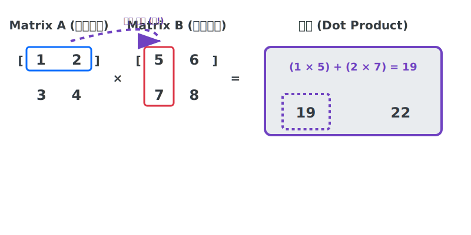

# 1.4 내적(Dot) 충돌 데미지 매트릭스: 행렬 곱셈의 미스터리

## 학습목표
가장 직관을 파괴하는 기괴한 연산인 '행렬의 곱셈(Matrix Multiplication)' 규칙이 사실은 방정식에 다른 방정식을 대입하는 중학생 다항식 논리에서 유래했음을 비유로 해부합니다. 앞 덩어리의 '행(가로)'과 뒷 덩어리의 '열(세로)'이 격돌하며(내적 충돌) 하나의 숫자로 압축폭발하는 매커니즘을 배웁니다.

---

## 💡 TL;DR (1분 핵심 요약): 행렬의 덧셈과 곱셈 차이

1. **상식 파괴의 곱셈 🤯**: 행렬의 곱셈은 덧셈처럼 같은 자리끼리 정직하게 곱하는 얌전한 방식이 절대로 아닙니다.
2. **가로와 세로의 헤드온 충돌 (Dot Product) ⚔️**: **앞 행렬의 가로줄(행, Row)**과 **뒤 행렬의 세로줄(열, Column)**이 통째로 부딪히며, 성분끼리 각각 곱해진 뒤 하나의 거대한 **"합(Sum)"**으로 폭발해 칸 하나를 차지합니다.
3. **아다리가 맞아야 충돌 가능 🧩**: 앞 파이터의 팔 길이(열 갯수)와 뒷 파이터의 키(행 갯수)가 **반드시 똑같아야만** 이 무시무시한 충돌 곱셈이 승인됩니다.

---

## 1. 대체 왜 행렬 곱셈은 이토록 변태적인 걸까?

대부분의 초보자가 선형대수학 첫 장을 펼쳤을 때 절망하는 지점이 행렬 곱셈입니다. 
"아니, 그냥 숫자 1, 2, 3이랑 똑같은 자리에 있는 10, 20, 30 끼리 곱하면 안돼?!"

왜 앞 배열의 (가로) 전체가 뒤 배열의 (세로) 전체를 덮치면서 막 각자 곱해서 더하는 이런 미친 짓(이하 내적, Dot Product)을 할까요? 이건 행렬이 태어난 **"방정식 대입의 고향"**을 들여다봐야만 한이 풀립니다.

중학교 때 배운 다항식 대입 수사를 펼쳐보죠.
우리에겐 식 2개가 있습니다.
1. `y = 2a + 3b`
2. `z = 4y + 5`

만약 이 `y`의 덩어리를 두 번째 식의 `y` 자리에 강제로 찔러 넣으면(대입하면) 어떻게 풀리죠?
`z = 4(2a + 3b) + 5`
`z = 8a + 12b + 5`

바로 이겁니다. 앞선 식의 계수들(2와 3)이 뒷 식의 계수(4)와 차례로 부딪히며 **분배되어 곱해지고 더해지는** 이 "수식 압축 충돌 과정"을 빈틈없이 수행하기 위해 만들어진 설계도가 바로 행렬의 곱셈 규칙인 것입니다.

---

## 2. 십자수 충돌(헤드온)의 렌더링

앞에 선 `A` 행렬은 **가로본능(Row)**입니다.
뒤에 선 `B` 행렬은 **세로본능(Column)**입니다.

$$
A = \begin{bmatrix}
1 & 2 \\
3 & 4
\end{bmatrix}, \quad
B = \begin{bmatrix}
5 & 6 \\
7 & 8
\end{bmatrix}
$$

`A`의 1층 가로줄 `[1,  2]` 가 미사일처럼 발사되어서, `B`의 1호 라인 세로 기둥 `[5, 7]` 에 그대로 꽂힙니다!
*   첫 번째끼리 쾅! $$1 \times 5 = 5$$
*   두 번째끼리 쾅! $$2 \times 7 = 14$$
*   이 둘이 폭발해서 더해지며 한 줌의 재(단일 숫자)가 됩니다. $$5 + 14 = \mathbf{19}$$

이 **19** 라는 숫자가 최종 결과 맵의 1층 1호 방에 당당하게 입주하는 것입니다. 이 미친 융단 폭격을 가로/세로 매칭하여 모든 창문에 쏴대면 곱셈 연산이 끝납니다.

*(SVG 다이어그램: 왼쪽 행렬의 가로줄(파란색 하이라이트 지시 화살표)이 오른쪽 행렬의 세로줄(빨간색 하이라이트 화살표)을 향해 미사일처럼 돌진하고, 두 블록이 격돌하면서 톱니바퀴 연산장(Σ)을 거쳐 1개의 보라색 스칼라 수치로 합쳐져 결과판에 꽂히는 역동적인 시뮬레이션 과정)*

---

## 3. 조건: 아다리가 무조건 맞아야 한다 (모양의 규격)

덧셈은 똑닮은 쌍둥이끼리만 더할 수 있었습니다.
곱셈은 앞 놈과 뒷 놈이 모양이 전혀 다르게 생겨도 상관없이 충돌할 수 있습니다. 단 **규격 한 가지**만 목숨처럼 지켜야 합니다.

**앞 행렬의 폭(열의 수) == 뒤 행렬의 높이(행의 수)**

앞놈 가로 로켓이 3개의 엔진(요소 3개, 길이가 3)을 가지고 있다면, 부딪히는 놈의 세로 기둥도 높이가 정확히 3(요소가 3개)칸이어야 톱니가 1:1로 정확하게 맞물려 들어갑니다.

$$
(M \times \mathbf{K}) \times (\mathbf{K} \times N) = M \times N (\text{새로운 결과 맵 탄생})
$$

이 복잡하고 골치 아픈 충돌 곱셈 계산을 Numpy 파이썬 엔진은 단 한 줄, `@` (앳) 기호나 `np.dot()` 함수 한 방으로 0.001초만에 박살 내버립니다. 우리는 그저 수학적 구조가 '내적 충돌'이라는 본질만 느끼면 됩니다. 이 거친 충돌이 만들어내는 놀라운 시공간 왜곡이 바로 이어지는 단원의 주인공, 벡터 선형 변환입니다.
