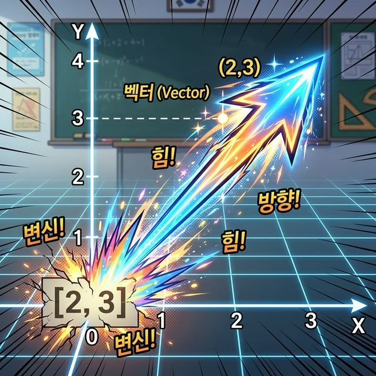
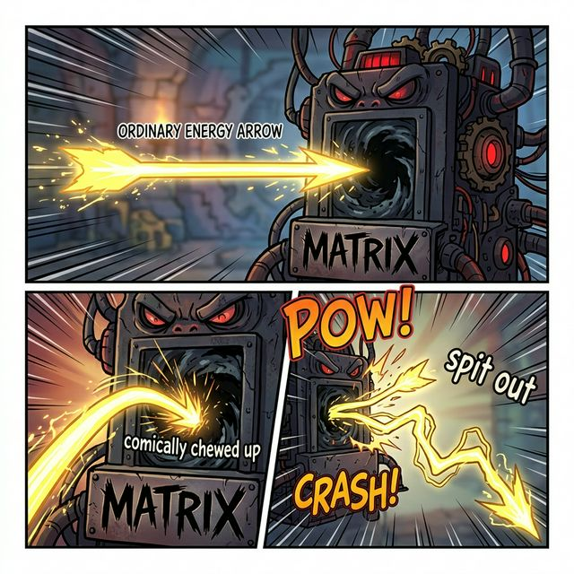
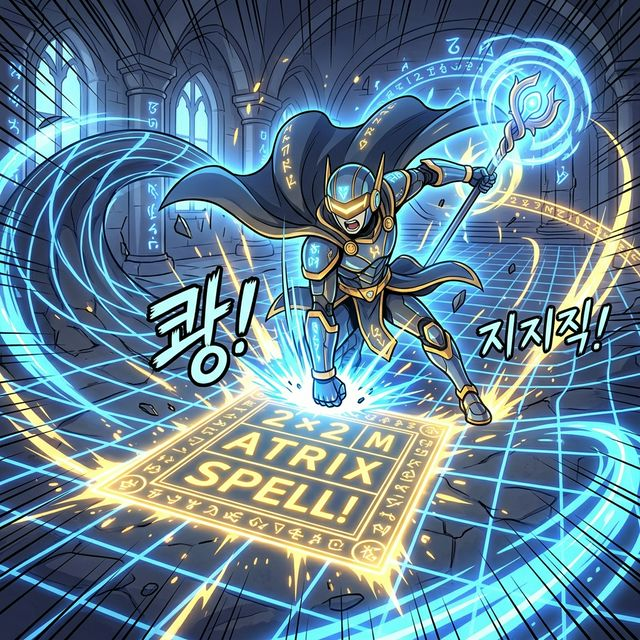

# 1.5 시공간을 비틀어라! 선형 변환 (Linear Transformation)

## 학습목표
숫자들이 갇힌 감옥(행렬)이 어떻게 "방향성을 지닌 화살표 빔(벡터, Vector)"과 결합하여 물리적 모니터 공간이나 게임 세계 전체를 돌리고, 늘리고, 찌그러뜨리는 '물리/그래픽 변환 엔진'으로 돌변하는지 시각적으로 이해합니다.

---

## 💡 TL;DR (1분 핵심 요약): 행렬 × 벡터 = 변환

1. **벡터(화살표) 🏹**: 스칼라가 그냥 고정된 점이나 덩치라면, 벡터는 "(0, 0) 원점에서 특정 좌표(x, y)를 향해 쫙! 뻗어나가는 힘과 방향을 가진 화살표"입니다.
2. **행렬은 함수(기계)다 ⚙️**: 우직한 벡터 화살표를 행렬 곱셈 기계에 집어넣으면, 기계가 덜컹거린 뒤 **"전혀 다른 방향과 길이로 왜곡된 새로운 화살표"**를 뱉어냅니다.
3. **선형 변환 (Linear Transformation) 🌀**: 즉, 공간 위의 모든 픽셀 좌표(터치포인트)들에 특정 행렬을 싹 다 곱해버리면, 화면 전체가 90도 회전하거나 대각선으로 찌그러지는 그래픽 마법이 발동합니다.

> **[돌아보기]** 화살표(벡터)의 꼬리 물기 덧셈이나 물리적인 힘에 대해 더 파보고 싶다면 언제든 [벡터 (Arrows in Space)](/math_story/53_vectors/) 파트를 되새겨 보세요.

---

## 1. 정직한 화살표 군단, 벡터(Vector)

우리가 앞서 본 `[2, 3]` 과 같은 1차원 데이터들, 즉 한 줄로 쭉 서 있는 배열을 수학자와 Numpy 개발자들은 **벡터(Vector)**라고 부릅니다. 

방정식에서는 그저 과일장수의 사과 개수에 불과했지만, 2차원(x, y) 기하학 평면에 이 숫자를 떨어뜨리는 순간 `[2, 3]`이라는 데이터는 "(0, 0) 중심에서 시작해 (2, 3)을 향해 창 끝을 날카롭게 뽑으며 날아가는 힘의 화살표"로 부활합니다.

> 바닥에 무기력하게 적혀 있던 지루하고 딱딱한 텍스트 배열 `[2, 3]`이 갑자기 각성하더니, (0,0) 원점을 박차고 화려한 네온 에너지를 뿜어내는 날카롭고 강력한 화살표(벡터)로 변신하여 허공을 뚫고 날아오르는 멋진 컷

게임 화면에 존재하는 무수히 많은 지점(캐릭터 중심점 등)은 모두 이 화살표 좌표 하나하나에 묶여 있습니다.

---

## 2. 행렬 (Matrix) = 파괴적인 물리 변환 기계

그렇다면, 이 우직한 벡터(화살표) `[1, 1]` 옆에 음침한 **행렬 `[2x2]`** 를 살며시 곱해주면 어떤 짓이 벌어질까요?

앞 단원에서 배운 '기괴한 십자수 내적 충돌'이 여지없이 발동합니다.

$$
\text{행렬} \begin{bmatrix}
2 & 0 \\
0 & 3
\end{bmatrix}
\times 
\text{벡터 화살표} \begin{bmatrix}
1 \\ 1
\end{bmatrix}
= \text{돌연변이} \begin{bmatrix}
2 \times 1 + 0 \times 1 \\
0 \times 1 + 3 \times 1
\end{bmatrix}
= \begin{bmatrix}
2 \\ 3
\end{bmatrix}
$$

원래 $x$축 우상단(1, 1)으로 조신하게 날아가던 화살표가 행렬의 충돌 공격을 받고 나자, $y$축 방향 위쪽으로 훌쩍 키가 커버린 (2, 3) 향의 **돌연변이 화살표로 강제 변환** 되어버렸습니다!

> 평범한 일직선 에너지 화살표가 'Matrix'라는 간판이 붙은 어둡고 무서운 괴물 기계 통과구 안으로 쏘옥 들어가더니, 기계가 우적우적 씹는 소리를 낸 뒤 전혀 다른 각도로 심하게 꺾이고 기괴하게 길쭉해진 돌연변이 화살표를 퉤! 하고 뱉어내는 코믹 씬

이처럼 행렬을 무작정 곱해준다는 것은, 평온하던 좌표 평면 격자의 살들을 쥐어짜서 **'위아래로 확 잡아 늘리는 짓(크기 변환)'** 이었음을 증명한 것입니다.

---

## 3. 회전과 찌그러짐 렌더링 (마법진 스펠)

늘리는 것뿐일까요? 마법진 역할을 하는 행렬의 숫자(계수)들을 음수나 코사인(Cosine/Sine) 각도로 교묘하게 비틀어 주면, 컴퓨터 화면(공간) 전체가 거대한 구심점을 향해 **빙글빙글 회전(Rotation)하거나, 대각선으로 찌그러지며 쓰러지는(Shear)** 환각 효과를 만들어낼 수 있습니다.

> 평온한 바둑판 격자 타일 위에 멋진 사이보그 마법사가 강림해 `2x2 행렬 마법진`을 바닥에 쾅! 내리찍습니다. 타격 순간, 모범적이던 격자 전체가 마치 말랑한 고무처럼 대각선으로 심하게 찌그러지고 소용돌이치듯 빙글 돌며 시공간이 처참하게 왜곡되는 압도적 스펠 시전 장면

3D 게임 엔진 최적화 전문가라면, 매 프레임마다 캐릭터가 뛰고 회전하고 팔을 흔들 때 그 관절 폴리곤들의 수십만 개 벡터 좌표에 이런 특수 행렬 스펠 마법진 쪼가리를 미친 듯이 연발 융단 폭격(곱셈)하여 실시간 화면을 렌더링하고 있는 것입니다.

이 무지막지한 수백 수천만 개의 찌그러뜨림 수학을 쥐어짜다 지친 인류가 결국 어떤 결단을 내렸고 파이썬이 어떻게 응수하는지, 이 대서사시의 최종 장에서 마주해 봅시다.
