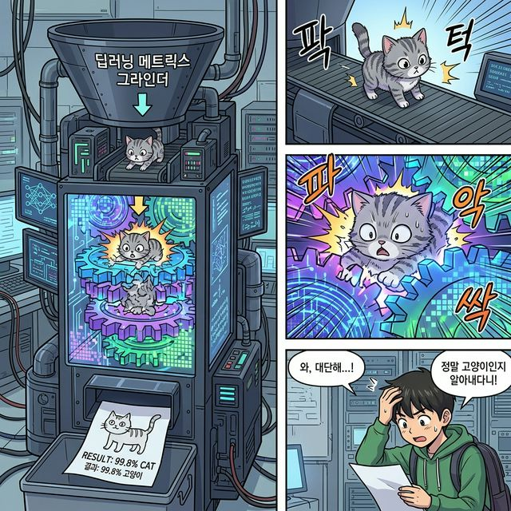
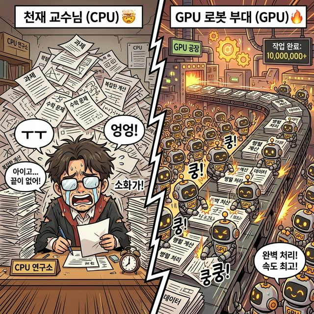

# 1.6 마지막 승부: 왜 AI와 GPU는 행렬에 미쳐있는가 (그리고 Numpy 접속)

## 학습목표
수백만 개의 변수(방정식)와 픽셀 변환(선형변환)이 충돌하는 AI와 딥러닝의 폭발적인 연산 세계에서, 왜 CPU가 아닌 거대 그래픽 카드(GPU) 공장이 필요한지 비유를 통해 체화합니다. 그리고 그 무지막지한 공장을 단돈 몇 줄짜리 코드로 가동시키는 위대한 라이브러리 **파이썬 내장 Numpy(넘파이)** 세계로 접속할 준비를 마칩니다.

---

## 💡 TL;DR (1분 핵심 요약): Numpy의 철학

1. **지능을 만들려면 행렬 폭격이 필요하다 🧠**: AI 딥러닝 봇의 거대한 뇌세포 신경망(가중치 데이터블록)은 엄청난 덩치의 수많은 행렬 뭉치(Tensor)로 이루어져 있습니다.
2. **CPU의 절망 vs GPU 공장장 🏭**: 똑똑하지만 한 번에 하나씩만 계산하는 똑똑박사(CPU CPU)보다, 조금 멍청하더라도 수천천 명의 노동자가 한꺼번에 덧셈/일괄곱셈 도장을 찍어버리는 단순 반복 거대 공장(GPU) 체재가 행렬 폭격 연산에 미치도록 최적화되어 있습니다.
3. **Numpy: 거인 조종기 파이썬 패키지 🐍**: 이 복잡한 수만 차원의 그리드 배열(다차원 Array)을 손쉽게 주무르고 절단하며, 강력한 `C 언어` 코어 엔진으로 광속 연산을 토해내는 파이썬의 표준 무기가 곧 넘파이입니다.

---

## 1. 딥러닝 신경망 (수만 개의 행렬 그라인더)

현대 인공지능(초거대 챗봇 언어모델, 자율주행 시각 렌더링)의 뇌를 한마디로 요약하면 어떻게 생겼을까요? 바로 고기 다지는 기계, **'거대한 다중 행렬 분쇄기 구조'** 입니다.

여러분이 그린 어떤 고양이 사진 (1000 x 1000 픽셀 = 즉 100만 행렬) 이 이 뇌구조 입구에 들어갑니다.
*   **첫 번째 뇌 가중치 행렬층 쾅!** : 100만 개의 변수에 무시무시한 내적 곱셈 스펠로 공간 왜곡 폭격
*   **두 번째 뇌 가중치 행렬층 쾅!** : 찌그러진 공간에 또 곱셈
*   (이걸 수백 번 반복하는 심층 신경망)
*   **결과값 출력:** "...야옹! 이 돌연변이 그림은 고양이일 확률이 99.8%네."

*(웹툰 비유: 거대하고 무시무시한 톱니바퀴가 얽힌 '딥러닝 행렬 그라인더' 기계 위로 귀여운 그림이 쏙 들어갑니다. 기계가 번쩍이며 그림을 사정없이 으깨고 찌그러뜨린 뒤, 밑구멍으로 덜컥 하고 "99.8% 확률: 고양이" 라고 찍힌 영수증 종이 한 장을 쿨하게 뱉어내는 씬)*

AI 모델의 수천억 개 파라미터라는 것은 전부, 이 각 단계를 통과할 때마다 화면을 얼마만큼 회전시키고 왜곡시킬지(선형 변환 스펠의 강도)를 담은 무수한 숫자(계수)들의 묶음, 즉 "텐서 행렬(Tensor Matrix)" 덩어리에 다름 아닙니다.

---

## 2. 천 명의 바보와 한 명의 똑똑박사 (CPU vs GPU 비유)

이렇게 미치도록 행렬 덩어리를 더하고 곱해대야 하는데, 우리 가여운 데스크탑의 두뇌 CPU (Central Processing Unit)는 고통받습니다.
CPU는 엄청나게 논리적이고 뛰어난 천재 박사(8코어, 즉 8명)지만, 행렬 안에 있는 수백만 번의 반복 노가다성 더하기/곱하기를 이 8명이 순차적으로 처리하려니 날이 샙니다. (for 문 100만 번 충돌)

*(웹툰 비유: 화면이 정확히 반으로 나뉩니다. [좌측 CPU] 안경을 쓴 고지식한 초우주 천재 박사 한 명이 에베레스트 산처럼 쌓인 행렬 서류에 깔려 피눈물을 흘립니다. [우측 GPU] 거대한 초고속 컨베이어 벨트 라인에 작고 멍청하지만 힘은 넘치는 쌍둥이 미니언 로봇 수천 마리가 달라붙어, 무한히 쏟아지는 서류들에 동시에 일제히 결재 도장을 쾅쾅쾅! 찍어버리는 무자비한 병렬 노동 공장 씬)*

그래픽 카드 연산 코어인 GPU(Graphics Processing Unit)는 수천, 수만 개의 바보 로봇 칩으로 구성되어 있습니다. 복잡한 논리 분기(방탈출 로직)는 못 풀지만, 화면 수만 개 픽셀에 똑같이 들어가는 **단순 병렬 행렬 연산(스칼라 분배, 십자수 내적)에는 한 방에 동시 타격(동시 렌더링)하는 미친 폭발력**을 자랑합니다. 그 때문에 현재 AI 시대의 심장으로 GPU 폭주가 일어난 것입니다.

---

## 3. 그리고 파이썬 넘파이 (Numpy Array 접속)

마지막 결론입니다.

그럼 우리는 수학자들마냥 종이 노트를 펼쳐놓고 그 망할 십자수 `for` 루프 행렬식을 매일 풀어야 할까요? GPU한테 알아들을 수 없는 어셈블리어로 일일이 "이 픽셀 저 픽셀 더해라" 코딩을 해야 할까요?

그 중간 장벽을 완벽하게 밀어버리고, **프로그래머(당신)에게 인간의 언어로 된 조종석을 선물해 준 위대한 파이썬 코어 시스템.**
이것이 바로 이어지는 단원부터 여러분이 끝까지 파헤치고 씹어먹을 패키지, **Numpy (넘파이)** 입니다.

수만 차원(Tensor)의 숫자 아파트 단지를 순식간에 통째로 만들고(`.zeros`, `.ones`), 아파트 구조 기둥을 칼로 자르듯 슬라이싱하고(`[:]`), 그 어마어마한 아파트 두 채를 공중에 집어던져 단 1줄 기호 충돌(`.dot()`, `@`)로 폭격 압축시켜 버리는 압도적 고속 연산의 세계.

*(웹툰 비유: 후드를 푹 눌러쓴 쿨한 천재 해커 학생이 어두운 방에서 노트북의 빛나는 `Numpy` 엔터키 하나를 까딱! 하고 누릅니다. 그 순간, 창밖으로 거대하고 무식했던 숫자(Matrix) 빌딩들이 번개 마법에 맞은 듯 순식간에 허물어지고 새로운 최첨단 텐서(Tensor) 타워들로 초고속 재건축되는 마법 같은 사이버펑크 씬)*

수학이야기라는 긴 터널을 지나, 이제 진짜 파이썬 데이터 과학의 베이스캠프인 Numpy의 기초 배열 객체(ndarray) 사용 설명서(Chap 02)로 당당히 접속하시기 바랍니다!
