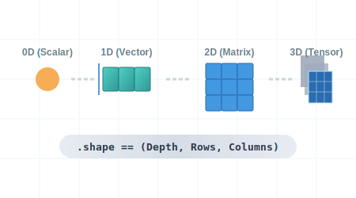

# 4.3.1 넘파이 기초와 벡터/행렬의 이해


## 1. 수학적 의미: 차원(Dimension)이란 무엇인가?
앞선 2장에서 우리는 변수가 폭발하는 연립방정식을 통제하기 위해 '행렬(Matrix)'이라는 숫자 타일 덩어리를 고안했습니다. 


> 점, 선, 면, 입체로 확장되는 ndarray 차원 진화


## 2. 차원의 등급
이를 수학적 차원(Dimension) 공간과 연결해 보면, 형태에 따라 크게 4가지 등급으로 분류됩니다.


> 어두운 공간에서 찬란하게 빛오르는 수학의 기초 조각들. 단 하나의 빛나는 점(0D 스칼라) 옆으로 매끈하고 긴 미래지향적 기차(1D 벡터)가 달리고, 그 뒤로 평평한 빛의 격자판(2D 행렬)이 펼쳐지며, 마지막으로 공중에 떠서 찬란하게 회전하는 마법의 루빅스 큐브(3D 텐서)가 시선을 사로잡는 진화의 컷

- **스칼라 (0D Tensor)**: 방향이 없는 단 하나의 점, 숫자입니다. (비유: `HP = 100`, 통장 잔고 1개)
- **벡터 (1D Tensor)**: 숫자들이 한 줄로 길게 늘어선 1차원 선분입니다. (비유: 일렬로 늘어선 기차, `[국, 영, 수]`)
- **행렬 (2D Tensor)**: 직사각형 표처럼 가로, 세로 2개의 축(행과 열)을 가진 평면 배열입니다. (비유: 엑셀 스프레드시트, 단일 흑백 이미지)
- **고차원 텐서 (3D+ Tensor)**: 행렬이 여러 장 겹쳐 입체가 된 덩어리 축입니다. (비유: 루빅스 큐브, 빛의 삼원색 RGB가 겹친 컬러 이미지)

## 3. 수기 계산 시뮬레이션: 파이썬 리스트의 한계
당신이 과일 상인이고 오늘 사과 3개 각각의 가격(100원, 200원, 300원)에 물가 상승률 10%를 모두 올려받고 싶다고 가정해 봅시다.

일반적인 수학 수기 노트였다면 괄호를 치고 밖에서 `1.1`을 곱해버리면 끝납니다. 즉, $$1.1 \times [100, 200, 300]$$.

하지만 기본 파이썬 리스트로 이 수학 계산을 시도하면 어떻게 될까요?


> 다 쓰러져가는 엄청나게 느린 거북이 자동차(for-loop)에 올라탄 학생이 피눈물을 흘리면서, 산더미처럼 쌓여 있는 사과(리스트 원소) 하나하나에 'x1.1' 가격표 스티커를 일일이 수작업으로 붙이고 있는 끔찍하게 피곤한 노가다 장면

### 리스트에 바로 곱셈 시도
`[100, 200, 300] * 1.1` 은 파이썬 에러를 발생시킵니다. 

```python
prices = [100, 200, 300]
new_prices = prices * 1.1
print(new_prices)
```

어쩔 수 없이 `for` 문을 돌리며 승용차를 3번 탑승해 각각 수치를 곱하고 빈 리스트에 `append` 해야 합니다. 원소가 100만 개라면 자동차는 메모리 주소를 100만 번 찾아 헤매다 퍼져버립니다.


## 4. Numpy 강림: 다차원 배열(ndarray) 컨테이너 트럭
바로 이때 데이터 과학의 핵심 엔진인 **Numpy(Numerical Python)**가 강림합니다. 


> 화면을 꽉 채울 듯 웅장하고 매끈하게 빠진 SF 느낌의 거대 'Numpy 트럭'이 도열해 있습니다. 트럭 안에 질서정연하게 줄춰선 사과 수천 개 위로, 천장의 거대한 강철 로봇 파워 암이 내려와 'x1.1' 도장을 쾅! 하고 단 한 번에 일괄 폭격(Vectorization)으로 찍어버리는 통쾌하고 폭발적인 장면

Numpy 제공하는 핵심 타입인 `ndarray`(N-Dimensional Array)는 오직 "규격화된 화물형 숫자"만 싣고 다니는 **대형 컨테이너 트럭**입니다. 

데이터가 메모리에 빈틈없이 일렬로 연속(Contiguous) 배치되어 있기 때문에, 방금 전 사과 가격 인상 문제 같은 것을 CPU가 순식간에 **한 번의 덧셈/곱셈 폭격(Vectorization)**으로 전멸시켜 버립니다. 

### 벡터화 연산(Vectorization)
루프(`for`문)가 필요 없는 세계에 오신 것입니다.

```python
import numpy as np

# 파이썬 리스트를 넣으면, 강력한 연속 메모리 ndarray 기체로 조립됩니다.
prices = np.array([100, 200, 300]) 
print("타입:", type(prices)) 

# 1.1배 상수(스칼라) 곱셈 한 방 폭격! for 루프가 필요없습니다.
new_prices = prices * 1.1
print("인상된 가격:", new_prices)
```


## 5. 실전 파이썬 예제
코드를 통해 직접 확인해 봅니다. Numpy를 불러와 1차원 벡터 기차를 만들고, 수학 공식을 통째로 던져보겠습니다.


> 어두운 방에서 눈이 파랗게 빛나는 천재 중학생 느낌의 해커가 자신감 넘치는 썩소를 지으며 마법 기계식 키보드의 '엔터(Enter)'를 경쾌하게 누릅니다. 그러자 모니터에서 엄청난 파워의 레이저 충격파가 뿜어져 나오며 몰려오던 수만 마리의 골치 아픈 수학 문제 몬스터들을 단 일격에 증발시켜 버리는 짜릿한 컷

```python
import numpy as np

# 파이썬 리스트를 넣으면, 강력한 연속 메모리 ndarray 기체로 조립됩니다.
prices = np.array([100, 200, 300]) 
print("타입:", type(prices)) 

# 1.1배 상수(스칼라) 곱셈 한 방 폭격! for 루프가 필요없습니다.
new_prices = prices * 1.1
print("인상된 가격:", new_prices)
```


> 브로드캐스팅(Broadcasting)을 통한 강력한 일괄 연산 처리 과정

**출력:**
```text
타입: <class 'numpy.ndarray'>
인상된 가격: [110. 220. 330.]
```
