# 4.3.2 다차원 배열 자료형 ndarray

`numpy`에서 가장 많이 다루는 대표적인 자료형은 `ndarray`입니다. 용어의 `n`은 다차원(n-dimensional)을 의미하며, `array`는 배열을 뜻합니다. 


## 1. ndarray 의미
> **💡 array의 단어적 의미:**
> 영단어 'array'는 본래 군대나 물건 등을 '정돈하여 가지런히 배열하다, 진열하다'라는 뜻을 가집니다. 프로그래밍과 데이터 과학에서는 수많은 데이터(숫자)들을 마치 바둑판이나 서랍장 칸칸이 일정한 규칙과 간격에 맞춰 빈틈없이 정리해 놓은 **'배열(정렬된 빈틈없는 집합)'**을 의미합니다.


*(웹툰 비유: 거대한 최첨단 사이버 군사 기지 연병장. 수만 명의 복제 로봇 병사들이 일말의 오차나 빈틈도 없이 바둑판처럼 완벽한 그리드(Grid) 대열을 맞춰 서 있는 압도적인 장면. 한 치의 오차도 허용하지 않는 '동일한 규격'과 '연속 메모리 공간'을 특징으로 하는 ndarray를 상징)*

`ndarray` 객체는 고정된 크기(fixed-size)를 가지며, 그 내부의 모든 데이터가 **반드시 단 하나의 동일한 자료형(homogeneous)**으로 채워져 있어야 한다는 엄격한 규칙을 가집니다. 

이는 파이썬의 기본 리스트(List)가 정수, 실수, 문자열을 하나의 괄호 안에서 자유롭게 섞어 쓸 수 있는 것과 크게 대비됩니다. 이러한 엄격함 덕분에, `numpy`는 컴퓨터 메모리에 데이터를 빈틈없이 연속으로 꽉 끼워 맞춰 배치할 수 있어 대량의 데이터 계산 속도를 극대화할 수 있습니다.

## 2. 차원과 텐서(Tensor)의 구조 파악하기: .shape

빅데이터 분석에서는 길이가 같은 숫자형 원소들의 나열(1D 벡터)을 2차원의 사각형 표 모양으로 묶어 놓은 것을 행렬(2D)이라고 부릅니다. 

이 사각형의 면적(크기)이나, 내부에 들어있는 전체 요소 개수를 측정할 때 넘파이의 강력한 내장 속성들을 자연스럽게 이용하게 됩니다. 

> **💡 차원(Dimension)이란?**
> 차원은 데이터가 놓여 있는 '공간의 방향(축) 개수'를 수학적으로 나타내는 말입니다. 좌우로만 움직이는 선은 1차원(축이 1개), 가로/세로로 움직이는 면은 2차원(축이 2개), 앞뒤 공간까지 포함된 입체는 3차원(축이 3개)이 됩니다.

> **💡 텐서(Tensor)란?**
> 수학과 물리학에서 유래한 용어로, 선형적인 관계를 나타내는 기하학적인 다중 배열 상자를 뜻합니다. 흔히 프로그래밍에서는 스칼라(0D), 벡터(1D), 행렬(2D)을 모두 통틀어 부르는 최고위 포괄적 명칭(예: "다차원 데이터 덩어리")으로 사용됩니다. 구글의 딥러닝 프레임워크인 'TensorFlow'도 이 텐서들이 흘러다닌다는 뜻에서 유래했습니다.


*(웹툰 비유: 칠판 앞에 선 열혈 수학 선생님이 빛나는 지시봉으로 공중에 떠 있는 빛의 홀로그램 행렬(2행 3열)을 가리킵니다. 가로축과 세로축이 빛나면서 "이것이 우주의 데이터를 담는 기본 뼈대, Shape (2, 3)이다!"라고 열변을 토하는 멋진 수학적 시각화 장면)*

**수학적 의미의 행렬 모양(Shape):**
수학에서 $m \times n$ 행렬은 $m$개의 행(가로줄)과 $n$개의 열(세로줄)을 가지는 직사각형 배열을 의미합니다. 넘파이의 `.shape`는 이 수학적 직사각형 크기 정보를 정확히 `(m, n)` 형태의 튜플로 반환하여, 선형 대수학 모델(예: 딥러닝 가중치 행렬 곱셈)에서 행렬의 차원 크기가 수학적으로 맞아떨어지는지 검증하는 핵심 메타데이터 역할을 수행합니다.

앞서 배운 4가지 차원 등급(0D ~ 3D)을 파이썬 속성인 `.shape`가 어떻게 출력하는지 유심히 관찰해 보세요.

```python
import numpy as np

# 1차원 벡터 기차 (1D)
vec = np.array([1, 2, 3, 4, 5])
print("벡터의 차원 형태(shape):", vec.shape)         
# 결과: (5,) -> 1차원 구조. 쉼표 뒤가 비어있음! 선분에 5개의 점이 꽂혀있다는 뜻입니다.

# 2차원 행렬 타일 (2D)
# 두 개의 벡터를 위아래로 쌓아 타일을 만듭니다.
mat = np.array([[1, 2, 3], [4, 5, 6]])
print("행렬의 생김새:\n", mat)
print("행렬의 차원 형태(shape):", mat.shape)         
# 결과: (2, 3) -> 2행(가로줄 2개) 3열(세로칸 3개)의 2차원 구조.

print("행렬의 전체 원소 수(size):", mat.size)        
# 결과: 6 (2 * 3 = 6)
```


> 1D 벡터 기차와 2D 행렬 타일이 메모리에 배열되며 형태(shape)와 통계(size)를 도출하는 과정

이처럼 `ndarray`는 괄호가 없는 내장 속성값인 `.shape`, `.size`, `.ndim` 등을 이용해 현재 내가 다루고 있는 데이터가 점인지, 기차인지, 타일인지, 큐브인지 그 규모를 구조적으로 파악할 수 있도록 설계되어 있습니다.

## 3. 넘파이의 다양한 기본 자료형 (dtype)

어떤 데이터 타입으로 배열을 강제로 통일시키는지 실험해 봅시다. 

다음과 같이 숫자와 문자열을 억지로 표 배열 안에 욱여넣으면, `numpy`는 내부 오류를 면하기 위해 가장 스펙트럼이 넓은 자료형인 문자열(String) 형태로 모든 숫자를 일괄 **캐스팅(형 변환)**해 버립니다.

> 캐스팅이란? 


> 'Numpy 공항'의 엄격한 마법사 세관원 로봇이 화를 내며 "오직 단 하나의 데이터 타입만 허용한다!"라고 소리칩니다. 사과, 숫자, 글자들이 섞인 무리들이 억지로 똑같은 유니폼(문자열 String복장)으로 강제 변신당한 채 울면서 메모리 기차에 탑승하려는 코믹한 묘사

```python
# 문자와 숫자가 섞인 배열 선언
mix_vec = np.array(["사과", 12, "수박", 8])
print("결과:", mix_vec) 
# ['사과' '12' '수박' '8'] -> 12와 8이 계산 불가능한 따옴표 문자로 강제 변환됨
```

따라서 배열 안에 정확히 어떤 타입의 데이터가 계산될 것인지 지정해주는 것이 매우 중요합니다. 

`numpy`는 표준 파이썬보다 훨씬 세분화된 메모리 최적화용 `기본 수치형 자료형`을 제공합니다.

| 자료형                                | 설명                                                 |
| :------------------------------------ | :--------------------------------------------------- |
| `bool`                                | 부울 (참(`True`) 또는 거짓(`False`))                 |
| `int8`, `int16`, `int32`, `int64`     | 8비트, 16비트, 32비트, 64비트 정수형 데이터          |
| `uint8`, `uint16`, `uint32`, `uint64` | 음수가 배제된 **부호 없는(Unsigned)** 양의 정수 전용 |
| `float16`, `float32`, `float64`       | 16비트, 32비트, 64비트 부동 소수점(실수) 척도 데이터 |
| `complex64`, `complex128`             | 주로 공학 분야에서 허수부를 표현하는 데 쓰이는 복소수|

> 팁: 자료형 뒤에 붙은 숫자 16, 32, 64 등은 데이터를 운영체제 메모리에 저장할 때 사용하는 비트(Bit) 용의 크기를 의미합니다. 숫자가 클수록 소수점 아래 무한에 가까운 방대하고 정밀한 숫자를 표현할 수 있으나, 그만큼 램(RAM) 용량을 많이 소비하게 됩니다.

## 4. 배열의 차원수 감지기: .ndim

공간이 몇 차원으로 구성되어 있는지(점, 선, 면, 입체)를 파악할 때는 `.ndim` 속성을 사용합니다. 

데이터 전처리 과정에서 이 데이터가 단순히 1차원 리스트인지 2차원 표 구조인지 헷갈릴 때, 코드로 직관적인 스캐너를 들이대는 것과 같습니다.


> 똑똑한 모범생 로봇이 렌즈에 초록색 광선이 나오는 첨단 AR 스캐너 안경을 쓰고 있습니다. 로봇이 평범한 실(1D), 평평한 도화지(2D), 빛나는 루빅스 큐브(3D)를 바라보자마자, 허공에 띠링~ 소리와 함께 `ndim=1`, `ndim=2`, `ndim=3` 이라는 초록색 홀로그램 판정표가 즉석에서 홀로그램으로 떠오르는 씬

```python
import numpy as np

# 1차원 선분 (ndim = 1)
a = np.array([1, 2, 3])
print("a의 차원수:", a.ndim) # 결과: 1

# 3차원 큐브 (ndim = 3)
c = np.array([[[1, 2], [3, 4]], [[5, 6], [7, 8]]])
print("c의 차원수:", c.ndim) # 결과: 3
```

## 5. 이미지 배열의 육중한 크기 확인: .size 와 .nbytes

데이터가 몇 개의 원소(Element)로 이루어져 있는지, 그리고 컴퓨터 RAM 메모리를 실질적으로 얼마나 무겁게 차지하고 있는지를 알기 위해 `.size` 와 `.nbytes` 속성을 사용합니다.


> 동글동글하고 귀여운 행렬(Matrix) 캐릭터가 최첨단 오락실 체중계 위에 올라갔습니다. 체중계 전광판에는 '원소 개수: 6 (size)' 라고 적혀 있고, 캐릭터가 끙끙대며 짊어지고 있는 거대한 초고중량 디지털 배낭에는 '전체 용량(램 무게): 48 bytes (nbytes)' 라는 무서운 딱지가 붙어 있어 땀을 삐질 흘리는 코믹한 모습

*   **`.size`**: 배열 안에 있는 값들의 물리적인 '총 개수'를 의미합니다. (예: 2행 3열짜리 배열이면 총 6개의 숫자가 있으므로 `size=6`이 됩니다.)
*   **`.nbytes`**: 그 숫자들이 실제로 컴퓨터의 램(RAM) 메모리를 몇 바이트(Bytes)나 잡아먹고 있는지를 알려주는 현실적인 척도입니다. 빅데이터 처리 시 서버가 터지지 않게끔 미리 무게를 재보는 용도입니다.

```python
import numpy as np
mat = np.array([[1, 2, 3], [4, 5, 6]], dtype=np.int64)

# 총 요소(알맹이)의 개수
print("데이터 총 개수(size):", mat.size) 
# 결과: 6 (2 x 3)

# 메모리 차지 용량 (Bytes)
print("메모리 총 차지량(nbytes):", mat.nbytes)
# 결과: 48 (6개의 원소 x 각 8 bytes(int64) = 48 bytes)
```
