# 4.3.5 배열의 물리적 크기와 메모리 용량 확인

데이터가 몇 개의 원소(Element)로 이루어져 있는지, 그리고 컴퓨터 RAM 메모리를 실질적으로 얼마나 무겁게 차지하고 있는지를 알기 위해 `.size` 와 `.nbytes` 속성을 사용합니다.


> 동글동글하고 귀여운 행렬(Matrix) 캐릭터가 최첨단 오락실 체중계 위에 올라갔습니다. 체중계 전광판에는 '원소 개수: 6 (size)' 라고 적혀 있고, 캐릭터가 끙끙대며 짊어지고 있는 거대한 초고중량 디지털 배낭에는 '전체 용량(램 무게): 48 bytes (nbytes)' 라는 무서운 딱지가 붙어 있어 땀을 삐질 흘리는 코믹한 모습


## size

배열 안에 있는 값들의 물리적인 '총 개수'를 의미합니다. 
(예: 2행 3열짜리 배열이면 총 6개의 숫자가 있으므로 `size=6`이 됩니다.)

## nbytes

그 숫자들이 실제로 컴퓨터의 램(RAM) 메모리를 몇 바이트(Bytes)나 잡아먹고 있는지를 알려주는 현실적인 척도입니다. 

빅데이터 처리 시 서버가 터지지 않게끔 미리 무게를 재보는 용도입니다.



## 예제

```python
import numpy as np
mat = np.array([[1, 2, 3], [4, 5, 6]], dtype=np.int64)

# 총 요소(알맹이)의 개수
print("데이터 총 개수(size):", mat.size) 
# 결과: 6 (2 x 3)

# 메모리 차지 용량 (Bytes)
print("메모리 총 차지량(nbytes):", mat.nbytes)
# 결과: 48 (6개의 원소 x 각 8 bytes(int64) = 48 bytes)
```
