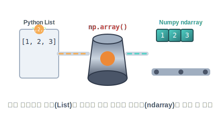

# 4.1 내장함수 array()로 ndarray 생성


## 4.1.1 내장함수 array()로 ndarray 생성

**[수학적 의미: 무에서 유를 창조하는 공간 선언]**
선형대수학에서는 어떤 연산을 시작하기 전, 스케치북에 "나는 가로 3칸, 세로 3칸짜리 2차원 공간을 쓰겠다"고 차원(Dimension)을 선언합니다. 

`numpy`에서도 마찬가지로 가장 뼈대가 되는 배열 생성자 팩토리(Factory)를 가동해야 합니다.


> **[애니메이션] 느슨한 리스트 원자재를 압축하여 ndarray 장갑차로 생산해 내는 array() 엔진**

**[Numpy 강림: array() 엔진]**
파이썬의 가장 원시적인 자료구조인 리스트(List) 재료를 `array()` 공장의 파이프에 밀어 넣으면, 내부적으로 메모리를 압축하여 막강한 `ndarray` 장갑차로 변환되어 나옵니다.

```python
import numpy as np

a = np.array([1, 2, 3], dtype=int)
a
```
**출력:**
```
array([1, 2, 3])
```

```python
type(a)
```
**출력:**
```
numpy.ndarray
```

위 `ndarray` 객체 `a`는 `shape`, `ndim` 등 여러 속성을 참조할 수 있다.

```python
print(a.shape)
print(a.ndim)
print(a.dtype)
print(a.size)
print(a.itemsize)
print(a.nbytes)
```
**출력 (예시):**
```
(3,)
1
int32
3
4
12
```

## 속성
넘파이는 객체를 생성하고, 속성을 참조할 수 있다.

다음은 `numpy`의 `ndarray`(다차원 배열)의 주요 속성을 설명한 표이다.

| 속성               | 설명                                               |
| :----------------- | :------------------------------------------------- |
| `ndarray.shape`    | 배열의 차원을 나타내는 튜플. 각 차원의 크기를 표현 |
| `ndarray.ndim`     | 배열의 차원 수                                     |
| `ndarray.size`     | 배열의 총 요소 수                                  |
| `ndarray.dtype`    | 배열 요소의 데이터 형식                            |
| `ndarray.itemsize` | 배열의 각 요소의 크기(바이트)                      |
| `ndarray.nbytes`   | 배열의 전체 크기(바이트)                           |

함수 `array()`의 인자는 배열을 표현하는 리스트나 튜플 하나이며 다음처럼 수를 나열하면 오류가 발생한다.

```python
import numpy as np
np.array(1, 2, 3)
```
**오류:**
```
TypeError: array() takes from 1 to 2 positional arguments but 3 were given
```

## 자료형

`ndarray`는 모든 원소(elements)가 `단일한 자료형`으로 구성된다. 

그러므로 다음 코드처럼 하나라도 항목이 문자열이면 모든 항목이 동일하게 문자열 자료형인 `<U32`으로 지정된다.

```python
np.array([1, 'py', 3.14])
```
**출력:**
```
array(['1', 'py', '3.14'], dtype='<U32')
```

`numpy`의 자료형은 데이터의 저장 방식과 크기를 지정하는 데 사용되며, 배열의 요소는 이러한 자료형 중 하나만을 가질 수 있다. `numpy`에서 배열의 빠른 계산 처리를 위한 방법이다.

> [!NOTE]
> **문자열 자료형 `<U32`**
>
> `<U32`와 같은 자료형은 `numpy`에서 사용되는 유니코드 문자열 자료형을 나타낸다. 이 자료형은 길이가 32(32개의 문자를 포함할 수 있는)인 Unicode 문자열을 표현한다. 여기서 `<`는 Little-endian을 나타내고, `U`는 Unicode를, 32는 문자열의 최대 길이를 나타낸다. Little-endian은 숫자의 표현 방식 중 하나로, 숫자를 메모리에 저장할 때 가장 낮은 자릿수부터 저장하는 방식을 말한다.

```python
import numpy as np
unicode_array = np.array(['가나다', '라마바', '사아자'], dtype='<U32')

unicode_array
```
**출력:**
```
array(['가나다', '라마바', '사아자'], dtype='<U32')
```

물론 `dtype`은 생략하거나 우리가 알고 있는 `str`을 적을 수 있다.

```python
lang = np.array(['파이썬', '자바', '씨'])
lang
```
**출력:**
```
array(['파이썬', '자바', '씨'], dtype='<U3')
```

```python
lang = np.array(['파이썬', '자바', '씨'], dtype=str)
lang
```
**출력:**
```
array(['파이썬', '자바', '씨'], dtype='<U3')
```

## float

다음처럼 `dtype=float`로 명시하면 모든 항목 자료형이 `float`가 된다.

```python
a = np.array((1, 2, 3), dtype=float)
a
```
**출력:**
```
array([1., 2., 3.])
```


다음처럼 `dtype=float`가 없더라도 배열 원소 중에 하나라도 `float`이면 자동으로 더 큰 범주인 `float`가 `dtype`이 된다.

```python
b = np.array((1, 2.5, 3))
b
```
**출력:**
```
array([1. , 2.5, 3. ])
```

---

## 내장함수 repeat()과 tile()을 활용한 배열 생성

동일한 숫자를 여러 번 반복해서 배열을 만들고 싶을 때는 수작업으로 입력하는 대신 `np.repeat()`과 `np.tile()` 함수를 사용하면 매우 편리합니다.

### np.repeat() 함수
`np.repeat()` 함수는 배열의 각 개별 요소를 지정한 횟수만큼 반복하여 늘려줍니다.

> **np.repeat(a, repeats)**
> - **a**: 반복할 입력 배열 또는 스칼라 값
> - **repeats**: 각 요소를 반복할 횟수

```python
import numpy as np

# 4.2.1 단일 값 8을 4번 반복
print("단일 값 반복:", np.repeat(8, 4))
# 4.2.1 출력: [8 8 8 8]

# 4.2.1 배열 [1, 2, 4]를 통째로 2번씩 반복 (각 원소가 2번씩 연달아 나옴)
print("배열 원소 각각 반복:", np.repeat([1, 2, 4], 2))
# 4.2.1 출력: [1 1 2 2 4 4]

# 4.2.1 배열 요소마다 다르게 반복 횟수 지정 ([1은 1번, 2는 2번, 4는 3번])
print("각기 다른 횟수 반복:", np.repeat([1, 2, 4], repeats=[1, 2, 3]))
# 4.2.1 출력: [1 2 2 4 4 4]
```

### np.tile() 함수
`np.tile()` 함수는 `repeat()`과 달리 패턴 단위로 묶어서(블록 전체를) 통째로 복사해서 이어 붙입니다. 타일(Tile)을 바닥에 깔아 나가는 방식을 생각하면 이해하기 쉽습니다.

> **np.tile(a, reps)**
> - **a**: 반복할 패턴이 담긴 배열
> - **reps**: 전체 패턴을 반복 복사할 횟수

```python
# 4.2.1 배열 [1, 2, 4] 패턴 전체를 통째로 2번 반복
repeated_whole = np.tile([1, 2, 4], 2)
print("패턴 전체를 타일처럼 두 번 이어붙이기:", repeated_whole)
# 4.2.1 출력: [1 2 4 1 2 4]
```
