# 4.2.2 내장함수 arange()와 linspace()

## 4.2.2 numpy의 내장함수 arange() 개요


**[수학적 의미: 수직선 상의 자(Ruler)]**
그래프 X축을 그리기 위해 눈금을 균등하게 분할해야 할 때가 있습니다. 수학 선생님이 "0부터 10까지 2칸씩 띄어서 점을 찍어라"라고 하셨을 때, 수직선 위에 $$0, 2, 4, 6, 8$$ 좌표를 찍는 행위와 같습니다.

**[Numpy 강림: arange() 점프]**
`np.arange`는 시작점에서 목표 지점(끝점) 전까지, 정해진 보폭(Step)으로 껑충껑충 뛰어가는 **개구리 점프** 알고리즘입니다. (단, 프로그래밍의 관습상 끝점은 절대 포함하지 않고 도착 바로 앞에서 멈춥니다!)




## 내장함수 arange() 개요

내장함수 `np.arange()`는 파이썬의 기본 `range()`와 원리는 같지만, 리스트가 아닌 초고속 `ndarray` 행렬을 반환하며, 정수뿐만 아니라 `0.5` 같은 실수 보폭(Step)도 허용한다는 압도적인 차이가 있습니다.

주어진 간격 내에서 균등한 간격의 값을 반환하며, 다양한 수의 위치 인수를 사용하여 호출하고, 정수 인수의 경우 함수는 파이썬 내장함수 `range()`와 거의 동일하지만 range 인스턴스가 아닌 `ndarray`를 반환

- `arange(stop)`: 반 개방 구간 `[0, stop)` (즉, 시작은 포함하고 정지는 제외한 구간) 내에서 값이 생성되며, `step`은 1
- `arange(start, stop)`: 반 개방 구간 `[start, stop)` 내에서 값이 생성되며, `step`은 1
- `arange(start, stop, step)`: 반 개방 간격 `[start, stop)` 내에서 생성되며 값 사이의 간격은 `step`으로 지정

## 내장함수 arange() 활용

다음은 인자로 정수를 사용한 예이다. 

```python
import numpy as np

# 0부터 3 미만(2)까지, 기본 간격(step=1)으로 배열 생성
print(np.arange(3))

# 3부터 7 미만(6)까지, 기본 간격(step=1)으로 배열 생성
print(np.arange(3, 7))

# 3부터 7 미만(6)까지, 간격(step=2)을 두고 2칸씩 점프하여 생성
print(np.arange(3, 7, 2))
```

결과로 출력된 `ndarray`에서 수 목록에 콤마가 없다.

**출력:**
```
[0 1 2]
[3 4 5 6]
[3 5]
```

### 내장함수 arange() 활용

다음은 인자로 실수를 사용한 예이다. 

함수 `arange()`는 배열의 수를 정확히 알기 힘들 수 있다.

```python
import numpy as np

# 0.0부터 2.0 미만까지, 실수형 요소로 기본 간격(step=1) 배열 생성
print(np.arange(2.0))

# 2.0부터 6.5 미만까지, 기본 간격(step=1)으로 실수 배열 생성
print(np.arange(2.0, 6.5))

# 2.0부터 6.5 미만까지, 0.8 간격(step=0.8)으로 세밀하게 점프하며 실수 배열 생성
print(np.arange(2.0, 6.5, 0.8))
```

**출력:**
```
[0. 1.]
[2. 3. 4. 5. 6.]
[2.  2.8 3.6 4.4 5.2 6. ]
```
