# 4.4.3 배열의 모양을 바꾸는 reshape()

## 배열에서 매트릭스로


**[비유로 이해하기: 긴 찰흙 뱀을 반듯한 사각형으로 빚기]**
보통 1줄짜리 긴 배열(`arange` 등)을, 마트의 계란판처럼 행과 열이 있는 형태로 접어 바꿀 때 사용합니다.
- **[규칙] 총 개수는 불변!**: 길이가 12인 찰흙은 `3x4=12` 또는 `2x6=12` 대형으로만 빚을 수 있습니다. 총합이 일치하지 않으면 오류가 발생합니다.



## 왜 배열 모양(Shape)을 바꿔야 할까요?

데이터 분석이나 인공지능 분야에서는 데이터의 **형태(Shape)**가 맞지 않으면 함수나 알고리즘이 아예 작동하지 않는 경우가 많다. 


이럴 때 데이터를 새로 만들지 않고 `메모리는 유지한 채`로 형태만 재조립해주는 마법이 바로 `reshape()` 이다.


### 예시 1: 딥러닝 이미지 데이터 입력
우리가 보는 사진은 2차원(가로x세로)이지만, 외부 파일에서 읽어올 때는 가끔 1줄짜리 긴 선(1차원 배열)으로 불러와지기도 한다.

예를 들어 `784`개의 픽셀이 한 줄로 서 있는 데이터를, 

인공지능 모델이 "아, 이건 28x28 픽셀 크기의 정사각형 흑백 사진이구나!" 하고 

2차원으로 인식할 수 있게 모양을 `(28, 28)`로 재조립해야 할 때 가장 많이 쓰인다.

### 예시 2: 시계열 데이터 분석 단위 변경
공장 센서가 1년 동안 매일 측정한 온도 데이터 `365`개가 1차원 배열에 들어있다고 가정해 봅시다. 

이를 주(Week) 단위로 묶어서 분석하고 싶다면, `reshape(52, 7)` 을 사용하여 `[52주, 7일]` 형태의 2차원 표(행렬)로 단숨에 탈바꿈시킬 수 있다.

## reshape() 기본 사용법

함수 `reshape()`로 이미 생성된 `ndarray` 객체의 모양(shape)을 수정할 수 있다. 

배열 원소의 수가 같으나 차수가 다른 모양은 모두 허용한다. 

차수에 따라 원소의 수가 맞지 않으면 오류가 발생한다. 

모양이 `(3, 5)`이면 원소가 15개인데 원래 배열 원소는 12개이므로 오류가 발생한다.

### 예시 1: 1차원 배열을 2차원 배열로 변환

```python
import numpy as np

a = np.arange(12).reshape(3, 4)
a
```

**출력:**
```
array([[ 0,  1,  2,  3],
       [ 4,  5,  6,  7],
       [ 8,  9, 10, 11]])
```

### 예시 2: 1차원 배열을 2차원 배열로 변환
다음 코드로는 2행 6열의 2차원 배열이 반환된다.

```python
np.reshape(a, (2, 6))
```
**출력:**
```
array([[ 0,  1,  2,  3,  4,  5],
       [ 6,  7,  8,  9, 10, 11]])
```

### 예시 3: 크기(Size)가 맞지 않는 잘못된 형태 변환 시도
배열 원소의 총 개수(`size`)가 목표로 잡은 크기(`shape`)의 곱과 일치하지 않으면 어떻게 될까요?

`a`는 총 원소가 12개인 배열이다. 

이를 `(3, 5)` 즉, 15개의 자리가 필요한 형태로 억지로 모양을 바꾸려 해 보자.

```python
# 12개의 데이터 블록을 3행 5열(총 15칸) 공간에 억지로 우겨넣으려 시도
np.reshape(a, (3, 5))
```
**오류:**
```text
ValueError: cannot reshape array of size 12 into shape (3,5)
```

> **에러 원인 분석 (`ValueError`)**
> 위 오류 메시지는 **"원래 12개의 원소(size 12)를 가진 배열을, 15칸이 필요한 (3,5) 모양으로 다시 빚을(reshape) 수 없다."**고 경고하는 내용이다. 
> 
> 형태를 바꿀 때는 반드시 원래 가지고 있던 데이터의 총조각 수(`size`)가 남거나 모자라지 않게 완벽히 일치해야 한다. (예: 12개 찰흙 덩어리는 3x4, 2x6 등 곱해서 12가 나오는 모양으로만 빚을 수 있음)

### 예시 4: 1차원 배열을 2차원 배열로 변환

다음 코드로 1차원 배열에서 3행 2열의 2차원 배열은 반환할 수 있다.

```python
b = np.array([1, 2, 3, 4, 5, 6]).reshape(3, 2)
b
```
**출력:**
```
array([[1, 2],
       [3, 4],
       [5, 6]])
```

다음으로는 1차원 배열에서 2행 3열의 2차원 배열이 반환된다. 열에 지정한 `-1`은 명시하지 않아도 원소 수와 행 수에 맞게 열을 지정해 달라는 의미로 3이 자동으로 지정된다. `-1`은 자동으로 설정하자는 의미이다.

```python
np.reshape(b, (2, -1))
```
**출력:**
```
array([[1, 2, 3],
       [4, 5, 6]])
```
