# 4.4.4 일정한 간격의 값

## 수학적 의미: 무한의 선분 쪼개기와 등차수열 (Arithmetic Sequence)
미술 시간에 10cm짜리 선분을 정확히 5칸으로 똑같이 나누어 점을 찍는다고 상상해보세요. 


시작점과 끝점을 고정해 두고, 그 사이의 공간을 정확한 비율로 쪼개어 채워 넣는 이 과정을 수학적 용어로 **선형 보간(Linear Interpolation)**이라고 합니다.

## 등차수열
더 나아가, 이는 중고등학교 수학에서 배우는 **등차수열(Arithmetic Sequence)**과 완벽하게 동일한 개념입니다. 
- **첫째항($a$)**: 시작점 (`start`)
- **마지막항($l$)**: 도착점 (`stop`)
- **항의 총 개수($n$)**: 내가 원하는 점의 개수 (`num`)
- **공차($d$)**: 일정하게 벌어진 각 점 사이의 보폭 (`step`)

우리가 수학 시간에 $\frac{l - a}{n - 1}$ 공식을 써서 공차를 직접 구했던 수고로움을, `linspace` 함수는 내부적으로 완벽하게 대신 계산하여 긴 등차수열 배열을 뽑아내 줍니다.


## Numpy 강림: linspace() 등분기
`np.linspace(start, stop, num)` 함수는 이 선분 등분 작업을 자동화해 줍니다. 

앞서 배운 `arange`가 **"보폭(Step)"** 중심이라면, `linspace`는 **"정해진 조각 개수(Count)"** 중심입니다. 

내가 중간 간격을 일일이 계산할 필요 없이 "0부터 10까지 정확히 50개의 점을 고르게 찍어줘"라고 명령하면 Numpy가 내부적으로 알아서 소수점 간격을 계산하여 점을 뿌려줍니다. 



차트나 그래프의 부드러운 곡선(X축 데이터)을 그릴 때 거의 무조건 사용하게 되는 강력하고 유용한 함수입니다.


## 내장함수 linspace()
내장함수 `numpy.linspace()`는 하나의 전체 구간(Interval)을 지정된 개수(num)의 하위 간격으로 동일하게 분할하여 1차원 `ndarray` 배열을 반환합니다. 

기본적으로 시작점과 끝점을 모두 결과에 **포함**시킨다는 점이 `arange`와의 가장 큰 차이점입니다.

```
numpy.linspace(start, stop, num=50, endpoint=True, retstep=False, dtype=None)
```
지정된 간격에 걸쳐 균등한 간격의 숫자를 반환하며, 간격의 끝점은 `endpoint`로 선택적으로 제외될 수 있음

주요 매개변수:
- `start`: 시퀀스의 시작 값
- `stop`: 시퀀스의 마지막 값. `endpoint=False`이면 제외되며, 구간의 크기도 변경됨
- `num`: 생성되는 샘플 수로 기본값은 50
- `endpoint`: `True`이면 `stop`이 마지막 값이 되며 `False`이면 제외됨
- `retstep`: `True`이면 `(samples, step)`이 반환되며 아니면 `samples`만 반환되고 `step`은 샘플 수 사이의 간격을 말함

## 내장함수 linspace() 예제


```python
import numpy as np

# 2.0부터 3.0까지(끝점 포함) 정확히 5개의 숫자로 고르게 등분하여 배열 반환
np.linspace(2.0, 3.0, num=5)
```
**출력:**
```text
array([2.  , 2.25, 2.5 , 2.75, 3.  ])
```

> **코드 설명**
> - **시작(`start`)과 끝(`stop`)**: `2.0`에서 시작하여 `3.0`으로 정확히 끝납니다. `arange`와 달리 끝점(`3.0`)이 무조건 배열에 포함된다는 것이 핵심입니다.
> - **조각과 간격 원리**: 총 들어가야 할 점의 개수가 `num=5`개이므로, 5개의 점을 찍기 위한 칸(간격)의 개수는 `5 - 1 = 4`칸이 됩니다. 
> - 따라서 각 점 사이의 보폭(공차)은 `(3.0 - 2.0) / 4 = 0.25`로 자동으로 내부 계산되어, `2.0`, `2.25`, `2.5`, `2.75`, `3.0`이 만들어집니다.

## 내장함수 linspace() 각종 파라미터 활용 예제

### 예제 1: `num` (기본값 50개 생성)
파라미터 `num`을 별도로 지정하지 않으면, 기본값인 50개의 점으로 등분된 배열을 생성합니다.

```python
import numpy as np

# 2.0부터 3.0까지 50조각으로 나누어 배열 생성 (기본값)
np.linspace(2.0, 3.0)
```
**출력 (일부):**
```text
array([2.        , 2.02040816, 2.04081633, ... , 2.97959184, 3.        ])
```

### 예제 2: `retstep=True` (계산된 보폭 확인하기)
`retstep=True`를 추가하면, 점이 찍힌 "배열"뿐만 아니라 내부적으로 자동 계산된 "점 사이의 간격(보폭)"까지 튜플 형태로 함께 묶어서 반환해 줍니다. 

```python
# 배열과 함께 생성된 점 사이의 간격을 반환받음
np.linspace(2.0, 3.0, retstep=True)
```
**출력 (일부):**
```text
(array([2.        , ... , 3.        ]), 0.02040816326530612)
```

위 결과에서 두 번째 값인 `0.020408...`이 등분 간격입니다. 실제로 50개의 점을 찍으려면 간격(칸)은 49개가 필요하므로 계산 결과는 다음과 똑같습니다.

```python
# 수동으로 공차(보폭)를 계산해본 결과
print( (3-2) / (50-1) )
```
**출력:**
```text
0.02040816326530612
```

### 예제 3: `endpoint=False` (끝점을 버리고 등분하기)
그래프의 주기성을 다룰 때 마지막 도착점을 제외하고 싶다면 `endpoint=False`를 켭니다. 
이렇게 되면 마지막 점을 찍기 직전에서 끊기게 되어, "칸의 개수"를 계산하는 방식이 완전히 달라집니다. (간격 조각 개수가 `num - 1`이 아니라 바로 `num`으로 동일해짐)



```python
# 3.0 도착점을 빼고 5개의 숫자로 등분 -> 간격은 (3.0-2.0)/5 개로 계산됨
np.linspace(2.0, 3.0, num=5, endpoint=False, retstep=True)
```
**출력:**
```text
(array([2. , 2.2, 2.4, 2.6, 2.8]), 0.2)
```

위에서 보듯, 끝점이 제외되면 `(stop - start) / num`이 바로 등분 간격(0.2)이 됩니다.

```python
# 50개로 나눴을 때 끝점이 빠지면 간격은 0.02가 됨
np.linspace(2.0, 3.0, endpoint=False, retstep=True)
```
**출력 (일부):**
```text
(array([2.  , 2.02, ... , 2.98]), 0.02)
```

### 💡 실무 활용 예제: 부드러운 차트(그래프) 그리기

`linspace()`가 가장 많이 활약하는 곳은 바로 **데이터 시각화(Data Visualization)** 분야입니다. 인공지능이나 수학 함수(예: 사인 곡선 $y = \sin(x)$)의 그래프를 곡선으로 매끄럽게 그리려면, X축의 좌표가 촘촘하고 일정한 간격으로 아주 많이 필요합니다. 



```python
import numpy as np
import matplotlib.pyplot as plt

# 0부터 10까지의 구간을 100개의 점으로 매우 촘촘하게 쪼갭니다. (X축)
x = np.linspace(0, 10, 100)

# 100개의 x 좌표 각각에 대해 사인(Sine) 값을 계산합니다. (Y축)
y = np.sin(x)

# 계산된 100개의 (x, y) 좌표들을 선으로 연결하여 부드러운 곡선을 그립니다.
plt.plot(x, y)
plt.title("np.linspace()를 활용한 부드러운 사인 곡선")
plt.show()
```

만약 `np.arange(0, 10, 1)` 처럼 1칸씩 듬성듬성 점을 10개만 찍어 연결했다면, 곡선이 아니라 각진 꺾은선 그래프가 삐뚤빼뚤하게 그려졌을 것입니다. `linspace` 덕분에 우리는 아주 손쉽게 컴퓨팅 자원을 이용해 고해상도의 매끄러운 무한의 그래프 데이터를 뽑아낼 수 있습니다.
