# 4.4.5 내장함수 arange()와 linspace() 비교


내장함수 `numpy.arange()`와 `numpy.linspace()`는 특정 구간 내에서 일정한 간격으로 나열된 숫자의 배열을 만든다는 공통적인 목적을 가지고 있습니다. 

하지만 숫자를 생성하는 **'중심 기준점'**과 내부 방식이 완전히 다릅니다.
- **`arange()`**: **"보폭(Step)"** 중심 (예: 한 걸음에 0.1씩 가라) - 기본 보폭 1
- **`linspace()`**: **"조각 개수(Count)"** 중심 (예: 공간을 무조건 5개로 쪼개라) - 기본 샘플 수 50


## ⚠️ arange()의 치명적 함정: 소수점 오차 (Float Precision Error)

파이썬을 비롯한 컴퓨터 프로그래밍에서 실수(Float, 예: 0.1)는 우리가 아는 것과 완벽히 일치하지 않고 미세한 오차를 가집니다. 

`arange`를 실수 보폭으로 사용할 때 이 오차가 계속 누적되면, **의도치 않게 끝점이 배열에 포함되어버리는 대참사**가 종종 발생합니다.



### 예제 1: 실수 환경에서의 `arange` 오류 시뮬레이션

다음 코드는 `0.1`부터 `0.4` 미만까지 `0.1` 간격으로 점을 찍는 코드이므로, 원래 수학적 정의로는 `[0.1, 0.2, 0.3]` 3개만 나와야 정상입니다. 

하지만 컴퓨터의 `float` 표현 오차(예: `0.1 + 0.1 + 0.1 = 0.30000000000000004`) 때문에 도착선(0.4)을 돌파하지 않은 것으로 착각하여 예기치 않게 0.4가 포함되어 버립니다.

예제를 통하여 이를 확인해 봅니다.

```python
import numpy as np

# 0.1 부동소수점 오차 누적으로 인해 0.4가 범위 내로 잘못 인식됨
np.arange(0.1, 0.4, 0.1)
```
**출력:**
```text
array([0.1, 0.2, 0.3, 0.4])
```

## 해결책: 등분은 `linspace`에게 맡기자

### 예제 2: 정수형으로 우회하기
굳이 `arange`를 고집하고 싶다면, 실수가 아닌 정수로 크게 계산을 한 뒤 나중에 나누어 주는 방식을 사용해야만 안전합니다. 
(Numpy 배열의 스칼라 나눗셈 연산은, 배열 내부의 모든 원소 각각에 일괄적으로 나눗셈을 적용하여 반환합니다.)



```python
# [1단계] 정수 1부터 4 미만(3)까지 보폭 1로 
# 오차 없는 정수 배열 생성 -> [1, 2, 3]
# [2단계] 생성된 안전한 정수 배열의 모든 원소에 
# 일괄적으로 10.0을 나누어 실수로 변환 -> [0.1, 0.2, 0.3]
np.arange(1, 4, 1) / 10.0
```
**출력:**
```text
array([0.1, 0.2, 0.3])
```

### 예제 3: `linspace`를 활용한 가장 깔끔한 해결법

치명적인 부동소수점 오차를 원천적으로 차단하고 코드를 짧게 쓰는 가장 깔끔한 방법은 **원하는 점의 개수**를 정확하게 함수에 알려주는 `linspace`를 사용하는 것입니다.

```python
# 시작점(0.1)부터 끝점(0.4)까지 공간을 잡습니다.
# 단, 도착점 0.4는 포함하지 않고(endpoint=False) 
# 정확히 3개의 점만 찍어서 구간을 분할합니다.
# 결과: [0.1, 0.2, 0.3] 오류 없이 생성!
np.linspace(0.1, 0.4, 3, endpoint=False)
```
**출력:**
```text
array([0.1, 0.2, 0.3])
```

만약 끝점 0.4를 포함하여 정확히 4개의 조각으로 나누고 싶다면 다음과 같이 작성합니다.

### 예제 4: `linspace`로 끝점을 포함하여 정확하게 나누기
```python
# 시작점(0.1)부터 끝점(0.4)까지 
# 도착점 0.4를 반드시 포함하여(endpoint=True가 기본값)
# 정확히 4개의 조각으로 구간을 완벽하게 분배합니다.
# 결과: [0.1, 0.2, 0.3, 0.4] 안전하게 생성 완료!
np.linspace(0.1, 0.4, 4)
```
**출력:**
```text
array([0.1, 0.2, 0.3, 0.4])
```

> **💡 핵심 요약 (Best Practice)**
> - 정수 격자(간격)를 만들 때는 직관적인 `arange(1, 10, 2)`를 사용하세요.
> - **실수(Float)** 간격으로 데이터를 세밀하게 분할해야 할 때는, 예기치 못한 오차를 막기 위해 가급적 **`linspace()`**를 사용하는 것이 훨씬 안전하고 권장되는 방법입니다.
