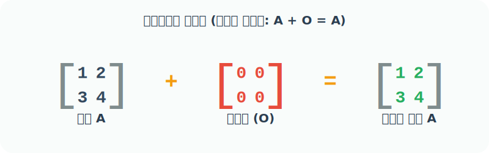

# 4.2.6 내장함수 zeros()와 ones(), empty() 


## 영행렬(Zero Matrix)의 수학적 의미와 활용
> 원소가 모두 0인 배열

### 영행렬(Zero Matrix)과 덧셈의 항등원
선형대수학에서 모든 원소가 `0`으로 가득 찬 행렬을 **영행렬(Zero Matrix)**이라고 부릅니다. 

이 행렬은 숫자 `0`과 같아서, 아무리 다른 행렬과 `더해도` 상대방의 값을 변하게 하지 않는 마법의 성질(덧셈의 항등원)을 갖습니다. 
> **덧셈의 항등원이란?**
> 어떤 수나 행렬에 더했을 때 '자기 자신이 그대로 결과로 나오게' 만들어주는 수학적 장치를 말합니다. 숫자 세계에서는 `0`이 덧셈의 항등원(`5 + 0 = 5`)이며, 거대한 행렬이나 배열의 세계에서는 모든 칸이 0으로 채워진 **'영행렬(Zero Matrix)'**이 그 역할을 완벽하게 동일하게 수행합니다.


### 수학에서의 영행렬 사용 용도

수학에서 영행렬은 단순히 '아무것도 없는 빈칸' 이상의 중요한 역할을 합니다. 

숫자 계산에서 숫자 `0`이 반드시 필요하듯, 고차원 데이터 덩어리인 행렬의 세계에서도 기준점이 되는 무의 상태가 꼭 필요합니다.

1. **기반점 역할 (덧셈의 항등원)**: $A + O = A$. 기존 행렬의 데이터를 전혀 해치지 않고 연산을 이어갈 수 있는 베이스캠프 역할을 합니다.
2. **초기화 및 리셋 (곱셈을 통한 소멸)**: $A \times O = O$. 어떤 복잡한 데이터가 들어있는 행렬이든, 영행렬을 곱해버리면 한순간에 모든 값을 0으로 리셋(초기화)시켜 버릴 수 있습니다.
3. **연립방정식의 해 (Homogeneous System)**: 수학에서 변수가 들어있는 복잡한 연립방정식을 행렬로 풀 때, 그 결괏값이 모두 0인 상태(`Ax = 0`)를 표현할 때 영행렬 우변이 사용됩니다. 이를 통해 시스템의 근본적인 뼈대(구조)를 분석합니다.




## 넘파이에서 영행렬 생성하기 및 프로그램 활용

수학에서의 영행렬 개념을 파이썬 코드로 그대로 옮겨놓은 것이 바로 넘파이의 `np.zeros()` 함수입니다. 

`zeros()` 함수는 우리가 원하는 배열의 크기인 `shape`(가로, 세로 길이나 차원)만 던져주면, 순식간에 내부에 `0`을 꽉꽉 채워 넣은 거대한 `ndarray` 아파트를 바로 지어서 반환해 줍니다. 


### 프로그램에서 영행렬의 의미 (언제, 어떤 용도로 사용할까?)

프로그래밍 관점에서 `np.zeros()`는 미래에 계산될 데이터들을 담기 위해 **"메모리 공간을 깨끗하게 청소하고, 빈 상자들을 미리 만들어두는 도화지(Placeholder 선언)"** 역할을 수행합니다.

- **도화지 및 이미지 캔버스 초기화 (Computer Vision)**: 그림판 앱이나 딥러닝 영상 처리 모델을 만들 때, 처음 캔버스를 온통 픽셀값 0(검은색)으로 깨끗하게 칠해두고, 그 위에 필요한 부분만 색상 데이터를 하나씩 입혀 나갈 때 주로 사용합니다.
- **점수판 / 누적 계산기 초기화 (AI & Data Science)**: 인공지능이 게임을 시작하거나 수많은 사용자 데이터를 누적해야 할 때, 기존에 남아있던 쓰레기값(Garbage Data)이 연과 방해되지 않도록 파라미터(오차값, 가중치, 점수)를 `0`으로 비워두고 첫 시작을 할 때 필수적으로 씁니다.

### numpy.zeros() 함수
```
numpy.zeros(shape, dtype=float, order='C', *, like=None)
```

- 주어진 모양과 유형의 0으로 채워진 새 배열의 반환
- `shape`: `int` 모양 또는 `int`의 튜플, 즉 배열의 모양 예, `(2, 3)` 또는 `2` 등
- `dtype`: 데이터 유형, 선택 사항. 배열에 대해 원하는 데이터 유형(예: `numpy.int8`), 기본값은 `numpy.float64`
- `order`: 순서 `{'C', 'F'}`, 선택 사항, 기본값: `'C'`. 다차원 데이터를 행 중심(C 스타일) 또는 열 중심(포트란 스타일) 순서로 메모리에 저장할지 여부를 지정

## 내장함수 zeros() 활용 예제

### 예제 1: 1차원 영배열 생성 (기본값 float)
인자 `shape`에 정수 5를 주면 원소가 5개인 1차원 배열이 생성됩니다. 

이때 `dtype`을 지정하지 않으면 기본적으로 소수점이 있는 형태(`float64`, 즉 `0.`)로 만들어집니다.

```python
import numpy as np

# 빈 칸 5개를 만들고 모두 0.0 (float)으로 깨끗하게 채움
a = np.zeros(5)
a
```
**출력:**
```text
array([0., 0., 0., 0., 0.])
```

```python
# 자료형을 확인해 보면 float64(실수) 타입임을 알 수 있음
a.dtype
```
**출력:**
```text
dtype('float64')
```

### 예제 2: 자료형(dtype)을 정수(int)로 강제 지정하기
소수점이 필요 없고 오직 정수(Integer) `0`만 필요하다면, `dtype=int` 옵션을 추가해주면 됩니다. 

(메모리 용량을 아낄 때 유리합니다)

```python
# 크기가 5인 1차원 배열을 만들되, 실수(0.)가 아닌 완벽한 정수(0)로 채움
np.zeros((5,), dtype=int)
```
**출력:**
```text
array([0, 0, 0, 0, 0])
```

### 예제 3: 2차원 영행렬(Zero Matrix) 생성하기
딥러닝이나 이미지 처리에서는 2차원 이상의 배열행렬 구조를 주로 사용합니다. 

괄호 안에 `(행, 열)` 튜플 형태로 `shape`를 넘겨줍니다.

```python
# 세로 2줄(행), 가로 1칸(열)을 가지는 2차원 빌딩 모양으로 0을 꽉 채움
# 출력 결과를 보면 대괄호가 2개([[]]) 겹쳐 있는 2차원 구조임을 알 수 있음
b = np.zeros((2, 1))
b
```
**출력:**
```text
array([[0.],
       [0.]])
```

```python
# shape(모양) 속성을 조회하여 2행 1열 구조임을 확인
b.shape
```
**출력:**
```text
(2, 1)
```
