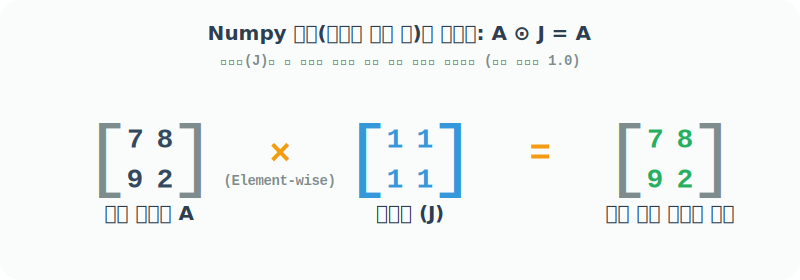

# 4.2.7 원소가 모두 1인 배열을 생성하는 ones()


## 일행렬(All-ones Matrix)의 수학적 의미와 활용
> 원소가 모두 1인 배열


### 수학에서의 일행렬 사용 용도

영행렬이 아무것도 없는 무(無)의 상태라면, 모든 칸이 `1`로 채워진 행렬은 **어떤 데이터를 균일하게 처리하거나 기본 가중치(Base Weight)를 부여할 때** 주로 사용되는 **일행렬(All-ones Matrix, 보통 $J$로 표기)**입니다.

일반적인 선형대수학에서는 '단위행렬(Identity Matrix, 대각선만 1인 행렬)'이 곱셈의 항등원 기능을 하지만, **Numpy의 기본 연산인 '요소별 원소 곱(Element-wise Multiplication, Hadamard Product)'** 세계에서는 이 **일행렬($J$)**이 바로 완벽한 곱셈의 항등원 역할을 수행합니다.

1. **원소별 곱셈의 기반점 (Hadamard 항등원)**: $A \circ J = A$. 기존 행렬의 데이터를 전혀 변질시키지 않고 기본 배수(x1)로 유지하는 든든한 방패막이 역할을 합니다.
2. **합계(Sum) 계산의 마법 지팡이**: 일벡터를 기존 행렬과 내적(Dot Product)하면, 루프(for문)를 돌지 않고도 행렬 안의 수많은 원소들을 순식간에 다 더해버리는 통계 연산이 가능합니다.




## 넘파이에서 일행렬 생성하기 및 프로그램 활용

넘파이 파이썬 코드로 이 일행렬을 만드는 방법이 바로 `np.ones()` 함수입니다. `zeros()` 함수와 내부 문법 구조가 100% 동일하며, 모양(`shape`)만 입력하면 순식간에 내부에 `1`을 꽉꽉 채워 넣은 `ndarray` 아파트를 지어줍니다. 



### 프로그램에서 일행렬의 의미 (언제, 어떤 용도로 사용할까?)

프로그래밍 관점에서 `np.ones()`는 미래에 수많은 데이터를 **'곱해서' 증폭시킬 때**, 그 곱셈의 초기 기준값을 안정적으로 잡아주는 **"기본 배수판(Multiplier Base)"** 역할을 수행합니다.

- **딥러닝 가중치(Weight) 초기화 주의사항**: 인공지능이 어떤 값을 필터링할 때, 일단 처음에는 입력값을 건드리지 않고 1배수 그대로 살려서 내보내기 위해 `1.0`으로 가중치 배열을 초기화하곤 합니다. (만약 곱셈이 될 자리에 `zeros`로 0을 초기화해버리면, 이후의 모든 신호가 `* 0`이 되어 싹 다 죽어버리는 대참사가 일어납니다!)
- **마스킹(Masking) 기본 캔버스**: 전체 데이터를 기본적으로 모두 켜짐(True/On, 1) 상태인 캔버스로 만들어 두고, 필요 없는 부분만 0으로 꺼나갈(자르기) 때 훌륭하게 쓰입니다.


## 내장함수 ones() 활용 예제

### 예제 1: 2차원 일행렬(All-ones Matrix) 생성 (기본값 float)
괄호 안에 `(행, 열)` 크기를 튜플로 넘겨주면, 그 크기만큼 1로 채워줍니다. `zeros`와 마찬가지로 `dtype`을 지정하지 않으면 기본적으로 소수점이 있는 실수형(`float64`, 즉 `1.`)으로 만들어집니다.

```python
import numpy as np

# [1단계] 세로 2줄(행), 가로 4칸(열)의 빈 부지를 확보
# [2단계] 모든 칸에 1.0 (float)을 꽉 채워 넣어 2D 일행렬 생성 완료!
np.ones((2, 4))
```
**출력:**
```text
array([[1., 1., 1., 1.],
       [1., 1., 1., 1.]])
```

### 예제 2: 자료형(dtype)을 정수(int)로 강제 지정하기
소수점이 불필요하고 정수(Integer) `1`이 딱 떨어지게 필요하다면, `dtype=int` 옵션을 제일 뒤에 추가해 줍니다. 

```python
# [1단계] 세로 2줄, 가로 4칸의 빈 부지 확보
# [2단계] 이번엔 소수점이 없는 완벽한 정수 1로 모든 칸을 채움!
np.ones((2, 4), dtype=int)
```
**출력:**
```text
array([[1, 1, 1, 1],
       [1, 1, 1, 1]])
```
