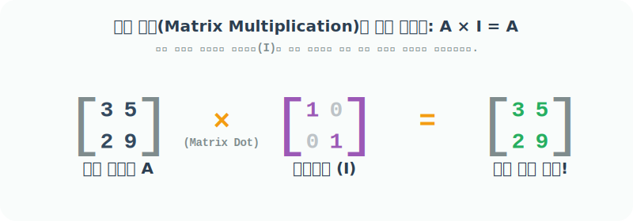

# 4.2.8 대각선 원소가 모두 1인 2차원 배열을 만드는 eye()


## 단위행렬(Identity Matrix)의 수학적 의미와 활용
> 주대각선만 1이고 나머지는 모두 0인 정방행렬


### 수학에서의 단위행렬 사용 용도

행렬 곱셈의 세계에서 숫자 `3 * 1 = 3`의 숫자 `1` 역할을 하는 마법의 행렬이 있습니다. 

이를 **단위행렬(Identity Matrix, 기호 $I$)**이라고 부릅니다. 
규칙은 오직 "왼쪽 위에서 오른쪽 아래로 떨어지는 주대각선만 `1`이고 나머지는 모두 `0`"이라는 것입니다. 방금 배운 `zeros` 영행렬 위에 대각선으로 `1`을 쫙 그어 내린 형태입니다.

단위행렬은 선형대수학에서 가장 핵심적인 근간을 이루는 항등원입니다.

1. **행렬 곱셈의 진정한 항등원 (완벽한 거울)**: $A \times I = A$. 어떤 거대한 행렬이든 단위행렬($I$)을 행렬곱(Dot Product) 해주면 자기 자신의 모습이 하나도 왜곡되지 않고 그대로 거울처럼 튀어나옵니다. 
2. **역행렬(Inverse Matrix)의 기준**: 수학에서 어떤 수에 역수를 곱하면 1이 되듯($3 \times \frac{1}{3} = 1$), 행렬에 역행렬을 곱하면 바로 이 단위행렬($I$)이 나옵니다. 미지수가 많은 방정식 시스템을 푸는 핵심 기준점이 됩니다.



### 💡 헷갈리기 쉬운 개념: 일행렬(`ones`) vs 단위행렬(`eye`)
두 행렬 모두 "곱셈 연산에서 데이터를 보존(1)하는 데 쓰인다"는 공통점이 있지만, 사용하는 맥락이 완전히 다릅니다.

1. **`np.ones` (일행렬)**: 모든 칸이 `1`입니다. Numpy의 기본 곱셈 연산인 **"요소별 곱셈(Element-wise Multiplication, `A * B`)"**을 할 때 항등원으로 쓰입니다. 즉, 각각의 칸끼리 매칭해서 곱할 때 기존 값을 1배수로 유지해 줍니다.
2. **`np.eye` (단위행렬)**: 대각선만 `1`입니다. 선형대수학의 본격적인 **"행렬 내적(Dot Product, `np.dot(A, B)`)"** 연산에서 진정한 수학적 항등원으로 쓰입니다. 여기서 만약 단위행렬이 아니라 일행렬(`ones`)을 행렬곱해 버리면, 행과 열이 전부 더해지면서 값이 의도치 않게 거대하게 증폭폭발해 버립니다!


## 넘파이에서 단위행렬 생성하기 및 프로그램 활용

넘파이 함수 `eye()`는 영단어 단위행렬을 뜻하는 대문자 **'I(아이)'에서 발음을 따온** 아주 재치 있는 네이밍입니다. 입력한 사이즈만큼 주대각선 원소가 1인 정사각형(또는 직사각형) 단위행렬을 즉시 뿜어냅니다.


### 프로그램에서 단위행렬의 의미 (언제, 어떤 용도로 사용할까?)

- **수학 공식(선형대수)의 프로그래밍 구현**: 파이썬으로 인공지능이나 물리 엔진의 수학 공식을 코드로 옮길 때 수식에 기호 $I$가 등장하면 무조건 `np.eye()`를 호출하여 공식의 뼈대를 맞춥니다.
- **원핫 인코딩(One-Hot Encoding)**: 머신러닝에서 "강아지, 고양이, 새" 같은 문자열 카테고리 데이터를 컴퓨터가 이해하기 쉽게 `[1,0,0], [0,1,0], [0,0,1]` 등 0과 1의 배열 형태로 변환할 때, `eye()`로 큰 매트릭스를 만들어 두고 거기서 필요한 행만 쏙쏙 뽑아 쓰는 테크닉이 자주 활용됩니다.
- **대각선 데이터 추출/마스킹**: 복잡한 엑셀(표) 데이터에서 대각선에 위치한 데이터만 살리고 나머지를 0으로 덮어씌워 지우고 싶을 때 필터 용도로 쓰입니다.

### numpy.eye() 함수
```
numpy.eye(N, M=None, k=0, dtype=<class 'float'>, order='C', *, like=None)
```
- 대각선에 1이 있고 다른 곳에는 0이 있는 2차원 배열을 반환
- `N`: `int`, 출력할 행(Height)의 개수
- `M`: `int`, 선택 사항, 출력할 열(Width)의 개수. 입력하지 않으면 `N`과 동일하게 지정되어 **정사각형 행렬(정방행렬)**이 됨!
- `k`: `int`, 대각선의 위치를 오르내리는 오프셋 슬라이더! `0(기본값)`은 한가운데 메인 대각선, 양수(+)는 위쪽으로, 음수(-)는 아래쪽으로 그어 내리는 시작 위치를 바꿈
- `dtype`: 데이터 유형, 선택 사항. 기본값은 실수를 뿜어내는 `numpy.float64`

## 내장함수 eye() 활용 예제

### 예제 1: 정사각형 형태의 단위행렬 만들기 (기본값)
다음 코드는 가로세로 크기가 `3`인 3행 3열짜리 2차원 정사각형 배열을 반환합니다. 기본값이 실수형이므로 `1.0`과 `0.0`으로 채워져 있습니다.

```python
import numpy as np

# [1단계] 3x3의 거대한 영행렬(zeros) 캔버스를 만든다.
# [2단계] 좌상단부터 우하단까지 번개를 쳐서 주대각선만 1.0으로 바꾼다!
np.eye(3)
```
**출력:**
```text
array([[1., 0., 0.],
       [0., 1., 0.],
       [0., 0., 1.]])
```

### 예제 2: 자료형(dtype)을 정수(int)로 강제 지정하기
소수점이 필요 없다면, 키워드 인자 `dtype=int` 값을 조절하여 깔끔한 정수 1과 0만 튀어나오게 만들 수 있습니다.

```python
# 가로세로 2x2 사이즈 지정 후, 
# 내용물은 완벽한 정수(Integers)로만 채우기
np.eye(2, dtype=int)
```
**출력:**
```text
array([[1, 0],
       [0, 1]])
```

### 예제 3: 직사각형 형태(행과 열이 다름)의 배열 만들기
`np.eye(N, M)` 처럼 가로세로 길이를 다르게 입력해주면, 정사각형이 아닌 **직사각형 모양**의 배열이 나옵니다. 이때 대각선 긋기는 `(0, 0)` 좌표에서 시작해서 갈 수 있는 데까지만 긋고 멈춥니다.

```python
# 3행(세로) 4열(가로)의 넙적한 직사각형 배열 생성.
# 대각선은 [0,0] -> [1,1] -> [2,2] 까지만 무사히 1이 그어지고 멈춤!
np.eye(3, 4)
```
**출력:**
```text
array([[1., 0., 0., 0.],
       [0., 1., 0., 0.],
       [0., 0., 1., 0.]])
```

### 예제 4: 대각선을 출발하는 위치 슬라이더 조정하기 (k 오프셋 반환)
파라미터 `k`는 대각선 긋기를 시작하는 위치를 조절하는 매우 재밌는 슬라이더입니다!
- `k`가 **양수(+)**이면: 메인 대각선보다 기수만큼 **오른쪽(위쪽)**으로 치우친 곳에서 대각선을 긋기 시작합니다.
- `k`가 **음수(-)**이면: 메인 대각선보다 기수만큼 **왼쪽(아래쪽)**으로 치우친 곳에서 대각선을 긋기 시작합니다.

```python
# 세로 3줄 가로 4칸의 직사각형 배열에
# k=1 이므로, 메인 대각선보다 오른쪽 한 칸 옆([0, 1] 지점)부터 선 긋기 시작!!
a = np.eye(3, 4, 1)
a
```
**출력:**
```text
array([[0., 1., 0., 0.],
       [0., 0., 1., 0.],
       [0., 0., 0., 1.]])
```

```python
# 세로 3줄 가로 4칸의 배열에
# k=-1 이므로, 메인 대각선보다 아래쪽 한 칸 옆([1, 0] 지점)부터 선 긋기 시작!!
a = np.eye(3, 4, -1)
a
```
**출력:**
```text
array([[0., 0., 0., 0.],
       [1., 0., 0., 0.],
       [0., 1., 0., 0.]])
```
