# 4.2.9 원소가 모두 특정 값인 배열을 만드는 full()


## np.full()의 프로그래밍적 의미와 활용
> 지정한 모든 칸을 '원하는 단일 값(fill_value)'으로 꽉 채운 배열

앞서 배운 `zeros`는 `0`으로 칠하고, `ones`는 `1`로 칠하는 전용 도구였습니다.
하지만 항상 0이나 1만 필요한 것은 아닙니다. **"이 표를 전부 행운의 숫자 7로 채워줘!"**, **"모든 칸을 '비어있음(-1)' 상태로 한 번에 세팅해 줘!"**와 같이, 내가 원하는 특정한 값 하나로 거대한 메모리 공간을 단숨에 도배하고 싶을 때 사용하는 '강력한 만능 도장기'가 바로 `np.full()`입니다.



### 언제 어떤 용도로 사용할까? (실무 활용 사례)

- **초기 상태(Default State) 세팅**: 게임에서 체스판의 타일을 모두 같은 지형 번호로 세팅하거나, 데이터 분석에서 통계 설문조사 응답이 없는 빈칸을 일괄적으로 `-1`이나 `999` 같은 특수 값(결측치 식별자)으로 채워둘 때 사용합니다.
- **이미지 단색 배경 초기화**: 그림판의 캔버스를 새하얀색 픽셀(`255`) 혹은 특정 단색 값으로 꽉 채워서 초기화할 때 씁니다.
- **패턴 강제 복사 (Broadcasting)**: 단순한 스칼라(단일 숫자) 뿐만 아니라, `[1, 2, 3]` 같은 리스트(벡터) 패턴 배열 자체를 인자로 주면, 캔버스 크기에 맞춰 강제로 여러 줄 똑같이 복사해서 채워 넣는 놀라운 기능도 수행합니다.

### numpy.full() 함수
```
numpy.full(shape, fill_value, dtype=None, order='C', *, like=None)
```
- 지정된 `fill_value`로 채워진 주어진 모양과 유형의 새 배열을 반환
- `shape`: `int` 또는 정수 시퀀스 튜플. 짓고 싶은 배열 아파트의 층과 호수. 예: `(2, 3)`
- `fill_value`: 찍어 누를 도장의 내용 값. 단일 숫자(스칼라) 또는 짧은 배열 형태의 객체도 모두 가능
- `dtype`: 원소의 데이터 유형. 딱히 지정하지 않으면 우리가 건네준 `fill_value`의 자료형 분위기를 자동으로 눈치채고 따라감

## 내장함수 full() 활용 예제

### 예제 1: 단일 숫자(스칼라)로 공간 가득 채우기
다음 코드는 가로세로 `(2, 3)` 모양의 2차원 공간을 확보한 뒤, 모든 칸을 하나의 단일 숫자 `10`으로 모조리 도장 찍어 채웁니다.

```python
import numpy as np

# [1단계] 2행 3열의 빈칸을 만든다.
# [2단계] 모든 칸에 한 치의 오차 없이 '10'을 채워 넣는다.
np.full([2, 3], 10)
```
**출력:**
```text
array([[10, 10, 10],
       [10, 10, 10]])
```

### 예제 2: 1차원 리스트(배열) 패턴을 통째로 복사해서 도장 찍기
숫자 하나만 되는 것이 아닙니다. 도장의 면을 `(1, 2, 3)`이라는 긴 1차원 리스트 패턴으로 깎은 뒤 쿵 찍을 수도 있습니다! Numpy는 가로 길이가 3칸이라는 것을 확인하고, 각 행(Row)마다 똑같은 튜플 리스트를 한 줄 통째로 찍어줍니다.

```python
# 가로가 3칸인 2x3 빈 캔버스에,
# 가로 길이가 딱 맞는 (1, 2, 3) 도장 패턴을 한 줄씩 쾅, 쾅! 두 번 찍어냄
np.full([2, 3], (1, 2, 3))
```
**출력:**
```text
array([[1, 2, 3],
       [1, 2, 3]])
```

### 예제 3: 파이썬 range() 객체 넘겨주기
리스트나 튜플 대신 배열을 생성해 내는 파이썬 내장함수 `range(4)`를 건네주어도, 자동으로 `[0, 1, 2, 3]`이라는 리스트 패턴으로 풀어서 해석한 뒤 각 행마다 똑같이 복사해 줍니다. 

```python
# 가로 길이 4칸에 딱 떨어맞게 range(4) = [0, 1, 2, 3] 도장을 3줄로 찍음!
np.full([3, 4], range(4))
```
**출력:**
```text
array([[0, 1, 2, 3],
       [0, 1, 2, 3],
       [0, 1, 2, 3]])
```

### 예제 4: 2차원 열(Column) 방향 패턴을 통째로 복사해서 찍기
이번에는 세로(열)를 기준으로 도장을 찍어볼 차례입니다.
`np.arange(4)`를 만들어 `[0, 1, 2, 3]`을 준비한 뒤, `.reshape(4, 1)`을 써서 **모양이 세로로 기다란 `4x1` 모양 블록 세트**로 다듬어버립니다. 
이를 4x3 캔버스에 주면, 이번엔 행이 아니라 열(가로 방향)로 옆으로 여러 번 찍어버립니다!

```python
# [1단계] 세로 4칸짜리 수직 블록 도장 [[0], [1], [2], [3]] 준비
# [2단계] 세로 4줄 가로 3칸 캔버스에 쾅! 찍으면 옆으로 3번 복제됨! (Broadcasting 마법)
np.full([4, 3], fill_value=np.arange(4).reshape(4, 1))
```
**출력:**
```text
array([[0, 0, 0],
       [1, 1, 1],
       [2, 2, 2],
       [3, 3, 3]])
```
