# 4.4.10 초기화되지 않은 쓰레기값 배열을 생성하는 empty()


## np.empty()의 프로그래밍적 의미와 활용
> 값을 지우는 작업은 패스! 메모리 껍데기 상자만 빛의 속도로 확보하는 함수


지금까지 배운 `zeros()`, `ones()`, `full()`은 배열을 만들고 나서, 그 칸마다 `0`, `1`, `7` 같은 숫자를 예쁘게 새로 칠해 넣는 **'초기화(Initialization)'** 작업을 거칩니다. 


하지만 데이터가 수억 개에 달할 정도로 거대하고 1분 1초가 급한 상황에서, 어차피 우리가 1초 뒤에 새로운 이미지 픽셀 데이터나 센서 데이터로 배열 **전체를 완전히 덮어씌울(Overwrite) 거라면**, 굳이 처음부터 `0`이나 `1`로 예쁘게 지우는 시간조차 아깝지 않을까요?

이럴 때 쓰는 극강의 속도 최적화 도구가 바로 **`np.empty()`**입니다. 

이 함수는 내용을 무언가로 지우거나 채우는 시간을 전부 건너뛰고, 컴퓨터 메모리 어딘가에 남아있던 **'과거 삭제된 데이터의 파편(쓰레기값, Garbage Value)'**을 그대로 둔 채 빈 껍데기 상자판만 번개처럼 빠르게 던져줍니다.



### 언제 어떤 용도로 사용할까? (실무 활용 사례)

- **극강의 속도 최적화 (Extreme Performance)**: 배열을 만들자마자 외부에서 대용량 데이터를 읽어와서 `100% 덮어씌울` 계획이 완벽하게 잡혀있을 때, 초기화 연산 연산량을 아끼기 위해 사용합니다. (딥러닝 프레임워크나 영상 처리 엔진 등 속도가 생명인 곳에서 내부적으로 자주 쓰입니다.)
- **⚠️ 주의사항**: 박스 안에 무슨 쓰레기 데이터가 들어있는지 아무도 모르기 때문에, 이 배열을 생성하자마자 그냥 출력해보면 `1.474e-311` 같은 기괴한 외계어 숫자(또는 우연히 `0.0`)들이 튀어나옵니다. **절대 빈 공간이라고 생각하고 읽거나 연산(더하기 등)의 재료로 사용하면 안 됩니다.** 값이 매번 무작위로 다르게 나옵니다.

### numpy.empty() 함수
```
numpy.empty(shape, dtype=float, order='C', *, like=None)
```
- 초기화(0 채우기 등)를 생략하고, 지정된 모양과 유형의 새 배열을 가장 빠르게 반환
- `shape`: `int` 또는 `tuple`. 새 메모리 상자의 크기. 예: `[2, 2]` 또는 `3`
- `dtype`: 할당할 메모리 공간의 데이터 허용 범위. 기본값은 `numpy.float64`(소수점 실수)

## 내장함수 empty() 활용 예제

### 예제 1: 2차원 쓰레기값 배열 생성하기 (기본값 float)
모양 `[2, 2]`인 2행 2열 배열을 만듭니다. 안의 원소값은 예측할 수 없는 쓰레기값입니다. (운이 좋으면 0이 나올 수도 있지만 믿어선 안 됩니다.)

```python
import numpy as np

# [주의] 이 코드 블록을 실행할 때마다 출력값이 바뀔 수 있습니다!
# 초기화 없이 메모리를 즉시 할당받습니다.
np.empty([2, 2])
```
**출력 (예시):**
```text
# 아주 작거나 기괴한 정체불명의 메모리 파편(가비지 값)들이 등장합니다.
array([[6.23042070e-307, 4.67296746e-307],
       [1.69121096e-306, 1.42176308e-312]])
```

### 예제 2: 1차원 쓰레기값 벡터 생성하기
정수 하나만 넘겨주어 `shape=3`으로 지정하면, 원소가 3개 들어갈 수 있는 공간만 빠르게 확보합니다.

```python
# 원소 3개를 담을 1차원 벡터 빈 공간 확보! (내용물은 쓰레기값)
np.empty(3)
```
**출력 (예시):**
```text
array([1.47466827e-311, 4.94065646e-324, 0.00000000e+000])
```

### 예제 3: 자료형(dtype)을 정수(int)로 강제 지정하기
`dtype=int` 키워드 인자로 자료형을 지정하면, 메모리를 정수 크기에 맞춰서 잘라오기 때문에 쓰레기값들도 소수점이 아닌 기괴한 정수 형태로 나타납니다.

```python
# 2줄 3칸짜리 공간을 '정수(int)' 크기로 재단해서 확보!
np.empty([2, 3], dtype=int)
```
**출력 (예시):**
```text
array([[         0, 1072693248,          0],
       [1072693248,          0, 1072693248]])
```
