# 4.4.11 형태를 훔치는 복제 마법 _like() 형제들


## `_like()` 함수의 프로그래밍적 의미와 활용
> "저 녀석의 크기와 형태(Shape)를 그대로 베껴서 빈껍데기만 만들어줘!"


프로그래밍을 하다 보면 외부에서 크기를 알 수 없는 미지의 배열 데이터 `A`를 넘겨받는 경우가 많습니다. 

이때 `A`와 완전히 똑같은 크기(Shape)와 데이터 타입(dtype)을 가진 새로운 캔버스(배열)를 준비해야 할 때가 있습니다.

이때 `A.shape`를 일일이 확인해서 `np.zeros(A.shape)`라고 귀찮게 타이핑할 필요 없이, **"A처럼(like) 만들어!"**라고 우아하게 명령할 수 있는 마법의 기능이 바로 `_like` 접미사가 붙은 형제 함수들(`zeros_like`, `ones_like`, `full_like`, `empty_like`)입니다.

이 함수들은 기존 배열을 3D 스캐너로 스캔하듯 **오직 '형태(Shape)'와 '자료형(dtype)' 껍데기만 쏙 빼내어 거푸집을 복제(Clone)**한 뒤, 그 빈 내용물은 우리가 지정한 값(0, 1, 특정 값)으로 가득 채워 새로운 배열을 뱉어냅니다.



### 언제 어떤 용도로 사용할까? (실무 활용 사례)
- **결과값 저장용 빈 바구니 준비**: 거대한 원본 데이터를 반복문으로 하나씩 처리하면서 결과를 담아야 할 때, 내용물 크기를 몰라도 원본 데이터와 똑같은 크기의 빈 바구니(영행렬 등)를 가장 쉽고 확실하게 미리 준비해 둘 수 있습니다.
- **마르지 않는 캔버스 복제**: 특정 해상도 크기의 화면(이미지 픽셀 배열)을 다룰 때, 원본 이미지 사이즈를 일일이 계산할 필요 없이 똑같은 사이즈의 하얀색(`ones`), 검은색(`zeros`) 보조 캔버스를 무한정 붕어빵처럼 찍어낼 때 극도로 편리합니다.

## 형태를 복제해 0으로 채우는 zeros_like()

`np.zeros_like(a)`는 인자로 받은 원본 배열 `a`의 크기와 형태를 스캔한 후, 내용물을 모조리 0으로 덮어버린 새로운 판을 반환합니다.

```python
import numpy as np

# [1단계] 크기를 미리 알기 어려운 어떤 원본 데이터 (2행 4열짜리)
a = np.arange(8).reshape(2, 4)
a
```
**출력:**
```text
array([[0, 1, 2, 3],
       [4, 5, 6, 7]])
```

```python
# [2단계] 원본 데이터 'a'의 모양(2x4)과 데이터 타입(int)만 쏙 베껴온 뒤,
# 그 안을 모두 0으로 깨끗하게 채운 새로운 도화지를 즉시 만들어냄!
np.zeros_like(a)
```
**출력:**
```text
array([[0, 0, 0, 0],
       [0, 0, 0, 0]])
```

## 형태를 복제해 1로 채우는 ones_like()

내장함수 `np.ones_like(a)`는 방금 전의 `zeros_like()`와 똑같이 거푸집을 뜨되, 내용물만 기본 배수 보존(Hadamard 항등원) 목적의 숫자 `1`로 꽉꽉 채워 줍니다.

```python
# 원본 'a'의 모양(2x4)을 훔쳐와 이번엔 1로 덮어씌움!
np.ones_like(a)
```
**출력:**
```text
array([[1, 1, 1, 1],
       [1, 1, 1, 1]])
```

## 형태를 복제해 원하는 값으로 채우는 full_like()

내장함수 `np.full_like(a, fill_value)`는 `zeros`나 `ones`로 부족할 때, 스캔한 껍데기 틀 안에 내가 원하는 특정한 숫자(예: `5`, `999`)를 도장 찍어 채워주게 하는 맞춤형 복제 함수입니다.

```python
# 원본 'a'의 모양(2x4)을 베껴온 뒤, 내가 원하는 숫자 '5'로 빈 공간을 융단폭격!
np.full_like(a, 5)
```
**출력:**
```text
array([[5, 5, 5, 5],
       [5, 5, 5, 5]])
```

> **[Tip]** 코드로 소개되지는 않았지만, 거푸집만 훔쳐오고 내부를 지우지도 않은 채 쓰레기값만 담아 스피드하게 반환하는 극강의 속도 함수 `np.empty_like(a)`도 존재한다는 사실을 기억해 두면 좋습니다!
