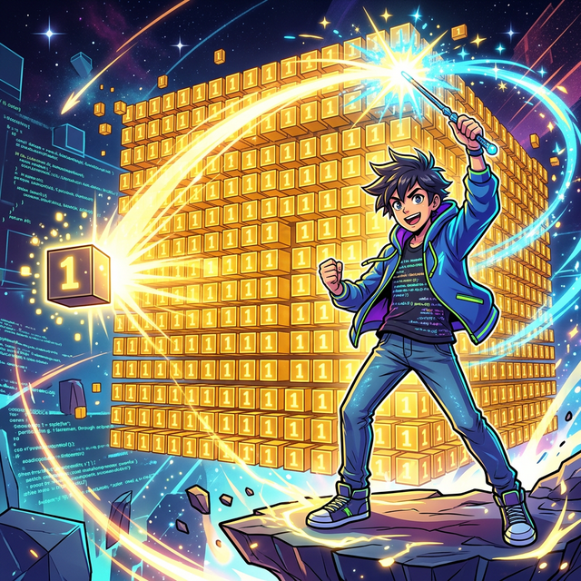

# 4.5.1 배열 연산과 스칼라 브로드캐스팅



<div style="text-align: center; margin: 30px 0;">
  <!-- SVG 브로드캐스팅(Broadcasting) 마법 애니메이션 -->
  <svg width="500" height="280" viewBox="0 0 500 280" xmlns="http://www.w3.org/2000/svg">
    <defs>
      <!-- 스칼라 에너지 볼 그라데이션 -->
      <radialGradient id="scalarGlow" cx="50%" cy="50%" r="50%">
        <stop offset="0%" stop-color="#fbd38d"/>
        <stop offset="50%" stop-color="#ed8936"/>
        <stop offset="100%" stop-color="#c05621"/>
      </radialGradient>
      
      <!-- 베이스 배열 블록 그라데이션 -->
      <linearGradient id="baseBox" x1="0%" y1="0%" x2="0%" y2="100%">
        <stop offset="0%" stop-color="#4299e1"/>
        <stop offset="100%" stop-color="#2b6cb0"/>
      </linearGradient>

      <!-- 버프 받은 배열 블록 그라데이션 -->
      <linearGradient id="buffBox" x1="0%" y1="0%" x2="0%" y2="100%">
        <stop offset="0%" stop-color="#4fd1c5"/>
        <stop offset="100%" stop-color="#2c7a7b"/>
      </linearGradient>

      <filter id="magicGlow" x="-50%" y="-50%" width="200%" height="200%">
        <feGaussianBlur stdDeviation="3" result="blur" />
        <feComposite in="SourceGraphic" in2="blur" operator="over" />
      </filter>
      
      <!-- 광선 빔 효과 -->
      <linearGradient id="beam" x1="0%" y1="0%" x2="100%" y2="0%">
        <stop offset="0%" stop-color="rgba(237, 137, 54, 0.8)"/>
        <stop offset="100%" stop-color="rgba(237, 137, 54, 0)"/>
      </linearGradient>
    </defs>

    <!-- 배경 데코레이션 -->
    <rect x="0" y="0" width="500" height="280" fill="#1a202c" rx="10"/>
    <g stroke="#2d3748" stroke-width="1" opacity="0.5">
      <line x1="0" y1="40" x2="500" y2="40"/>
      <line x1="0" y1="80" x2="500" y2="80"/>
      <line x1="0" y1="120" x2="500" y2="120"/>
      <line x1="0" y1="160" x2="500" y2="160"/>
      <line x1="0" y1="200" x2="500" y2="200"/>
      <line x1="0" y1="240" x2="500" y2="240"/>
    </g>

    <text x="250" y="30" font-family="Arial" font-size="16" font-weight="bold" fill="#e2e8f0" text-anchor="middle">
      Numpy Broadcasting 원리: 스칼라 버프 마법
    </text>

    <!-- 1. 좌측: 스칼라 마법사 (단일 값) -->
    <g transform="translate(60, 140)">
      <circle cx="0" cy="0" r="25" fill="url(#scalarGlow)" filter="url(#magicGlow)">
        <animate attributeName="r" values="22; 28; 22" dur="1.5s" repeatCount="indefinite"/>
      </circle>
      <text x="0" y="-35" font-family="monospace" font-size="14" font-weight="bold" fill="#fbd38d" text-anchor="middle">Scalar</text>
      <text x="0" y="6" font-family="monospace" font-size="20" font-weight="bold" fill="#fff" text-anchor="middle">* 2</text>
      
      <!-- 복제 확장 애니메이션 효과 (잔상) -->
      <g opacity="0">
        <animate attributeName="opacity" values="0; 0.6; 0" dur="2s" repeatCount="indefinite" begin="0.5s"/>
        <circle cx="0" cy="-60" r="15" fill="url(#scalarGlow)" opacity="0.5"/>
        <circle cx="0" cy="60" r="15" fill="url(#scalarGlow)" opacity="0.5"/>
        <text x="0" y="-55" font-family="monospace" font-size="12" fill="#fff" text-anchor="middle">* 2</text>
        <text x="0" y="65" font-family="monospace" font-size="12" fill="#fff" text-anchor="middle">* 2</text>
        <path d="M0,-25 L0,-40" stroke="#fbd38d" stroke-width="2" stroke-dasharray="2,2"/>
        <path d="M0,25 L0,40" stroke="#fbd38d" stroke-width="2" stroke-dasharray="2,2"/>
      </g>
    </g>

    <!-- 중앙 마법 광선 -->
    <g transform="translate(100, 140)">
      <rect x="0" y="-15" width="200" height="30" fill="url(#beam)">
        <animate attributeName="width" values="0; 200; 200" dur="2s" repeatCount="indefinite"/>
        <animate attributeName="opacity" values="1; 1; 0" dur="2s" repeatCount="indefinite"/>
      </rect>
    </g>
    
    <!-- 브로드캐스팅 빔 효과음? 텍스트 -->
    <text x="180" y="115" font-family="Arial" font-style="italic" font-size="12" fill="#ed8936">
      <animate attributeName="opacity" values="0; 1; 0" dur="2s" repeatCount="indefinite"/>
      Broadcasting...
    </text>

    <!-- 2. 우측: 타겟 배열 (1D Vector) -->
    <g transform="translate(320, 80)">
      <text x="60" y="-20" font-family="monospace" font-size="14" font-weight="bold" fill="#90cdf4" text-anchor="middle">Target Array</text>
      
      <!-- 블록 1 -->
      <g transform="translate(0, 0)">
        <rect x="0" y="0" width="120" height="35" rx="4">
           <animate attributeName="fill" values="#4299e1; #4fd1c5; #4299e1" dur="2s" repeatCount="indefinite" begin="0.8s"/>
        </rect>
        <text x="25" y="22" font-family="monospace" font-size="16" fill="#fff" font-weight="bold">1</text>
        <text x="60" y="22" font-family="monospace" font-size="14" fill="#fbd38d" opacity="0">
           <animate attributeName="opacity" values="0; 1; 0" dur="2s" repeatCount="indefinite" begin="0.8s"/>
           * 2
        </text>
        <text x="95" y="22" font-family="monospace" font-size="16" fill="#fff" font-weight="bold" opacity="0">
           <animate attributeName="opacity" values="0; 1; 0" dur="2s" repeatCount="indefinite" begin="1s"/>
           = 2
        </text>
      </g>

      <!-- 블록 2 -->
      <g transform="translate(0, 45)">
        <rect x="0" y="0" width="120" height="35" rx="4">
           <animate attributeName="fill" values="#4299e1; #4fd1c5; #4299e1" dur="2s" repeatCount="indefinite" begin="0.8s"/>
        </rect>
        <text x="25" y="22" font-family="monospace" font-size="16" fill="#fff" font-weight="bold">2</text>
        <text x="60" y="22" font-family="monospace" font-size="14" fill="#fbd38d" opacity="0">
           <animate attributeName="opacity" values="0; 1; 0" dur="2s" repeatCount="indefinite" begin="0.8s"/>
           * 2
        </text>
        <text x="95" y="22" font-family="monospace" font-size="16" fill="#fff" font-weight="bold" opacity="0">
           <animate attributeName="opacity" values="0; 1; 0" dur="2s" repeatCount="indefinite" begin="1s"/>
           = 4
        </text>
      </g>

      <!-- 블록 3 -->
      <g transform="translate(0, 90)">
        <rect x="0" y="0" width="120" height="35" rx="4">
           <animate attributeName="fill" values="#4299e1; #4fd1c5; #4299e1" dur="2s" repeatCount="indefinite" begin="0.8s"/>
        </rect>
        <text x="25" y="22" font-family="monospace" font-size="16" fill="#fff" font-weight="bold">3</text>
        <text x="60" y="22" font-family="monospace" font-size="14" fill="#fbd38d" opacity="0">
           <animate attributeName="opacity" values="0; 1; 0" dur="2s" repeatCount="indefinite" begin="0.8s"/>
           * 2
        </text>
        <text x="95" y="22" font-family="monospace" font-size="16" fill="#fff" font-weight="bold" opacity="0">
           <animate attributeName="opacity" values="0; 1; 0" dur="2s" repeatCount="indefinite" begin="1s"/>
           = 6
        </text>
      </g>
    </g>

    <!-- 하단 부연설명 -->
    <text x="250" y="260" font-family="Arial" font-size="13" fill="#a0aec0" text-anchor="middle">
      작은 차원(스칼라)이 형태를 쭉 늘이면서 확장(Broadcast)되어 배열 전체 타겟에 동시 명중합니다.
    </text>
  </svg>
  <p style="color: #718096; font-size: 0.9em; margin-top: -10px;"><em>[그림] 단일 스칼라 값이 배열 사이즈에 맞춰 복제되어 파티 전체에 버프를 거는 브로드캐스팅</em></p>
</div>

## 4.3.1 배열과 스칼라와의 연산

다음은 원소 3개로 구성된 1차원 배열 `a`이다.

```python
import numpy as np
a = np.arange(3)

a
```
**출력:**
```
array([0, 1, 2])
```

다음 코드처럼 배열과 스칼라 값과의 일반 연산은 모든 원소에 연산을 수행한 같은 모양의 배열을 반환한다.

```python
print(a + 2)
print(a - 2)
print(a * 2)
print(a / 2)
```
**출력:**
```
[2 3 4]
[-2 -1  0]
[0 2 4]
[0.  0.5 1. ]
```
