# 4.3.1 배열과 단일 숫자(스칼라)의 마법 같은 연산


## 스칼라 연산(Scalar Operations)의 프로그래밍적 의미와 활용
> 단 하나의 숫자가 배열 전체에 마법처럼 퍼져나가는 현상 (브로드캐스팅의 기초)

파이썬의 기본 리스트(`list`)에서 숫자를 더하거나 곱하려면 복잡한 `for` 반복문을 써서 원소를 하나하나 꺼낸 뒤 연산해야 합니다. 

하지만 Numpy의 강력한 특징 중 하나는 **크기가 거대한 배열(Array)에 단일 숫자(스칼라, Scalar) 하나를 던지면, 알아서 배열 안의 모든 원소에 똑같이 연산이 스며든다는 것**입니다!

이 현상을 전문 용어로 **브로드캐스팅(Broadcasting)**이라고 부릅니다. 


마치 방송국 송신탑에서 전파를 한 방 쏘면, 수만 대의 라디오가 동시에 똑같은 방송을 수신하는 것과 같은 이치입니다.


> 단일 스칼라 값이 배열 사이즈에 맞춰 스스로 복제되어 전체에 버프를 거는 모습

### 언제 어떤 용도로 사용할까? (실무 활용 사례)
- **일괄 데이터 보정표 (Data Scaling)**: 수만 명의 키나 몸무게 측정 데이터가 들어있는 배열에서 잴 때 기준이 잘못되어 전체적으로 "전부 +3cm 해줘", 혹은 달러 환율을 한국 돈으로 바꾸기 위해 "전부 * 1300 달러 환율을 곱해줘" 할 때 단 한 줄이면 1초 만에 완료됩니다.
- **좌표 일괄 이동 (Coordinate Shifting)**: 화면 속 주인공의 X, Y 좌표 배열을 가지고 있을 때, `좌표배열 + 10`을 하면 캐릭터가 우측으로 10픽셀 순간이동을 하게 됩니다. 물리 엔진 처리에서 필수적입니다.
- **퍼센트 및 확률변환**: 전체 학생의 시험 점수 배열을 `점수배열 / 100.0` 으로 나누어 단숨에 `0.0 ~ 1.0` 사이의 확률 값이나 퍼센테이지로 압축(정규화)할 때 쓰입니다.


## 스칼라 사칙연산 활용 예제

### 예제 1: 1차원 배열(벡터)에 기본 사칙연산 적용하기
원칙적으로 길이가 3칸짜리인 배열과 숫자 1개는 서로 덧셈이 불가능해야 하지만, Numpy는 스칼라(단일 숫자)를 3칸으로 쫙 `늘려` 복제한 뒤에 모든 칸에 동시에 더하고 곱해 줍니다.

```python
import numpy as np

# [1단계] 0부터 시작하는 3칸짜리 정수 배열 생성: [0, 1, 2]
a = np.arange(3)
a
```
**출력:**
```text
array([0, 1, 2])
```

```python
# [2단계] 스칼라 값(단일 숫자 2)을 이용한 사칙연산 마케팅 폭격!
# 덧셈: 모든 원소에 +2
print(a + 2)

# 뺄셈: 모든 원소에 -2
print(a - 2)

# 곱셈: 모든 원소에 *2
print(a * 2)

# 나눗셈: 모든 원소에 /2 (파이썬 기본 나눗셈은 실수를 반환하므로 float형으로 자동 변경됨)
print(a / 2)
```
**출력:**
```text
[2 3 4]
[-2 -1  0]
[0 2 4]
[0.  0.5 1. ]
```

> **[Tip]** 나눗셈 연산의 경우 파이썬 3의 특성상 `0 / 2`든 `1 / 2`든 결과가 무조건 소수점을 가지는 실수형(`float64`)으로 변환되어 배열 전체가 실수 배열로 바뀝니다. 정수만 남기고 버림을 하려면 `a // 2` (몫만 구하기) 연산자를 사용해야 합니다.
