# 4.5.2 배열과 배열의 요소별 연산 (Element-wise Operations)


## 아다마르 곱 (Hadamard Product)과 요소별 연산의 의미
> 크기(Shape)가 동일한 두 배열에서 같은 위치(인덱스)에 있는 원소들끼리 1:1로 수행하는 연산 방식


앞서 단일 실수값이 배열 안의 전체 요소에 적용되는 브로드캐스팅(Broadcasting)을 배웠습니다. 

이번에는 **크기(Shape)가 정확히 동일한 두 배열** 간의 사칙연산을 다룹니다. 배열 간의 기본 사칙연산은 모두 **요소별 연산(Element-wise operation)**으로 처리됩니다.

### 두 가지 종류의 행렬 곱셈
Numpy에서 다차원 배열(행렬) 간의 연산, 특히 곱셈 방식은 수학적으로 크게 두 가지로 나뉘어 처리됩니다. 이 두 가지를 혼동하지 않는 것이 매우 중요합니다.

#### 1. 요소별 연산과 아다마르 곱 (Hadamard Product)
두 행렬의 동일한 인덱스 위치에 있는 원소끼리 1:1로 대응하여 사칙 연산을 수행하는 방식입니다. 이 중에서도 두 행렬의 요소별 곱셈 연산을 지칭하여 수학에서는 **아다마르 곱(Hadamard Product)**이라고 부릅니다.

Numpy 프로그래밍에서 기본 사칙연산 기호인 `+`, `-`, `*`, `/`를 사용하면 모두 이 요소별 연산(Element-wise) 방식으로 동작합니다.

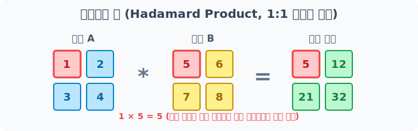
> 붉은색 테두리로 강조된 원소처럼 서로 동일한 행렬 위치를 가진 숫자끼리만 배타적으로 대응되어 곱해지는 모습입니다.

#### 2. 행렬의 내적 계산 (Dot Product)
선형대수학에서 정의하는 정통적인 행렬 곱셈 방식(내적 연산)입니다. 앞 행렬의 '행(Row)' 벡터 요소들과 뒤 행렬의 '열(Column)' 벡터 요소들을 순차적으로 곱하고 합산하여 값을 구성합니다.

이 내적 연산을 수행하기 위해서는 별도의 기호 `@` 또는 `.dot()` 함수를 명시적으로 사용해야 합니다.

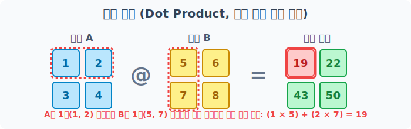
> 앞 행렬의 가로줄(행) 전체 집합과 뒤 행렬의 세로줄(열) 전체 집합이 십자가 형태로 교차하며 요소별로 곱해진 뒤 하나의 값 집합으로 합산하는(Dot Product) 과정입니다.

### 언제 어떤 용도로 사용할까? (실무 활용 사례)

실제 데이터 과학이나 프로그래밍 실무에서 배열 간의 '요소별 연산'은 매우 강력한 도구이며 광범위하게 쓰입니다.

#### 1. 대규모 데이터 세트 비교 및 병합 연산
예를 들어, '올해의 월별 매출액' 데이터 배열과 '작년의 월별 매출액' 데이터 배열이 있다고 가정해 봅시다. 파이썬 반복문을 돌리지 않고 단순히 `올해매출 - 작년매출` 단 한 줄의 뺄셈 기호만으로 모든 월의 '전년 대비 매출 증감액 배열'을 즉시 산출해 낼 수 있습니다.

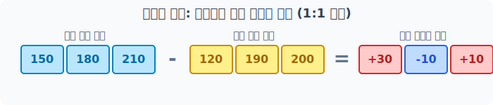
> 1월부터 12월까지 각각 동일한 위치(같은 월)에 해당하는 값끼리만 정확히 연산되어 증감 데이터가 추출됩니다.

#### 2. 이미지 처리에서의 마스킹(Masking) 및 합성
컴퓨터의 이미지는 결국 숫자들로 가득 찬 2차원(또는 3차원) 배열입니다. 특정 부위만 잘라내기 위해 0과 1로 이루어진 마스크(Mask) 배열을 겹쳐서 곱셈(`*`) 처리를 하면, 0인 부분(검은색)의 픽셀은 통째로 삭제되고 1인 부분의 원본 픽셀 정보만 고스란히 남아 깔끔한 영역 처리(크롭)가 완성됩니다. 이 외에도 투명도를 주어 두 사진을 겹치는 알파 블렌딩(`A * 0.5 + B * 0.5`) 작업 등에도 요소별 사칙연산이 필수적입니다.

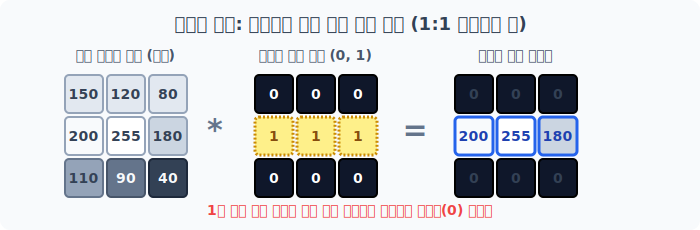
> 원본 이미지 배열에 0과 1로 구성된 마스크 필터 배열을 요소별로 아다마르 곱하게 되면, 1을 곱한 영역의 데이터만 보존되고 0을 곱한 나머지 데이터는 완전히 제거(0, 검정색)됩니다.


## 아다마르 연산
같은 모양(Shape) 두 원소끼리의 사칙연산

### 기본 배열 생성
다음 코드로 똑같은 2행 3열짜리 2차원 배열 `a`와 `b`를 준비합니다.

```python
import numpy as np

# [1단계] 1부터 6까지 채워진 2x3 배열
a = np.arange(1, 7).reshape(2, 3)
a
```
**출력:**
```text
array([[1, 2, 3],
       [4, 5, 6]])
```

```python
# [2단계] 'a'의 거푸집 틀을 빌려와 그 속을 [1, 2, 3] 패턴으로 가득 채운 쌍둥이 크기 배열
b = np.full_like(a, [1, 2, 3])
b
```
**출력:**
```text
array([[1, 2, 3],
       [1, 2, 3]])
```

모양이 정확히 2x3으로 동일한 두 배열은 파서는 기본 사칙 연산 연산자(`+`, `-`, `*`, `/`)를 만나면, 무조건 **같은 인덱스 위치의 맞은편 짝꿍 파트너와 1:1로 요소별 연산(Element-wise)**을 냅다 수행합니다. 

### 덧셈 (Addition)

크기가 같은 두 배열끼리 덧셈(`+`)을 수행하면, 서로 같은 위치(인덱스)에 있는 원소들끼리만 1:1로 더해진 결과 배열이 생성됩니다.

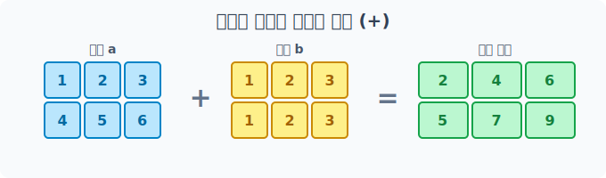
> 배열 `a`와 배열 `b`의 각 요소가 정확하게 같은 위치의 요소와 매칭되어 더해지는 모습입니다.

```python
# 배열 a와 b가 1:1로 대응하여 덧셈을 수행합니다.
result_add = a + b
print("1:1 덧셈 결과:\n", result_add)
```
**출력:**
```text
1:1 덧셈 결과:
 [[2 4 6]
  [5 7 9]]
```

### 뺄셈 (Subtraction)

뺄셈(`-`) 역시 동일하게 맞은편 짝꿍 파트너를 찾아 1:1로 빼앗는 연산을 진행합니다. 한 배열과 다른 배열의 데이터 간 차이를 비교 계산할 때 많이 쓰입니다.

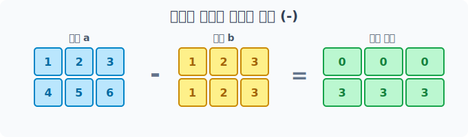
> 동일한 위치의 배열 `b` 값을 배열 `a`의 값에서 빼는 계산을 수행합니다.

```python
# 첫 번째 배열 a에서 두 번째 배열 b의 짝꿍을 1:1로 뺍니다.
result_sub = a - b
print("1:1 뺄셈 결과:\n", result_sub)
```
**출력:**
```text
1:1 뺄셈 결과:
 [[0 0 0]
  [3 3 3]]
```

### 곱셈 (Multiplication)

배열과 배열 사이의 기본 곱셈(`*`)은 내적(Dot Product) 행렬 곱이 아닙니다! **아다마르 곱(Hadamard Product)**이라 불리며 오직 자기와 똑같은 위치에 있는 맞은편 원소하고만 곱셈을 수행합니다.

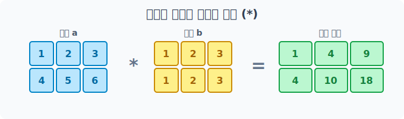
> 행렬의 일반적인 곱셈과 다르게 완전히 1:1 픽셀 단위로 마주보고 곱하게 됩니다.

```python
# 배열 a와 b의 같은 위치의 원소끼리만 곱합니다(아다마르 곱).
result_mul = a * b
print("1:1 곱셈 (아다마르 곱) 결과:\n", result_mul)
```
**출력:**
```text
1:1 곱셈 (아다마르 곱) 결과:
 [[ 1  4  9]
  [ 4 10 18]]
```

### 나눗셈 (Division)

나눗셈(`/`)도 맞은편에 대응되는 친구끼리만 나누어 결과를 반환합니다. 파이썬의 나눗셈 연산은 결과를 실수형(`float64`)으로 바꿔버리기 때문에 결과 배열 안에 소수점이 보이게 됩니다.

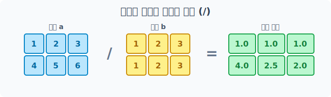
> 위치가 일치하는 짝꿍을 찾아 나눗셈 연산을 각각 배분하여 수행합니다.

```python
# 배열 a의 각 원소를 동일한 위치의 배열 b 원소로 1:1로 나누게 됩니다.
result_div = a / b
print("1:1 나눗셈 결과:\n", result_div)
```
**출력:**
```text
1:1 나눗셈 결과:
 [[1.  1.  1. ]
  [4.  2.5 2. ]]
```

## In-place 복합 대입 연산자와 파멸의 함정(Type Error)

Numpy 배열 연산에서도 파이썬처럼 `+=`, `-=`, `*=`, `/=` 등의 복합 대입 연산자를 지원합니다. 이를 사용하면 변수에 새로운 배열을 할당하지 않고 기존 메모리 공간을 덮어쓰기 때문에 속도와 메모리를 절약할 수 있습니다.

하지만 서로 다른 **자료형(dtype)** 을 가진 배열끼리 복합 대입 연산을 시도하면 끔찍한 함정에 빠질 수 있습니다. 

### 기본 배열 생성

정수형 배열 `a`와 실수형 배열 `b`를 예로 들어보겠습니다.

```python
# 정수형(int32) 공간 'a'
a = np.arange(4)
print("배열 a:", a)

# 실수형(float64) 공간 'b'
b = np.arange(0.5, 4, 1)
print("배열 b:", b)
```

### 1. 좁은 공간에 큰 데이터 밀어넣기 (에러 발생)

정수 전용인 `a` 방에 거대한 소수점 데이터인 `b`를 욱여넣으려(Cast) 시도하다가 좁아서 터지는(에러) 것을 볼 수 있습니다. 자료의 손실이 일어나는 경우에는 강제 저장이 안 됩니다.

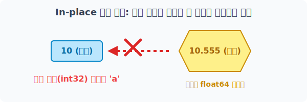
> 정수(int32) 전용 공간에 소수점이 있는 실수(float64) 데이터를 강제로 밀어 넣으려다 실패하는 상황입니다.

```python
# a (정수 공간) += b (실수 데이터) -> 크기가 작아서 실패!
a += b
```
**오류:**
```text
UFuncTypeError: Cannot cast ufunc 'add' output from dtype('float64') to dtype('int32') with casting rule 'same_kind'
```

### 2. 여유로운 공간에 안전하게 담기 (성공)

반대로 넓고 여유로운 실수형 보관 공간 `b`에 좁은 정수형 `a` 데이터를 들여오는 `b += a` 형태는 소수점 공간이라는 넓은 집이 이미 마련되어 있으므로 문제없이 부드럽게 흡수 보관됩니다.

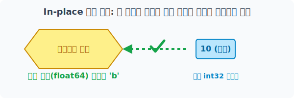
> 정수 데이터를 훨씬 더 넓은 실수형 보관 공간에 담는 것은 데이터 손실이 없으므로 안전하게 덧셈 연산 보관이 완료됩니다.

```python
# b (실수 공간) += a (정수 데이터) -> 넉넉하므로 성공!
b += a
print("안전하게 더해진 결과 b:", b)
```
**출력:**
```text
안전하게 더해진 결과 b: [0.5 2.5 4.5 6.5]
```

## 행렬의 내적 연산 (Dot Product)

수학에서 말하는 '전통적인 행렬 곱셈'인 내적(Dot Product) 연산은 아다마르 곱과 완전히 다릅니다. 앞 배열의 행(Row)과 뒤 배열의 열(Column) 개수가 서로 정확히 맞물려 떨어져야 수행할 수 있습니다.

내적 연산을 사용하려면 `*` 기호 대신 **앳(`@`) 기호**나 파이썬 객체 내장 **`.dot()` 함수**를 명시적으로 호출해야 합니다. 

### 1. 내적 연산의 형태 맞물림 조건 (Shape)

두 행렬이 내적 연산을 수행할 때 반드시 지켜야 하는 크기(Shape) 맞물림 규칙이 존재합니다. 행렬을 곱할 때, 앞 배열의 안쪽 열 개수와 뒤 배열의 안쪽 행 개수가 같아야만 맞물려 통과됩니다. 연산 후 새롭게 생성되는 배열의 크기는 양 끝 바깥쪽의 형태를 따르게 됩니다. 

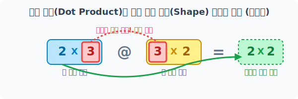
> `(2, 3)` 크기와 `(3, 2)` 크기는 행렬의 안쪽 기준 숫자인 `3`이 서로 일치하여 맞물리게 되므로 곱셈이 가능하며, 계산이 완료된 후에는 바깥쪽 숫자를 이어붙인 `(2, 2)` 모양의 데이터 배열이 생성됩니다.

### 기본 배열 생성

```python
# (2행 3열) 앞 행렬 데이터 준비
a = np.full((2, 3), [1, 2, 3])
print("행렬 a:\n", a)

# (3행 2열) 뒤 행렬 데이터 준비
b = np.full((3, 2), [2, 1])
print("\n행렬 b:\n", b)
```

### 2. 행렬 내적 연산 수행 (교환 법칙 불가능 주의!)

최신 파이썬의 표준 연산자인 골뱅이(`@`) 연산자나 Numpy 객체 전용 `.dot()` 함수를 호출하여 앞서 배운 행렬의 십자가 형태 합산 곱을 수행합니다.

일반적인 사칙연산의 단일 숫자 곱셈은 `3x2`나 `2x3`이나 순서를 바꾸어도 결과가 같은 교환법칙이 성립합니다. 하지만, **행렬의 내적 연산은 곱하는 순서를 뒤집으면 전혀 다른 크기와 구조의 결과가 나오게 됩니다.** 상황에 따라서는 내적 맞물림 조건 자체가 깨져 치명적인 연산 에러가 발생할 수도 있습니다.

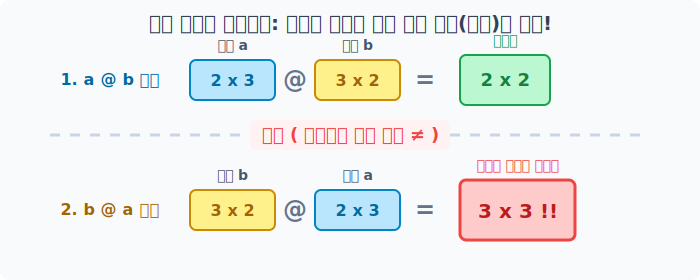
> `a @ b` 와 `b @ a` 는 완전히 다른 연산 흐름을 가지며, 결과물의 형태(Shape)와 내부 데이터 구조도 전혀 다르므로 절대 혼동하면 안 됩니다.

```python
# 직관적인 골뱅이 연산자 (파이썬 3.5 이후 지원)
result_ab = a @ b
print("행렬 a @ b 연산 결과:\n", result_ab)
```

**출력:**
```text
행렬 a @ b 연산 결과:
 [[12  6]
  [12  6]]
```

위 구조에서 곱셈의 순서를 바꿔 이번에는 `b @ a` 를 시도해 보겠습니다.
앞 자리에 배치된 `b(3x2)` 배열과 뒷자리에 배치된 `a(2x3)` 배열이 새롭게 만나면서 통과 조건 기준 숫자가 `2`가 되고, 연산 완료 후 양 끝의 테두리에 있던 `(3, 3)` 짜리 거대한 행렬 구조가 결과로 튀어나옵니다!

```python
# 순서를 바꿔 b를 앞으로, a를 뒤로 넘길 경우 완전 다른 세상이 열립니다!
result_ba = b.dot(a)
print("행렬 b @ a 연산 결과:\n", result_ba)
```

**출력:**
```text
행렬 b @ a 연산 결과:
 [[3 6 9]
  [3 6 9]
  [3 6 9]]
```
