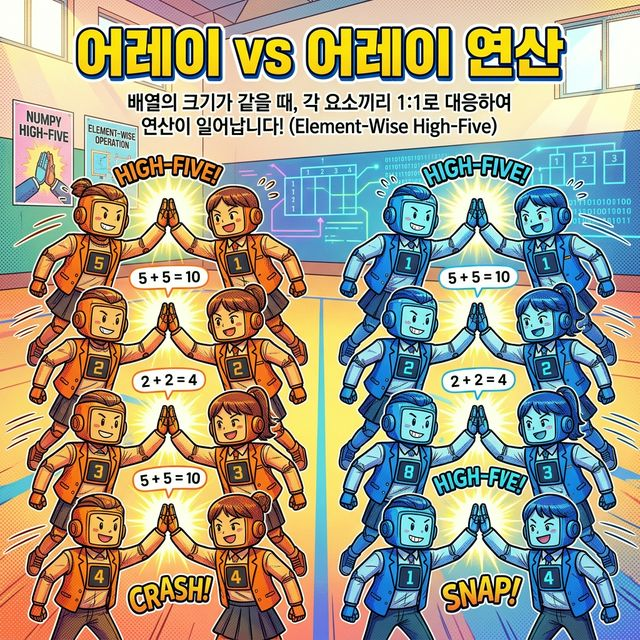

# 4.5.2 배열과 배열의 1:1 거울 연산 (Element-wise)


## 배열 대 배열 연산의 프로그래밍적 의미와 활용
> 모양(Shape)이 완전히 똑같은 두 그룹(배열)이 1:1로 짝을 지어 하이파이브 연산을 수행!



앞서 단일 숫자(스칼라)가 거대한 배열 전체에 똑같은 마법을 거는 브로드캐스팅을 배웠습니다. 

이번에는 반대로 **쌍둥이처럼 크기(Shape)가 정확히 같은 두 배열**끼리 만났을 때 벌어지는 일입니다.

### 수학적 의미: 두 가지 곱셈의 충돌
우리가 수학 시간에 종종 헷갈려 하는 부분이 배열(행렬)의 곱셈입니다. 

Numpy 행렬의 세계에는 완전히 성격이 다른 두 가지 방식이 존재합니다.

#### 1. 아다마르 곱 (Hadamard Product, 요소별 연산)
학생 그룹 A와 B가 마주 보고 서서, 자기 바로 맞은편에 있는 짝꿍하고만 정직하게 1:1로 곱하고 더하는 시각적 픽셀 연산입니다. 

프로그래밍에서 `+`, `-`, `*`, `/` 기호를 쓰면 무조건 이 방식이 작동합니다.

#### 2. 내적 (Dot Product, 행렬 곱)
앞 배열의 '가로줄(행)' 전체 팀과 뒤 배열의 '세로줄(열)' 전체 팀이 십자가 모양으로 무식하게 직진 충돌하여 하나의 숫자로 뭉쳐지는 찐 수학적 행렬 연산입니다. 

이 연산을 쓰려면 별도의 기호 `@`를 써야 합니다. (뒤에서 다시 자세히 배웁니다!)



### 언제 어떤 용도로 사용할까? (실무 활용 사례)

#### 두 데이터 세트 병합 연산   
예를 들어 올해와 작년의 '월별 매출액 배열' 두 개가 있을 때, 두 배열을 그냥 `올해매출 - 작년매출`로 빼주면 단숨에 1월부터 12월까지의 '전년대비 매출 증감액 배열'이 새롭게 탄생합니다.

#### 이미지 합성(Blending/Masking)  
두 장의 사진(픽셀 배열)을 투명도를 조절해 겹쳐 보이게 하거나(`A * 0.5 + B * 0.5`), 흑백 마스크 배열 장막(`0`과 `1`로 구성)을 곱해(`A * Mask`) 원하는 부위만 도려낼 때 자주 씁니다.


## 같은 모양(Shape) 두 원소끼리의 사칙연산 (아다마르 연산)

다음 코드로 똑같은 2행 3열짜리 2차원 배열 `a`와 `b`를 준비합니다.

```python
import numpy as np

# [1단계] 1부터 6까지 채워진 2x3 배열
a = np.arange(1, 7).reshape(2, 3)
a
```
**출력:**
```text
array([[1, 2, 3],
       [4, 5, 6]])
```

```python
# [2단계] 'a'의 거푸집 틀을 빌려와 그 속을 [1, 2, 3] 패턴으로 가득 채운 쌍둥이 크기 배열
b = np.full_like(a, [1, 2, 3])
b
```
**출력:**
```text
array([[1, 2, 3],
       [1, 2, 3]])
```

모양이 정확히 2x3으로 동일한 두 배열은 파서는 기본 사칙 연산 연산자(`+`, `-`, `*`, `/`)를 만나면, 무조건 **같은 인덱스 위치의 맞은편 짝꿍 파트너와 1:1로 요소별 연산(Element-wise)**을 냅다 수행합니다. 

```python
print("--- 1:1 덧셈 ---")
print(a + b)

print("\n--- 1:1 뺄셈 ---")
print(a - b)

print("\n--- 1:1 곱셈 (아다마르 곱) ---")
print(a * b)

print("\n--- 1:1 나눗셈 ---")
print(a / b)
```
**출력:**
```text
--- 1:1 덧셈 ---
[[2 4 6]
 [5 7 9]]

--- 1:1 뺄셈 ---
[[0 0 0]
 [3 3 3]]

--- 1:1 곱셈 (아다마르 곱) ---
[[ 1  4  9]
 [ 4 10 18]]

--- 1:1 나눗셈 ---
[[1.  1.  1. ]
 [4.  2.5 2. ]]
```

## In-place 복합 대입 연산자와 파멸의 함정(Type Error)

Numpy 배열 연산에서도 `+=`, `-=`, `*=`, `/=` 등의 복합 대입 연산자를 지원하여 메모리를 절약하며 변수 본연의 내용을 덮어버릴 수 있습니다. 

하지만, 배열 각각의 **자료형 허용치(dtype)** 가 다르면 끔찍한 함정에 빠질 수 있습니다.

```python
# 'a'는 정수(int32)들만 출입 가능한 아파트 
a = np.arange(4)
a
```
**출력:**
```text
array([0, 1, 2, 3])
```

```python
# 'b'는 소수점 실수형(float64) 아파트
b = np.arange(0.5, 4, 1)
b
```
**출력:**
```text
array([0.5, 1.5, 2.5, 3.5])
```

다음 코드는 정수 전용인 `a` 방에 거대한 소수점 데이터인 `b`를 욱여넣으려(Cast) 시도하다가 방이 좁아 터지는 에러를 발생시킵니다.

```python
# a(정수) 방에 a + b(결과는 실수) 데이터를 밀어넣으려고 시도! -> 실패!
a += b
```
**오류:**
```text
UFuncTypeError: Cannot cast ufunc 'add' output from dtype('float64') to dtype('int32') with casting rule 'same_kind'
```

반대로 넓고 여유로운 실수형 아파트 `b`에 좁은 정수형 `a` 데이터를 들여오는 `b += a`는 문제없이 부드럽게 흡수됩니다.

```python
# b(실수) 방에 실수 결과를 안전하게 밀어넣어 보관!
b += a
b
```
**출력:**
```text
array([0.5, 2.5, 4.5, 6.5])
```

## 행렬의 곱셈 (Dot Product)
수학에서 말하는 '진짜 행렬 단위의 내적(Dot Product) 연산'은 앞 배열의 행(Row)과 뒤 배열의 열(Column) 갯수가 서로 정확히 맞물려 떨어져야 수행할 수 있습니다. 

`*` 기호 대신 앳(`@`) 연산자나 `a.dot(b)` 함수 호출을 사용하여 파괴력 있는 십자가 충돌 곱 연산을 수행합니다.

- `(2, 3)` 모양의 배열과 `(3, 2)` 모양의 배열은 안쪽 고리인 `3`이 서로 맞물려 통과되므로 곱할 수 있으며, 바깥 고리인 `(2, 2)` 모양의 새 배열이 탄생합니다.

```python
# (2행 3열) 앞 행렬
a = np.full((2, 3), [1, 2, 3])
a
```
**출력:**
```text
array([[1, 2, 3],
       [1, 2, 3]])
```

```python
# (3행 2열) 뒤 행렬
b = np.full((3, 2), [2, 1])
b
```
**출력:**
```text
array([[2, 1],
       [2, 1],
       [2, 1]])
```

두 배열 `a`, `b`의 곱 연산은 `@` 연산자, 또는 `ndarray`의 객체 내장 함수 `.dot()`으로 깔끔하게 수행됩니다.

```python
# 직관적인 골뱅이 연산자 (파이썬 3.5 이후 지원)
a @ b
```
**출력:**
```text
array([[12,  6],
       [12,  6]])
```

```python
# 고전적인 함수 호출 방식
a.dot(b)
```
**출력:**
```text
array([[12,  6],
       [12,  6]])
```

일반적으로 행렬의 곱셈은 순서를 바꾸면 전혀 다른 결과가 나오거나 아예 에러가 납니다(교환법칙 성립 안됨!).

이번엔 반대로 `b(3x2)` @ `a(2x3)` 연산을 뒤집어 실행해 보면, 맞물리는 `2`를 제외하고 `(3, 3)` 덩어리 모양의 결과가 튀어나오게 됩니다!

```python
# b가 앞으로, a가 뒤로 가면 (3x3)이라는 완전히 새로운 세상이 열립니다
b.dot(a)
```
**출력:**
```text
array([[3, 6, 9],
       [3, 6, 9],
       [3, 6, 9]])
```
