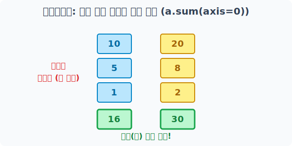
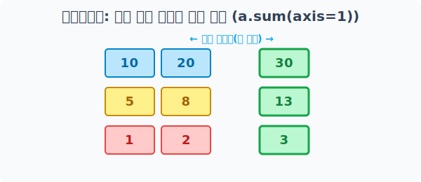

# 4.5.3 다차원 배열을 주무르는 마법
통계 압축(Aggregation)과 범용 함수(Ufunc)


## ① 축(Axis) 방향으로 데이터 압축하기 (통계 함수)

2차원 엑셀 표 같은 다차원 배열에서 요약 통계(`sum`, `mean` 등)를 구할 때는 **'어떤 방향으로 짜부라뜨릴지(축, Axis 설정)'**가 가장 중요합니다. 축을 적절히 설정하면 데이터가 지정한 방향으로 찌그러지며 통곗값이 추출됩니다.

### 기본 데이터 배열 준비

```python
import numpy as np

# 3행 2열짜리 학생 성적표 자료(배열) 생성
a = np.array([[10, 20], 
              [ 5,  8], 
              [ 1,  2]])
print("원본 배열 a:\n", a)
```

**결과 출력:**
```text
원본 배열 a:
 [[10 20]
  [ 5  8]
  [ 1  2]]
```

### 전체 데이터 뭉개기 (단일 스칼라 압축)

특별히 방향(`axis`)을 지시하지 않으면 표 안에 있는 모든 원소를 단순히 무식하게 하나로 몽땅 더해버린 단일 스칼라 값을 반환합니다.


> 배열 내부의 6개의 원소가 하나로 몽땅 병합되어 46이라는 하나의 단일 값만 도출됩니다.

```python
# 배열 안의 모든 숫자를 영혼까지 끌어모아 통째로 더하기
total_sum = a.sum()
print("전체 원소의 합:", total_sum)
```

**결과 출력:**
```text
전체 원소의 합: 46
```

### 세로 방향으로 압축하기 (axis=0)

`axis=0`을 지정하면 위에서 아래(세로) 방향으로 압축됩니다. 세로로 나열된 여러 행(Row)들이 하나의 가로줄로 통계(요약)됩니다. (예: 표에서 세로로 있는 각 과목별 총점 구하기)


> 위에서 아래 방향으로(axis=0) 누르듯 덧셈을 수행하여 세로 축이 소멸하고 하나의 가로 결과만 남습니다.

```python
# 세로 방향(과목별)으로 누적 합계 내기
col_sum = a.sum(axis=0)
print("세로 압축(axis=0) 결과:", col_sum)
```

**결과 출력:**
```text
세로 압축(axis=0) 결과: [16 30]
```

### 가로 막대 방향으로 압축하기 (axis=1)

`axis=1`을 지정하면 좌우(가로)에서 밀어 찌그러뜨립니다. 각 행 내부에 있는 열(Column)들이 서로 뭉개져 하나로 합산됩니다. (예: 세로로 나열된 학생들의 각 개인별 전과목 총점 구하기)


> 좌우 양옆에서(axis=1) 밀며 덧셈을 수행하여 가로 축이 합쳐지고 각 행 단위의 결과값만 남습니다.

```python
# 가로 방향(학생별)으로 합계 내기
row_sum = a.sum(axis=1)
print("가로 압축(axis=1) 결과:", row_sum)
```

**결과 출력:**
```text
가로 압축(axis=1) 결과: [30 13  3]
```

객체의 내장 메서드(`a.sum()`) 대신 넘파이 외장 함수(`np.sum(a)`)를 써도 완벽하게 똑같이 작동합니다.

```python
print("전체 합:", np.sum(a))
print("세로 압축(axis=0):", np.sum(a, axis=0))
print("가로 압축(axis=1):", np.sum(a, axis=1))
```

---

## ② 초고속 수학 계산 컨베이어 벨트: 범용 함수 (Universal Function, Ufunc)

파이썬의 기본 로직으로 100만 개의 숫자에 모두 제곱근(`루트`)을 씌우려면, `for` 반복문을 100만 번 돌며 수학 모듈(`math.sqrt`)을 호출해야 하므로 속도가 끔찍하게 느립니다.
Numpy는 이를 해결하기 위해 **초고속 C언어 엔진을 바탕으로, 데이터들을 컨베이어 시스템에 올려 각 원소에 동시에 수학 함수를 꽂아 넣어주는 '범용 함수(Ufunc)'**라는 마법의 메커니즘을 제공합니다. 


> for 반복문 없이, 배열 묶음을 통째로 기계에 넣기만 하면 각 원소 계산이 빛의 속도로 일괄 처리되는 컨베이어 벨트 구조입니다.

### 단일 인자 함수 일괄 적용 (루트와 특수 변환)

하나의 입력 배열 데이터를 받아 각각의 원소에 대해 수학 변환을 일괄 지시합니다.

```python
import numpy as np

# [1, 4, 9] 실수형 배열 생성
b = np.array([1, 4, 9])
print("원본 배열 b:", b)

# 수학 엔진으로 각 숫자에 일괄 루트(Square Root)를 씌움! (for문 불필요)
result_sqrt = np.sqrt(b)
print("각 원소 루트 씌우기:", result_sqrt)

# 일괄 자연 로그(Log) 변환 적용. (데이터 그래프 분포를 부드럽게 펼칠 때 유용)
result_log = np.log(b)
print("자연 로그 변환:", result_log)
```

**결과 출력:**
```text
원본 배열 b: [1 4 9]
각 원소 루트 씌우기: [1. 2. 3.]
자연 로그 변환: [0.         1.38629436 2.19722458]
```

### 다중 인자 함수 적용 (사칙연산의 숨겨진 함수 버전)

두 배열의 1:1 아다마르 연산 기호인 `+`, `-` 역시 결국 내부적으로 시스템 엔진인 특수 범용 함수를 불러 구동되는 원리입니다. 이를 명시적으로 호출할 수도 있습니다.


> 두 개의 배열이 동시에 짝을 지어 함수 컨베이어 시스템을 통과하며 1:1로 일괄 변환 처리됩니다.

```python
# 동일 위치에 사칙연산을 먹이기 위한 배열 구성
c = np.array([1, 4, 9])
d = np.full_like(c, 2)  # 통일된 [2, 2, 2] 생성

# 1:1 요소별 연산을 Ufunc을 직접 호출하여 내부 엔진으로 수행
print("요소별 더하기 함수 np.add(c, d):", np.add(c, d))
print("요소별 거듭제곱 np.power(c, d):", np.power(c, d))  # c 안의 요소들을 d 값(2) 만큼 승수 적용(1^2, 4^2, 9^2)
```

**결과 출력:**
```text
요소별 더하기 함수 np.add(c, d): [3 6 11]
요소별 거듭제곱 np.power(c, d): [ 1 16 81]
```

---

## ③ 데이터의 빈 구멍 (결측치) 치유하기: np.nan 과 None

빅데이터나 AI 모델 시나리오에서 시스템을 가장 골치 아프게 하는 것은 측정 기계 고장 등으로 비어버린 빵꾸값(결측치, Missing Values)입니다. 파이썬과 Numpy는 각각 다른 방식으로 이 구멍을 인지합니다.

### 시스템을 터트리는 파괴자: `None`

`None`은 데이터가 아예 존재하지 않음 그 자체를 나타내는 파이썬 기본 키워드 형입니다. 숫자로 취급받지 못하기 때문에 이를 연산에 더하거라 시도하면 **"NoneType엔 숫자를 수학적으로 더할 수 없어!"(TypeError)**라며 그 자리에서 컴퓨터가 프로그램을 멈추고 강제로 꺼버립니다. 빅데이터 분석에서 이 에러 하나만으로 모든 운영이 셧다운 될 수 있어 매우 위험합니다.

### 빈 공간을 보존하는 좀비 전염병: `np.nan` (Not a Number)

넘파이는 빈칸 처리를 위해 `np.nan`을 제공합니다. 이는 실제로는 비어있지만, 메모리 상에서는 엉성하게나마 **실수형(float)** 취급을 받아주기 때문에 억지로 계산을 시켜도 프로그램이 터지지는 않고 버팁니다.
하지만 가장 무서운 점은 **`nan`이 하나라도 섞인 배열을 그대로 통계 계산(sum, mean 등)에 밀어 넣으면, 나머지 정상적인 수백만 개의 숫자들마저 싸그리 파괴해버리며 결과물 전체를 `nan`으로 감염환자처럼 덮어씌운다**는 점입니다!


> 결측치가 단 하나라도 섞인 배열로 일반 통계를 돌리면 에러가 나지 않는 대신, 결과 자체가 고장난 nan으로 도출됩니다.

```python
# 두 번째 위치에 결측치(nan)가 한 마리 몰래 숨어 있는 배열
e = np.array([20, np.nan, 13, 24])

# 그냥 일반 평균 구하기 함수를 쓰면 주변 데이터까지 전염시켜 파괴해버림!
bad_mean = np.mean(e)
print("일반 통계함수 np.mean 결과:", bad_mean)
```
**결과 출력:**
```text
일반 통계함수 np.mean 결과: nan
```

### 전용 백신 함수로 nan 극복하고 데이터 살리기

Numpy는 이런 감염병 현상을 회피할 수 있는 `nan` 전용 보안(Safe) 통계 함수 시리즈를 별도로 제공합니다. 연산 도중 빈칸 오염구역을 발견하면 아예 투명하게 무시해버리고, 나머지 튼튼한 원소들끼리만 모아 안정적으로 평균과 통계를 산출합니다.


> `np.isnan(e)`로 진단서를 뽑고, 틸드(`~`) 기호로 내용을 부정(반대)하여 오염된 구간만 False로 떨어뜨리고 건강한 True 데이터만 추출해 냅니다.

```python
# 'nanmean' 이라는 백신 함수를 사용하여 nan만 무시하고 깨끗히 정제된 정상 데이터(20, 13, 24)들로만 다시 평균치 산출!
safe_mean = np.nanmean(e)
print("안전한 백신함수 np.nanmean 결과:", safe_mean)

# np.isnan()을 사용하면 nan이 숨어있는 부분만 True 병결 처리하는 진단서가 발급됨.
print("결측치 위치 탐지 진단서:", np.isnan(e))

# 앞에 틸드(~) 'Not'을 붙이면 "nan 진단을 안 받은 애들만 살려줘!" 라는 식으로 데이터 크롭이 가능!
clean_e = e[~np.isnan(e)]
print("nan 색출 후 완벽히 소독 정제된 배열:", clean_e)
```
**결과 출력:**
```text
안전한 백신함수 np.nanmean 결과: 19.0
결측치 위치 탐지 진단서: [False  True False False]
nan 색출 후 완벽히 소독 정제된 배열: [20. 13. 24.]
```

---

## 💡 요약 정리: 대표적 내장 유틸리티 함수(메서드) 모음집

Numpy에는 배열 내부 요소로 수많은 강력한 데이터 분석 기능이 구비되어 있습니다. 배열 객체 바로 뒤에 `.` 찍어서 사용하거나 외장 함수로 사용합니다. 축(`axis`) 기능을 조합하면 매우 정교한 분석이 가능합니다.

| 메서드        | 문법                 | 실무 사용 요약 해설                                                                                          |
| :------------ | :------------------- | :------------------------------------------------------------------------------------------------------------ |
| `sum()`       | `sum(axis=None)`     | 배열 원소들의 총합 반환.                                                                 |
| `mean()`      | `mean(axis=None)`    | 배열 안의 값들의 산술적인 전체 평균(Mean) 계산치.                                                                                  |
| `max()`       | `max(axis=None)`     | 배열에서 가장 높은 1등 요소(최고치) 값 리턴.                                                                                        |
| `min()`       | `min(axis=None)`     | 배열에서 가장 낮은 꼴찌 요소(최저치) 값 리턴.                                                                                      |
| `std()`       | `std(ddof=1)`        | 값들이 퍼져있는 산점의 불규칙한 정도를 계산하는 **표준편차(Standard Deviation)** 추출.                                |
| `var()`       | `var(ddof=1)`        | 정규 중심값 배열 데이터로부터 얼마나 폭넓게 이탈해 있는지 그리는 분산(Variance).                                                                    |
| `cumsum()`    | `cumsum(axis=None)`  | 앞쪽부터 순차적으로 계속해서 누적해 더하는 배열 반환 **(누적 합계/Cumulative Sum)**.                                                        |
| `cumprod()`   | `cumprod(axis=None)` | 앞쪽부터 순서대로 계속 이어서 곱해 나가는 배열 반환 **(누적 곱 단위계산)**. 이자 복리 이율 산정 등에 매우 유리.                             |
| `argmax()`    | `argmax(axis=None)`  | 최고 높은 값을 직접 주지 않고, 가장 높은 점수가 **몇 번째 순서(인덱스 번호)**에 앉아 있는지 위치만 반환.                                |
| `argmin()`    | `argmin(axis=None)`  | 제일 낮은 최저치 하위값이 위치한 **인덱스 번호** 반환.                                                                            |
| `reshape()`   | `reshape(newshape)`  | 전체 갯수는 깨트리지 않은 채, 3차원/다차원 행렬(Shape) 구조 블록 배열을 전혀 다른 새로운 구조로 재조립(트랜스폼).                                     |
| `transpose()` | `transpose(*axes)`   | 행렬의 가로줄(행) 전체 블록과 세로줄(열) 전체 구조물을 완전히 십자가 형태로 뒤집어 맞바꾸는 전치 치환 작업.                                     |
| `flatten()`   | `flatten()`          | 아무리 복잡한 3D, 4D 차원에 입체적으로 적재된 데이터라도, 불도저처럼 납작하게 밀어 1차원 직선형 데이터로 구조 파괴 및 압축.                                    |
| `clip()`      | `clip(min, max)`     | 데이터 폭주를 방지하기 위해 주어진 `min`/`max` 범위를 넘어선 돌연변이 데이터들을 억지로 상하한선 값에 고정시켜 정제시킴. |
| `astype()`    | `astype(dtype)`      | `astype(float)` 명시처럼 원래 정수나 문자로 되어있던 배열 전체 구성원을 통째로 새로운 규격(실수 등)의 자료형으로 변환 보정처리.                |
