# 4.5.3 다차원 배열을 주무르는 마법: 통계 압축(Aggregation)과 범용 함수(Ufunc)


## ① 축(Axis) 방향으로 데이터 짜부라뜨리기 (Aggregation)

**[비유로 이해하기: 축(Axis) 방향으로 데이터 압축]**
2차원 엑셀 표 같은 배열에서 요약 통계(`sum`, `mean` 등)를 구할 때는 **'어떤 방향으로 짜부라뜨릴지(축, Axis 설정)'**가 가장 중요합니다.
- **`axis=0`**: 위에서 아래(세로) 방향으로 누릅니다. -> 여러 행이 합쳐져 하나의 행으로 요약됩니다. (예: 각 과목별로 학생들의 총점 구하기)
- **`axis=1`**: 좌우(가로)에서 눌러 찌그러뜨립니다. -> 여러 열이 뭉개져 가로 합계 방향으로 계산됩니다. (예: 각 학생별로 전 과목 총점 구하기)

```python
import numpy as np

# [1단계] 3행 2열짜리 학생 점수표(배열) 생성
a = np.array([[10, 20], [5, 8], [1, 2]])
a
```
**출력:**
```text
array([[10, 20],
       [ 5,  8],
       [ 1,  2]])
```

아무 방향(axis)을 지시하지 않고 `a.sum()`을 호출하면, 표 안에 있는 모든 숫자를 무식하게 하나로 다 더해버린 스칼라 값을 반환합니다.

```python
# 배열 내의 진짜 모든 원소들을 영혼까지 끌어모아 다 더하기
a.sum()
```
**출력:**
```text
46
```

`a.sum(axis=0)`은 세로 방향(위에서 아래로) 압축 덧셈을 수행합니다. 3개의 행이 1개로 합쳐집니다.

```python
# 세로 방향(과목별) 통계 내기
a.sum(axis=0)
```
**출력:**
```text
array([16, 30])
```

`a.sum(axis=1)`은 가로 방향(좌에서 우로) 압축 덧셈을 수행합니다. 각각의 행 내부에서 열들이 합쳐집니다.

```python
# 가로 방향(학생별) 통계 내기
a.sum(axis=1)
```
**출력:**
```text
array([30, 13,  3])
```

객체의 내장 메서드(`a.sum()`) 대신 넘파이 외장 함수(`np.sum(a)`)를 써도 완벽하게 동일하게 작동합니다.

```python
print("전체 합:", np.sum(a))
print("세로 압축(axis=0):", np.sum(a, axis=0))
print("가로 압축(axis=1):", np.sum(a, axis=1))
```
**출력:**
```text
전체 합: 46
세로 압축(axis=0): [16 30]
가로 압축(axis=1): [30 13  3]
```

함수 `ndarray.cumsum()`은 모든 원소를 순서대로 누적 합계를 반환한다. n차원도 일차원 배열의 결과가 된다.

```python
a = np.array([[3, 5, 8], [4, 7, 11]])
a
```
**출력:**
```
array([[ 3,  5,  8],
       [ 4,  7, 11]])
```

```python
a.cumsum()
```
**출력:**
```
array([ 3,  8, 16, 20, 27, 38])
```

함수 `ndarray.cumsum(axis=0)`은 주어진 축인 열에 따라 요소의 누적 합계를 반환한다. 차원은 동일한 배열 모양의 결과가 된다. 함수 `ndarray.cumsum(axis=1)`은 주어진 축인 행에 따라 요소의 누적 합계를 반환한다. 차원은 동일한 배열 모양의 결과가 된다.

```python
a.cumsum(axis=0)
```
**출력:**
```
array([[ 3,  5,  8],
       [ 7, 12, 19]])
```

```python
a.cumsum(axis=1)
```
**출력:**
```
array([[ 3,  8, 16],
       [ 4, 11, 22]])
```

---

## ② 초고속 수학 계산 컨베이어 벨트: 범용 함수 (Universal Function, Ufunc)

파이썬의 기본 로직으로 100만 개의 숫자에 모두 제곱근(`루트`)을 씌우려면, `for` 반복문을 100만 번 돌면서 수학 모듈(`math.sqrt()`)을 한 땀 한 땀 호출해야 합니다. 속도가 끔찍하게 느리겠죠?
이 문제를 해결하기 위해 Numpy는 **배열을 컨베이어 벨트에 올리기만 하면, 기계가 초고속 C언어 엔진을 바탕으로 각 원소에 동시에 수학 함수를 때려 박아주는 '범용 함수(Ufunc)'**라는 마법의 메커니즘을 제공합니다.


<p style="color: #718096; font-size: 0.9em; text-align: center; margin-top: -10px;"><em>[그림] 배열을 한 번 통과시키면 원소 전체가 빛의 속도로 일괄 계산되는 모습</em></p>

다음은 `numpy`가 자랑하는 파워풀한 범용 수학 함수 핵심 리스트입니다.

| 함수 | 직관적 설명 | 예제 결과 |
| :--- | :--- | :--- |
| `np.add(x1, x2)` | 요소별 덧셈 (`+` 기호와 동일) | `np.add([1, 2], [3, 4])` -> `[4, 6]` |
| `np.subtract(x1, x2)` | 요소별 뺄셈 (`-` 기호와 동일) | `np.subtract([3, 4], [1, 2])` -> `[2, 2]` |
| `np.multiply(x1, x2)` | 요소별 곱셈 (`*` 기호와 동일) | `np.multiply([1, 2], [3, 4])` -> `[3, 8]` |
| `np.divide(x1, x2)` | 요소별 나눗셈 (`/` 기호와 동일) | `np.divide([3, 4], [1, 2])` -> `[3.0, 2.0]` |
| `np.power(x1, x2)` | 요소별 거듭제곱 (`**`와 동일) | `np.power([1, 2], [3, 4])` -> `[1, 16]` |
| `np.sqrt(x)` | **요소별 제곱근 (루트 씌우기)** | `np.sqrt([1, 4, 9])` -> `[1.0, 2.0, 3.0]` |
| `np.sin(x), cos(x)` | **요소별 삼각함수 파동 계산** | `np.sin([0, np.pi/2])` -> `[0.0, 1.0]` |
| `np.exp(x)` | 요소별 지수 함수 ($e^x$ 승) | `np.exp([1, 2])` -> `[2.718..., 7.389...]` |
| `np.log(x)` | 요소별 자연 로그 함수 | `np.log([1, np.e])` -> `[0.0, 1.0]` |

### Ufunc 단일 인자 적용 (제곱근, 로그)

다음 코드는 인자가 하나인 `np.sqrt(a)`의 결과를 반환한다.

```python
import numpy as np

a = np.array([1, 4, 9])
np.sqrt(a)
```
**출력:**
```
array([1., 2., 3.])
```

```python
a = np.array([1, 4, 9])

# 각 숫자에 대해 수학 엔진으로 일괄 루트(Square Root)를 씌움! 
np.sqrt(a)
```
**출력:**
```text
array([1., 2., 3.])
```

```python
# 일괄 자연 로그(Log) 변환 적용. 데이터 분포를 정규분포처럼 부드럽게 만들 때 유용함
np.log(a)
```
**출력:**
```text
array([0.        , 1.38629436, 2.19722458])
```

### Ufunc 다중 인자 적용 (두 배열의 사칙연산 함수 버전)
기호 `+`, `-` 대신 명시적인 `np.add()`, `np.divide()` 함수를 사용해도 결과는 같습니다. 시스템 내부적으로는 기호 연산도 이 함수들을 불러와 연산하는 것입니다!

```python
a = np.array([1, 4, 9])
b = np.full_like(a, 2)  # [2, 2, 2] 생성

# 두 배열을 인자로 주면 1:1 아다마르 요소별 연산을 일괄 수행
print("더하기 함수 np.add(a, b):", np.add(a, b))
print("나누기 함수 np.divide(a, b):", np.divide(a, b))
print("거듭제곱 함수 np.power(a, b):", np.power(a, b))   # a의 b승 (1^2, 4^2, 9^2)
```
**출력:**
```text
더하기 함수 np.add(a, b): [3 6 11]
나누기 함수 np.divide(a, b): [0.5 2.  4.5]
거듭제곱 함수 np.power(a, b): [ 1 16 81]
```

---

### ③ 배열에 속한 대표적인 내장 유틸리티 함수(메서드) 19선

수학적 연산 외에도 데이터를 조립하고, 값을 강제로 자르고, 정렬하는 등 실무 데이터 분석에서 빈번히 쓰이는 강력한 기능(Method)들이 배열 내부 요소로 구비되어 있습니다. 특히 `axis(축)`를 지정하면 2차원(행렬) 단위에서 세로/가로 단위 연산을 각각 독립적으로 시행할 수 있습니다.

| 메서드        | 문법                 | 실무 핵심 설명                                                                                                |
| :------------ | :------------------- | :------------------------------------------------------------------------------------------------------------ |
| `sum()`       | `sum(axis=None)`     | 배열 원소들의 총합 반환. `axis=0`은 각 열의 합계, `axis=1`은 각 행의 합계 도출.                                 |
| `mean()`      | `mean(axis=None)`    | 배열 원소들의 평균(Mean) 반환.                                                                                  |
| `max()`       | `max(axis=None)`     | 배열 내 가장 큰 값 반환.                                                                                        |
| `min()`       | `min(axis=None)`     | 배열 내 가장 작은 값 반환.                                                                                      |
| `std()`       | `std(ddof=1)`        | 배열 원소들의 **표준편차(Standard Deviation)** 파악. `ddof=1`으로 표본표준편차 보정 필수 적용 주의.             |
| `var()`       | `var(ddof=1)`        | 배열 원소들의 분산(Variance). 편차의 제곱합.                                                                    |
| `cumsum()`    | `cumsum(axis=None)`  | 앞쪽부터 쭉 계산해 나가는 **누적 합계(Cumulative Sum)**.                                                        |
| `cumprod()`   | `cumprod(axis=None)` | 앞쪽부터 쭉 곱해나가는 **누적 곱(Cumulative Product)**. 이자율 복리 계산 등에 유용.                             |
| `argmax()`    | `argmax(axis=None)`  | 최댓값이 있는 **위치(인덱스)** 반환. 제일 높은 점수(값)를 받은 데이터가 누구(인덱스)인지 찾을 때 씀.            |
| `argmin()`    | `argmin(axis=None)`  | 최솟값이 있는 **위치(인덱스)** 반환.                                                                            |
| `reshape()`   | `reshape(newshape)`  | 배열의 다차원 형태(Shape)를 전혀 다른 구조로 재배열 (예: 1x4 행렬을 2x2로).                                     |
| `transpose()` | `transpose(*axes)`   | 배열의 x축과 y축을 십자 뒤집기하듯 전치(Transpose) 변환하여 차원을 맞바꿈.                                      |
| `flatten()`   | `flatten()`          | 아무리 깊은 3차원, 4차원 데이터라도 일자로 쫙 펴서 1차원 데이터로 압축 변환.                                    |
| `clip()`      | `clip(min, max)`     | 주어진 자르기(Clip) 범위를 벗어난 이상치를 `min` 또는 `max` 상하한선 값으로 강제 변환하여 데이터를 안정화시킴. |
| `tolist()`    | `tolist()`           | 넘파이 다차원 배열을 파이썬의 표준 `list` 형식으로 원복하여 내보냄. 일반 파이썬 함수와 호환할 때 필요.            |
| `astype()`    | `astype(dtype)`      | `astype(int)`처럼 배열 전체 원소를 실수에서 정수 등으로 일괄 **캐스팅 형 변환**.                                |
| `copy()`      | `copy()`             | 얕은 참조로 원본이 오염되는 것을 막고, 새로운 메모리에 완벽히 독립된 배열로 거푸집 **깊은 복사**를 뜸.          |
| `sort()`      | `sort(axis=-1)`      | 배열 데이터 오름차순 정렬 처리.                                                                                 |
| `argsort()`   | `argsort(axis=-1)`   | 값을 직접 정렬하여 반환하는 대신, 원래 배열의 **몇 번째 순서(인덱스)들의 나열 조합인지 그 정렬 트리거**만 반환. |

### ④ 데이터의 빈 구멍 (결측치) 치유하기: np.nan 과 None

빅데이터나 AI 모델 시나리오에서 가장 사람을 골치 아프게 하는 것은 "측정되지 않은 텅 비어버린 빵꾸값(결측치, Missing Values)"입니다. 넘파이에서는 이것을 크게 2가지 방식으로 다룹니다.

**1. 산술 연산의 전염병, 파괴된 실수형 빈칸: `np.nan` (Not a Number)**
- `nan`은 "이 자리는 어떤 숫자가 와야 하는데 망가졌다"는 것을 의미하며 메모리상 공간을 유지시켜 줍니다.
- **가장 큰 주의사항**: `nan` 주변에 다른 정상적인 숫자를 더하거나 평균을 내려고 하면, 전체 결과까지 `nan`으로 감염시켜버립니다!
```python
# 결측치(nan)가 한 녀석이라도 섞여 있는 배열
a = np.array([20, np.nan, 13, 24])

print("일반 평균(mean) 구하기:", np.mean(a))
# 출력: nan (감염됨!)

# 특수한 백신 함수 'nanmean'을 사용해 nan을 제외하고 깨끗한 요소들만 모아 튜닝 완료!
print("nan 제외 진짜 평균 구하기:", np.nanmean(a))
# 출력: 19.0
```

**2. 존재의 완전한 부정, 시스템 킬러: `None`**
- `None`은 데이터가 아예 존재하지 않음 그 자체를 나타내는 파이썬 기본 형입니다.
- `np.nan`은 실수(`float`) 취급을 받아서 `1 + nan = nan`이라도 튀어나오지만, `None`에 숫자를 더하려 하면 컴퓨터가 **"NoneType엔 숫자를 못 더해!"(TypeError)**라며 프로그램을 그 자리에서 터트리고 종료시켜버립니다.
- 따라서 빅데이터 분석에서는 무조건 `None` 대신 부드러운 `np.nan`을 사용하는 것이 기본 소양입니다.

**결측치(nan) 색출 후 소독하기 (`np.isnan`)**
```python
a = np.array([20, np.nan, 13, 24])

# np.isnan(a)는 nan이 있는 위치만 찾아내어 [False, True, False, False]라는 진단서를 발급!
# 앞에 틸드(~) 모양 Not 기호를 붙여주면 "nan이 '아닌' 애들만 필터링해 줘!" 라는 뜻이 됨.
clean_a = a[~np.isnan(a)]

print("nan이 색출 및 소독된 깨끗한 배열:", clean_a)
# 출력: [20. 13. 24.]
```
