# 4.3.4 브로드캐스팅(Broadcasting) 개요


## 브로드캐스팅의 프로그래밍적 의미와 마법 같은 원리
> "너랑 나랑 크기(Shape)가 안 맞아? 내가 너한테 맞춰서 내 몸을 고무줄처럼 늘리고 복제해 줄게!"

**[수학적 의미: 차원 복제와 공간 확장 (Sweeping)]**
브로드캐스팅(Broadcasting)은 Numpy가 제공하는 가장 강력하면서도 유연한 넘파이만의 특허 연산 규칙입니다. 
수학에서 1차원 선분(Vector)을 y축 방향으로 똑같이 쭈욱 밀고 복사하며 나가면 2차원 면적(Matrix)이 되는 기하학적 원리를 프로그래밍에 도입했습니다. 

크기(`Shape`)가 서로 다른 크고 작은 배열끼리 연산을 시도할 때, 무식한 일반 프로그래밍 언어였다면 에러를 뿜었겠지만, Numpy는 똑똑하게도 **"부족한 차원을 스스로 복제하여 상대방의 거대한 차원 공간에 억지로 크기를 정확하게 맞춘 뒤 연산"**을 시도합니다.



**[비유로 이해하기: 광역 파티 버프 시전]**
온라인 게임에서 파티장 1명이 전체 파티원 5명에게 **"모두 공격력 +10!"**이라는 단일 스킬(광역 버프)을 탑니다. 스칼라 값(`10`) 1개비가 마법처럼 5명 크기의 배열로 쫙 늘어나(Broadcast) 동시에 덧셈 연산이 수행되는 직관적인 원리입니다.

### ① 완벽하게 형태가 일치하여 브로드캐스팅이 필요 없는 안전한 연산
이미 앞 챕터에서 보았듯이 NumPy 연산의 가장 기본 전제조건은 당연히 "두 타일의 가로세로 규격(Shape)이 완벽히 일치해야 한다"는 것입니다. 이 경우 각 원소는 1:1로만 작동합니다.

```python
from numpy import array

# [1단계] 완전히 똑같이 요소가 3개씩(Shape가 3으로 일치) 들어있는 1차원 배열 2개
a = array([3, 4, 5])
b = array([8, 7, 6])

# [2단계] 크기가 같으므로 브로드캐스팅(늘이기) 없이 1:1 맞대응 안전 덧셈
a + b
```
**출력:**
```text
array([11, 11, 11])
```

### ② 형태가 아예 달라서 브로드캐스팅(복제)으로도 커버 불가능한 끔찍한 연산 (오류)
하지만 브로드캐스팅이 만능은 아닙니다. 고무줄처럼 자신의 몸을 늘릴 때는 일정한 규칙이 필요한데, 아예 짝이 맞지 않는 애매한 크기를 던져주면 Numpy도 어떻게 형태를 맞춰줘야 할지 포기하고 에러를 뿜어냅니다.

```python
# 'a'는 크기가 4칸, 'b'는 크기가 3칸
a = array([3, 4, 5, 7])
b = array([8, 7, 6])

# "내가 1칸을 어떻게 늘려야 3칸이랑 맞을까? 모르겠어 포기!" -> 에러 발생
a * b
```
**오류:**
```text
ValueError: operands could not be broadcast together with shapes (4,) (3,)
```

브로드캐스팅을 성공시키려면 배열의 모양(Shape)을 구성하는 숫자 중 적어도 한쪽 차원이 `1`이어서 자유롭게 늘려질 수 있거나, 아니면 뒤쪽 끝을 기준으로 차원 길이가 완벽하게 일치해야 합니다. 자세한 성공 규칙은 다음 장거리인 **스칼라 브로드캐스팅**과 **차원 브로드캐스팅**에서 알아보겠습니다!
