# 4.3.5 스칼라(단일 숫자)의 브로드캐스팅 확장 마법


## 단일 값이 거대한 배열로 복제되는(Stretch) 원리
앞서 `01_scalar_operations` 챕터에서 우리는 1개의 숫자(스칼라)가 거대 배열 전체에 버프를 거는 마법을 보았습니다. 이번 장에서는 그 **스칼라 마법(브로드캐스팅)이 내부적으로 정확히 어떻게 작동하는지** 뜯어보겠습니다.

단일 값(Scalar)은 1개의 차원(점)입니다. 이 점은 상대방 배열(Array)과 연산 파트너로 만나는 순간, 덧셈/곱셈을 성립시키기 위해 상대방의 길이만큼 스스로 고무줄처럼 `쫘악-` 늘어나서 복제(Stretch)됩니다.



### ① 1차원 배열(선) 과 스칼라(점)의 만남
다음 길이가 3인 1차원 배열 `a`와, 단일 숫자(스칼라) 2를 지닌 변수 `b`가 있습니다.

```python
import numpy as np

# [1단계] 3칸짜리 1차원 배열 준비
a = np.array([3, 4, 5])
a
```
**출력:**
```text
array([3, 4, 5])
```

```python
# [2단계] 스칼라 단일 숫자 준비
b = 2
```

두 변수가 덧셈 `a + b`로 충돌하는 순간, Numpy 엔진 내부적으로는 점 하나였던 스칼라 `b`가 배열 `a`의 크기(3칸)에 맞춰져 `[2, 2, 2]`라는 가상의 1차원 배열로 복제 분신술을 사용합니다. 
그래서 최종적으로 `[3, 4, 5] + [2, 2, 2]` 라는 완전히 크기가 일치하는 두 1차원 배열 간의 안전한 사칙연산이 도출됩니다.

```python
# [3단계] b가 스스로 [2, 2, 2]로 분신술을 써서 자리(Index)를 맞춘 뒤 1:1로 덧셈!
a + b
```
**출력:**
```text
array([5, 6, 7])
```

### ② 2차원 배열(면) 과 스칼라(점)의 만남
규칙은 2차원, 3차원 배열로 커져도 똑같이 유지됩니다. 단일 숫자는 모자란 차원을 메우기 위해 끊임없이 자신을 가로세로로 복제합니다.

```python
# 2행 3열짜리 2차원 배열(아파트) 준비
A = np.array([[1, 2, 3], 
              [1, 2, 3]])
A
```
**출력:**
```text
array([[1, 2, 3],
       [1, 2, 3]])
```

2차원 배열에 단일 숫자 `2`를 더하면, 스칼라 점 `2`는 선분인 `[2, 2, 2]`로 한 번 늘어나고, 다시 2차원 면적인 `[[2, 2, 2], [2, 2, 2]]` 모양의 가상 배열로 두 번째 분신술을 펼칩니다. 
이렇게 상대방의 차원 크기에 완벽히 맞춰진 후 덧셈이 폭발합니다!

```python
# 2가 2차원 행렬 크기 전체로 퍼져나가며 일괄 덧셈이 일어남
A + 2
```
**출력:**
```text
array([[3, 4, 5],
       [3, 4, 5]])
```
