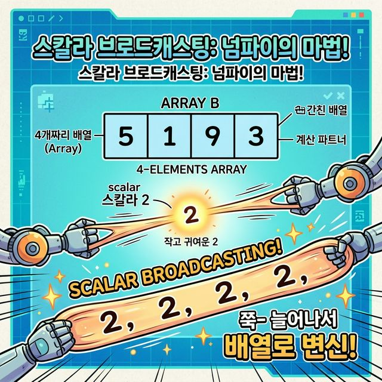

# 4.5.5 스칼라(단일 숫자)의 브로드캐스팅

앞서 여러분은 1개의 숫자(스칼라)가 거대 배열 전체에 버프를 거는 마법을 보았습니다. 

이번 장에서는 그 **스칼라 마법(브로드캐스팅)이 엔진 내부적으로 정확히 어떻게 작동하는지** 뜯어보겠습니다.



## 단일 값이 거대한 배열로 복제되는(Stretch) 원리


단일 숫자로 이루어진 값(Scalar)은 '점(Dot)'처럼 아주 작은 `0차원`입니다. 

이 작은 점은 거대한 상대방 배열(Array)과 구조적으로 연산을 하기 위해, 상대방의 규격(Shape)에 맞게 스스로 고무줄처럼 `쫘악-` 늘어나서 복제(Stretch)되는 마법을 부립니다.


> 하나의 점에 불과했던 단일 숫자가 옆으로, 그리고 아래로 차례차례 복제 분신술을 사용하며 빈 공간을 가득 메웁니다. 

---

## 1차원 선형 배열(Vector) 과 스칼라(점)의 만남

가장 간단한 1차원 상황을 살펴봅시다. 

길이가 3칸인 선형 배열 `a`와, 단일 점에 불과한 숫자(스칼라) `b`가 있습니다. 


> 배열 a(길이 3칸)와 충돌하는 순간, 엔진은 단일 숫자 2를 `[2, 2, 2]`라는 똑같은 크기의 가상 배열로 복제하여 1:1로 짝을 맞춰줍니다.

```python
import numpy as np

# [1단계] 3칸짜리 1차원 배열(선형) 준비
a = np.array([3, 4, 5])
print("1차원 배열 a:", a)

# [2단계] 작은 불씨인 스칼라 단일 숫자 선언
b = 2

# [3단계] 덧셈 충돌! b가 속으로 [2, 2, 2]로 분신술을 쓴 뒤 1:1 안전 연산 수행
result_1d = a + b
print("\n✅ 1차원 스칼라 브로드캐스팅 결과:", result_1d)
```
**실행 결과:**
```text
1차원 배열 a: [3 4 5]

✅ 1차원 스칼라 브로드캐스팅 결과: [5 6 7]
```

원래라면 `[3, 4, 5]`와 단일 숫자 `2`는 크기가 달라서 에러가 나야 맞지만, 브로드캐스팅 엔진이 개입하여 가상의 `[3, 4, 5] + [2, 2, 2]` 덧셈으로 치환시켜 버린 것입니다!

---

## 2차원 평면 배열(Matrix) 과 스칼라(점)

분신술의 규칙은 아파트 구조인 2차원, 3차원 배열로 차원이 거대해져도 동일한 패턴으로 작동합니다. 

단일 숫자는 모자란 차원을 한 치의 빈틈없이 메우기 위해 끊임없이 자신을 가로와 세로로 복제합니다.


> 단일 숫자 2가 가로줄(행)로 늘어난 뒤, 다시 아래(열 방향)로 2차원 평면 전체를 가득 채우며 `[[2,2,2], [2,2,2]]`로 변신합니다.

```python
import numpy as np

# [1단계] 2행 3열(2차원 평면) 크기의 다차원 행렬 아파트 준비
A = np.array([[1, 2, 3], 
              [1, 2, 3]])
print("2차원 평면 배열 A:\n", A)

# [2단계] 단일 숫자 2가 2차원의 빈 공간(행과 열 모두)으로 무한 증식하며 +2 일괄 덧셈이 일어남
result_2d = A + 2
print("\n🔥 2차원 스칼라 브로드캐스팅(동시 폭발) 결과:\n", result_2d)
```
**실행 결과:**
```text
2차원 평면 배열 A:
 [[1 2 3]
  [1 2 3]]

🔥 2차원 스칼라 브로드캐스팅(동시 폭발) 결과:
 [[3 4 5]
  [3 4 5]]
```

단일 숫자가 상대방 배열의 크기를 따라잡기 위해 가로축으로 3명, 세로축으로 2줄까지 무한히 확장하며 **광역 버프**를 거는 원리! 

이것이 바로 스칼라 브로드캐스팅 시스템의 본질입니다.
