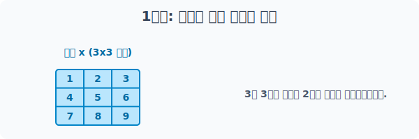
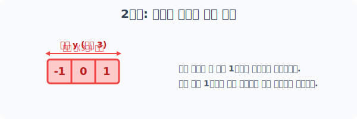

# 4.5.6 다차원 배열의 브로드캐스팅
> 쌍방향 차원 확장


## 빈 공간을 스캔하여 스스로를 복제(Clone)하는 홀로그램 시스템

스칼라가 보여주었던 `점(Dot)`의 분신술에 이어, 이번에는 거대한 `블록(Block)` 단위의 복제 마법을 알아볼 차례입니다. 


선 모양을 가진 1차원 배열(List)이나 기둥 모양의 열 벡터조차도 상대방과 크기가 맞지 않다면, 엔진은 에러를 뿜는 게 아니라 마치 **홀로그램 프로젝터처럼 텅 빈 허공(부족한 축 방향)을 향해 거대한 도장 찍듯 자기 자신을 통째로 복제 증식(Broadcasting)** 하는 마법을 뽐냅니다.

복제 확장의 성공 조건은 단 하나입니다.

 **"늘려야 하는 방향의 공간 길이가 `1`로 유연하거나, 아예 없어야 한다"**는 것입니다. 
 
 구체적으로 어떻게 홀로그램 스캔이 일어나는지 3가지 진격 방향 패턴을 살펴봅시다!

---

## 1. 아래로 하강 진격! (가로선 배열의 수직 복제)

가장 흔한 케이스를 3단계로 차근차근 분해해 봅시다! 

이미 거대한 3x3 아파트(2차원 배열)가 있고, 그 지붕 위에 가로 폭(너비 3)이 똑같은 1차원 가로선 배열이 있다고 시뮬레이션 해보는 과정입니다.

### [1단계] 베이스캠프: 넓은 2차원 공간 준비

먼저 타깃이 될 널찍한 구조물을 선언합니다.



```python
import numpy as np

# 거대한 3x3 (2차원 공간) 배열 x
x = np.arange(1, 10).reshape(3, 3)
print("거대한 2차원 공간 x:\n", x)
```
**1단계 결과:**
```text
거대한 2차원 공간 x:
 [[1 2 3]
  [4 5 6]
  [7 8 9]]
```

---

### [2단계] 무기 장전: 작은 1차원 가로 배열 준비

이제 방금 만든 3x3 배열과 맞붙을 작은 선 하나를 준비합니다. 이때 가로 폭이 `3`으로 똑같아야 에러 없이 마법이 시작됩니다.



```python
# 옆으로 세 칸 누워있는 1차원 가로선 홀로그램 도장 배열 y
y = np.array([-1, 0, 1])
print("1차원 가로선 배열 y:", y)
```
**2단계 결과:**
```text
1차원 가로선 배열 y: [-1  0  1]
```

---

### [3단계] 수직 하강! 브로드캐스팅 복제 충돌

자, 이제 서로 층수가 다른 두 배열을 곱해봅니다!


> 1차원 가로선 `[-1, 0, 1]` 블록 하나가 텅 빈 아래 공간을 스캔하며 `3x3` 바닥에 닿을 때까지 3연속으로 도장을 쿵, 쿵, 쿵 찍어 내려가며 위조 배열을 만듭니다!

```python
# y가 수직(아래쪽)으로 3층만큼 복제증식 된 후 1:1 곱셈 교전!
result_row = x * y
print("✅ 가로선 수직 하강 브로드캐스팅 연산 결과:\n", result_row)
```
**3단계 결과:**
```text
✅ 가로선 수직 하강 브로드캐스팅 연산 결과:
 [[-1  0  3]
  [-4  0  6]
  [-7  0  9]]
```

엔진이 가로선 `y`의 길이가 `x`의 가로 길이와 `3`으로 똑같다는 것을 확인하자마자 수직 빈 조각을 탐지하고, 일시적으로 `[[-1,0,1], [-1,0,1], [-1,0,1]]` 형태의 가상 2D 블록 복제본을 만들어 `x`와 1:1로 아다마르 곱(원소별 곱셈)을 때린 것입니다.

---

## 2. 수평확장
> 우측 옆구리로 찔러넣기! (세로 기둥 배열의 측면 복제)

이번에는 3층 탑처럼 세로축 하나로만 우뚝 서 있는 `(3, 1)` 형태의 좁은 2차원 기둥 벡터를 거대한 3x3 공간에 던져 넣었을 때의 반응입니다.


> 세로 기둥 탑이 자신의 우측에 텅 빈 공간(가로 폭 길이 1)을 감지하고, 오른쪽 옆구리를 향해 똑같은 기둥 복제본을 탁, 탁, 탁 꽂아 넣으며 자신을 넓힙니다.

```python
import numpy as np

# 거대한 3x3 배열 x는 기존과 동일하게 존재
x = np.arange(1, 10).reshape(3, 3)

# [1단계] 세로로 3층이 쌓인 (3, 1) 모양의 좁은 세로 기둥 배열 y (가로가 1칸으로 유연함)
y = np.array([[3], 
              [6], 
              [9]])
print("좁은 세로 기둥 y:\n", y)

# [2단계] 나누기 충돌! y가 구축해둔 허공(우측)으로 자신을 밀어내며 3x3을 위조!
result_col = x / y
print("\n✅ 세로 기둥 측면 브로드캐스팅 결과:\n", result_col)
```
**실행 결과:**
```text
좁은 세로 기둥 y:
 [[3]
  [6]
  [9]]

✅ 세로 기둥 측면 브로드캐스팅 결과:
 [[0.33333333 0.66666667 1.        ]
  [0.66666667 0.83333333 1.        ]
  [0.77777778 0.88888889 1.        ]]
```

모양(Shape)의 끝 단면이 `1`인 경우에는 고무줄처럼 우측으로 아주 유연하게 복제 확장이 가능하다는 브로드캐스팅의 대전제를 제대로 증명한 셈입니다.

---

## 3. 수직, 수평 확장
> 가로선 배열과 세로선 배열의 전면 교전

가장 압도적이고 마법 같은 스킬이 구현되는 백미입니다. 만약 **넓은 빈 공간(사분면)을 사이에 두고 1차원 가로선 배열과 세로줄 기둥 배열끼리** 격돌하게 놔두면 엔진은 어떻게 반응할까요?


> 가로선은 텅 빈 아래 수직 축으로 하강 복제하고, 세로선은 텅 빈 우측 축으로 수평 복제하여 기어이 거대한 공용 데스크(3x3 행렬) 테이블을 무에서 유로 창조해 냅니다!

```python
import numpy as np

# [1단계] 옆으로만 세 칸 누워있는 (3,) 가로선 배열 x
x = np.array([1, 2, 3])
print("가로선 배열 x:", x)

# [2단계] 위아래로 세 칸 서 있는 (3, 1) 세로선 탑 배열 y
y = np.array([[1], 
              [2], 
              [3]])
print("\n세로선 배열 y:\n", y)

# [3단계] 십자포화 충돌! 곱셈을 지시하면 위아래, 좌우 쌍방향으로 알아서 공간을 복제!
result_both = x * y
print("\n🔥 쌍방향 차원 팽창 연산(구구단 테이블) 완료!:\n", result_both)
```
**실행 결과:**
```text
가로선 배열 x: [1 2 3]

세로선 배열 y:
 [[1]
  [2]
  [3]]

🔥 쌍방향 차원 팽창 연산(구구단 테이블) 완료!:
 [[1 2 3]
  [2 4 6]
  [3 6 9]]
```

마치 1단, 2단, 3단 구구단 테이블 테이블을 그리듯, `x`는 텅 빈 아랫 공간을 향해 자신을 복제하고 `y`는 텅 빈 옆 공간을 향해 분신술을 사용해 기어이 쌍방향 교차(Intersection) 곱셈을 완성시켰습니다. 

**아무리 모양이 다르더라도, 복제해 나갈 빈 축(크기가 1이거나 없는 곳)만 존재한다면 Numpy의 브로드캐스팅은 절망하지 않고 공간을 채워 정답을 이끌어 냅니다!**
