# 4.3.6 다차원 배열의 쌍방향 차원 확장 브로드캐스팅


## 부족한 모양과 차원을 스스로 복제하는 마법 시스템
앞서 본 스칼라 점(1차원) 뿐만 아니라 선 모형을 가진 1D 다차원 배열이나 열 벡터조차도 서로 모양이 다르다면 Numpy는 에러를 뿜는 게 아니라 스스로 모양을 맞추기 위해 **동시에 부족한 축 방향으로 자기 자신을 복제 확장(Broadcasting)** 하는 마법을 보여줍니다.

이것만 알면 어떤 복잡한 행렬끼리의 연산일지라도 아주 편하게 코딩할 수 있습니다. 어떻게 늘어나는지 3가지 케이스를 살펴봅시다!

## ① 가로선 배열(1D)이 거대한 사분면(2D) 면적 깊숙이 하강침투 복제
먼저 아주 큰 3행 3열짜리 배열이 있고, 그 배열의 너비(칸 수 `3`)에 정확히 딱 맞는 가로줄 1차원 배열이 있다고 가정해 봅니다.

```python
import numpy as np

# 거대한 3x3 2차원 공간 배열 x
x = np.arange(1, 10).reshape(3, 3)
x
```
**출력:**
```text
array([[1, 2, 3],
       [4, 5, 6],
       [7, 8, 9]])
```

```python
# 옆으로 세 칸 누워있는 1차원 배열 y
y = np.arange(-1, 2)
y
```
**출력:**
```text
array([-1,  0,  1])
```

두 배열 `x` (3x3) 와 `y` (3칸) 곱셈을 수행하면 어떻게 될까요? Numpy는 가로 길이가 서로 `3`으로 일치함을 인지하고 1차원 `y`를 위에서 아랫방향으로 복제합니다.
`[-1, 0, 1]` 선분 하나가 마치 도장 찍듯이 아래로 `쿵, 쿵, 쿵` 세 번 찍혀서 `x`와 동일한 `3x3` 모습으로 스스로를 위조한 뒤 계산에 임합니다.

```python
# y가 3줄로 아래로 복제된 뒤 1:1 아다마르 곱 수행 
x * y
```
**출력:**
```text
array([[-1,  0,  3],
       [-4,  0,  6],
       [-7,  0,  9]])
```

## ② 세로 기둥 배열(열 벡터)이 우측으로 옆구리 확장 펀치 복제
이번에는 3층 탑처럼 세로축으로 쌓여있는 좁은 2차원 열 벡터의 경우입니다.

```python
# 세로로 3층이 쌓인 (3, 1) 모양의 배열 y
y = np.arange(3, 10, 3).reshape(3, 1)
y
```
**출력:**
```text
array([[3],
       [6],
       [9]])
```

거대한 3x3 `x`에 `x / y` 나누기 연산을 요구하면 세로 기둥 탑 `y`는 자신의 우측 옆구리에 빈 공간을 메우기 위해 오른쪽 방향을 향해 `탁, 탁, 탁` 자신의 복제본을 기둥째로 박아 넣으며 넓어집니다. `(3, 1)` 배열 안의 한계점 `1`은 늘리기가 아주 쉬운 고무줄 포인트이기 때문입니다!

```python
# y가 우측으로 복제되어 3x3 모양을 만든 뒤 1:1 나눗셈
x / y
```
**출력:**
```text
array([[0.33333333, 0.66666667, 1.        ],
       [0.66666667, 0.83333333, 1.        ],
       [0.77777778, 0.88888889, 1.        ]])
```

## ③ 쌍방향 진격! 가로 배열과 세로 기둥 배열의 전면 교전
가장 멋진 마법이 구현되는 백미입니다. 만약 **넓은 빈 공간을 두고 가로줄 1차원 배열과 세로줄 1차원 배열끼리** 격돌하면 무슨 일이 벌어질까요?



```python
# 옆으로 세 칸 누워있는 (3,) 배열 x
x = np.arange(1, 4)
x
```
**출력:**
```text
array([1, 2, 3])
```

```python
# 위아래 세 칸 쌓여있는 (3, 1) 배열 y
y = np.arange(1, 4).reshape(3, 1)
y
```
**출력:**
```text
array([[1],
       [2],
       [3]])
```

곱셈 구구식을 돌리듯 `x * y`를 입력하면, `x`는 텅 빈 위아래를 채우기 위해 **수직 하강 복제**를 하고, `y`는 텅 빈 양옆을 채우기 위해 **측면 분신술**을 사용합니다! 결국 둘 다 거대한 (3, 3)으로 변신하여 완벽한 계산 테이블을 장악하게 됩니다.

```python
# x는 아래로 세 번 늘어나고, y는 우측으로 세 번 늘어납니다! -> 그 결과 3x3 곱셈 테이블!
x * y
```
**출력:**
```text
array([[1, 2, 3],
       [2, 4, 6],
       [3, 6, 9]])
```

모양이 극단적으로 다를 경우에도 이 마법은 통합니다! 세로 4층 탑 (4, 1) 배열과 가로 2칸짜리 (2,) 배열이 만나면? **둘은 합심해서 거대한 (4, 2) 2차원 사분면을 만들어냅니다.**

```python
x = np.arange(0, 10, 3).reshape(4, 1)  # 4층 탑 형태 -> 2열짜리 우측 확장을 준비
y = np.arange(1, 3)                    # 2칸 가로선 형태 -> 4층짜리 하강 확장을 준비

x + y
```
**출력:**
```text
array([[ 1,  2],
       [ 4,  5],
       [ 7,  8],
       [10, 11]])
```
