# 4.5.7 np.newaxis: 강제로 새로운 차원(축) 찔러넣기


## 부족한 모양과 차원을 강제로 주입하는 마법 지팡이
앞서 우리는 Numpy가 모양이 맞지 않는 배열들을 브로드캐스팅(차원 확장)을 통해 자동으로 맞춰준다는 것을 배웠습니다. 하지만, **애초에 방향(가로/세로) 자체가 엇나가서 Numpy가 갈피를 못 잡는 경우**에는 우리가 직접 가이드를 줘야 합니다.

이때 수학적으로 완전히 새로운 빈 차원을 강제로 하나 주입하여 1차원 선분을 2차원 면적의 테두리로 밀어 올리는 마법의 상수가 바로 `np.newaxis` 입니다.



### ① 1차원 선분 배열 준비하기
우선 평범하게 바닥에 누워있는 4칸짜리 1차원 줄자 배열 `x`가 있다고 해봅시다.

```python
import numpy as np

# 그저 원소 4개가 한 줄로 들어있는 1차원 배열: (4,)
x = np.array([0, 10, 20, 30])
x
```
**출력:**
```text
array([ 0, 10, 20, 30])
```

### ② 가로 차원 추가: 1차원을 2차원(행렬)의 1행짜리로 둔갑시키기
원래 1차원이었던 배열 `x`를 2차원 배열의 첫 번째 가로줄(행)로 강제 승격시키는 방법입니다. 축(Axis) 자리에 `np.newaxis` 또는 파이썬 기본 상수 `None`을 찔러 넣으면 됩니다.
마치 대괄호 `[]`가 겉에 하나 더 둘러지는 시각적 효과를 가집니다!

```python
# 행(row) 자리에 새로운 차원(None) 주입, 열(col)은 원래 데이터(:) 전부 사용
# 1차원 (4,) 모델이 -> 2차원 (1, 4) 모델로 업그레이드!
a = x[np.newaxis, :]  # x[None, :] 라고 써도 완벽히 똑같이 동작합니다!
a
```
**출력:**
```text
array([[ 0, 10, 20, 30]])
```

### ③ 세로 차원 추가: 1차원을 2차원 기둥(열 벡터)로 세워버리기
데이터 분석 실무에서 가장 많이 쓰이는 기법입니다. 누워있던 선분 `x`를 세로로 우뚝 선 기둥형 2차원 배열(열 벡터)로 강제로 일으켜 세우려면, 이번엔 두 번째 축(열)의 위치에 `np.newaxis`를 주입합니다.

```python
# 행(row)은 원래 데이터 전부(:) 사용하고, 열(col) 자리를 빈 공간(newaxis)으로 쪼개어 세움!
# 1차원 (4,) 모델이 -> 2차원 (4, 1) 모델로 우뚝 섬!
a = x[:, np.newaxis]
a
```
**출력:**
```text
array([[ 0],
       [10],
       [20],
       [30]])
```

### ④ newaxis와 브로드캐스팅의 궁극의 콜라보레이션
왜 굳이 차원을 올렸다 세웠다 귀찮은 작업을 할까요? 바로 **복잡한 행렬 브로드캐스팅을 의도대로 조종**하기 위해서입니다!

아래 배열 `b`는 평행하게 3칸 늘어선 `(3,)` 1차원 배열입니다. 

```python
b = np.array([1, 2, 3])
```

아까 위첨 ③에서 세로로 세워둔 `(4, 1)` 기둥 배열 `a`와 `b`를 더하면 어떻게 될까요?
- `a`(4, 1)는 우측으로 가로 빈칸 3개를 복제하고
- `b`(3, )는 아래쪽으로 빈칸 4층을 복제하여 
최종적으로 전혀 연관성 없던 두 배열이 거대한 `(4, 3)` 2차원 공간을 창조하며 연산됩니다!

```python
# 세로기둥 (4,1) 배열에 가로선 (3,) 배열을 더해 서로 거대하게 쌍방향을 복제시킴!
a + b
```
**출력:**
```text
array([[ 1,  2,  3],
       [11, 12, 13],
       [21, 22, 23],
       [31, 32, 33]])
```

곱하기도 완벽하게 똑같이 브로드캐스팅 사분면을 장악합니다. 이것이 바로 파이썬 Numpy가 `for` 반복문 없이도 복잡한 수학 테이블을 빛의 속도로 뽑아내는 비결입니다!

```python
# x를 그 자리에서 바로 [:, np.newaxis]로 세운 뒤, b(1x3)와 행렬 충돌시킴!
x[:, np.newaxis] * b
```
**출력:**
```text
array([[ 0,  0,  0],
       [10, 20, 30],
       [20, 40, 60],
       [30, 60, 90]])
```

---

### 핵심 요약: 성공적인 브로드캐스팅의 3원칙
Numpy가 불평등한 두 배열을 에러 없이 강제 결합(Broadcast)시켜 연산을 성공시키려면, 머릿속에서 다음 3가지 규칙을 따른 결과물이 일치해야 합니다.

1. **차원이 다르면 앞쪽에 '1'을 채워 차원 개수를 맞춘다**: 한쪽이 1차원(3,)이고 다른 쪽이 2차원(4, 3)이면, Numpy는 1차원 녀석을 `(1, 3)` 모양의 2차원 행렬로 암묵적으로 간주합니다.
2. **어느 한 축의 길이가 '1'이면, 제일 큰 배열의 길이만큼 늘어날 수 있다**: `(4, 1)` 배열은 반대쪽에 3열이 필요하면 `(4, 3)`으로 우측 복제 확장이 합법적입니다.
3. **만약 차원의 길이가 서로 완전히 다른데 어디에도 '1'이 없다면?**: 복제(Stretch) 권한이 없으므로 `ValueError` 에러가 발생하며 프로그램이 박살납니다!
