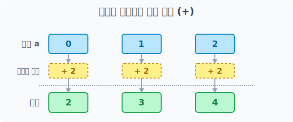
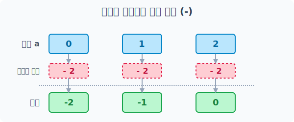
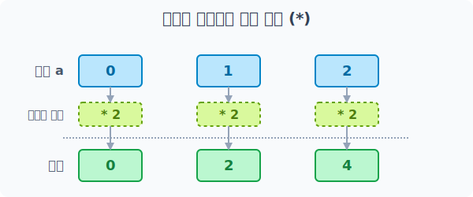
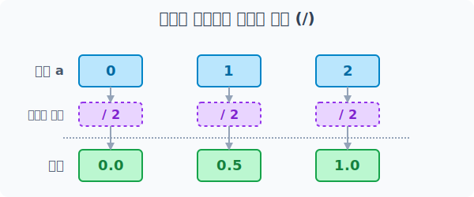

# 4.5.1 배열과 단일 숫자(스칼라)의 마법 같은 연산


## 스칼라 연산(Scalar Operations)의 프로그래밍적 의미와 활용
> 단 하나의 숫자가 배열 전체에 마법처럼 퍼져나가는 현상 (브로드캐스팅의 기초)

파이썬의 기본 리스트(`list`)에서 숫자를 더하거나 곱하려면 복잡한 `for` 반복문을 써서 원소를 하나하나 꺼낸 뒤 연산해야 합니다. 

하지만 Numpy의 강력한 특징 중 하나는 **크기가 거대한 배열(Array)에 단일 숫자(스칼라, Scalar) 하나를 던지면, 알아서 배열 안의 모든 원소에 똑같이 연산이 스며든다는 것**입니다!

이 현상을 전문 용어로 **브로드캐스팅(Broadcasting)**이라고 부릅니다. 


### 예시
마치 방송국 송신탑에서 전파를 한 방 쏘면, 수만 대의 라디오가 동시에 똑같은 방송을 수신하는 것과 같은 이치입니다.


> 단일 스칼라 값이 배열 사이즈에 맞춰 스스로 복제되어 전체에 버프를 거는 모습

### 언제 어떤 용도로 사용할까? (실무 활용 사례)
- **일괄 데이터 보정표 (Data Scaling)**: 수만 명의 키나 몸무게 측정 데이터가 들어있는 배열에서 잴 때 기준이 잘못되어 전체적으로 "전부 +3cm 해줘", 혹은 달러 환율을 한국 돈으로 바꾸기 위해 "전부 * 1300 달러 환율을 곱해줘" 할 때 단 한 줄이면 1초 만에 완료됩니다.
- **좌표 일괄 이동 (Coordinate Shifting)**: 화면 속 주인공의 X, Y 좌표 배열을 가지고 있을 때, `좌표배열 + 10`을 하면 캐릭터가 우측으로 10픽셀 순간이동을 하게 됩니다. 물리 엔진 처리에서 필수적입니다.
- **퍼센트 및 확률변환**: 전체 학생의 시험 점수 배열을 `점수배열 / 100.0` 으로 나누어 단숨에 `0.0 ~ 1.0` 사이의 확률 값이나 퍼센테이지로 압축(정규화)할 때 쓰입니다.


## 스칼라 사칙연산 활용 예제

이번에는 스칼라(단일 숫자)를 활용하여 배열에 사칙연산 요소들을 일괄 적용하는 방법을 알아봅시다.

### 기본 배열 생성

스칼라 연산을 테스트하기 위해 먼저 기본이 되는 1차원 배열(벡터) `a`를 생성하겠습니다. `np.arange(3)` 함수를 사용하면 0부터 시작해서 3개의 연속된 원소를 가지는 배열 `[0, 1, 2]`가 손쉽게 만들어집니다.


> `np.arange(3)` 함수가 0, 1, 2 세 개의 값을 자동으로 나열하여 1차원 배열 객체를 만드는 모습입니다.

```python
import numpy as np

# 0부터 시작하는 3칸짜리 정수 배열 생성
a = np.arange(3)

# 생성된 기본 배열의 형태를 출력하여 확인
print("기본 배열 a:", a)
```

**출력:**
```text
기본 배열 a: [0 1 2]
```

### 덧셈 (Addition)

배열의 모든 요소에 동일한 숫자(스칼라)를 한 번에 더합니다. 반복문을 사용하지 않아도 모든 원소에 일괄적으로 덧셈 연산이 수행됩니다.


> 배열 `[0, 1, 2]`의 각 원소에 숫자 2가 독립적으로 더해지는 과정을 보여줍니다.

```python
# 배열 a의 각 원소에 단일 숫자 2를 모두 더합니다.
result_add = a + 2
print(result_add)
```

**출력:**
```text
[2 3 4]
```

### 뺄셈 (Subtraction)

배열의 모든 요소에서 지정된 숫자(스칼라)를 한 번에 뺍니다. 기존 데이터들과의 일정한 차이를 구하거나 수치를 감소시킬 때 사용합니다.


> 배열의 각 원소에 복제된 -2가 적용되어 `-2, -1, 0`이 되는 모습을 나타냅니다.

```python
# 배열 a의 각 원소에서 지정된 단일 숫자 2를 뺍니다.
result_sub = a - 2
print(result_sub)
```

**출력:**
```text
[-2 -1  0]
```

### 곱셈 (Multiplication)

배열의 모든 요소에 동일한 숫자(스칼라)를 한 번에 곱합니다. 모든 데이터를 몇 배수만큼 일정 비율로 확대시킬 때 유용하게 사용합니다.


> 숫자 2가 복제되어 배열의 각 칸에 분배되고 곱셈이 이루어지는 과정입니다.

```python
# 배열 a의 모든 요소에 단일 숫자 2를 곱셈 처리합니다.
result_mul = a * 2
print(result_mul)
```

**출력:**
```text
[0 2 4]
```

### 나눗셈 (Division)

배열의 모든 요소를 동일한 숫자(스칼라)로 한 번에 나눕니다. 합계를 전체 개수로 나누어 각각의 비율이나 평균을 산출할 때 유용합니다.


> 배열 안의 각 요소들에 나누기 2가 수행되고 결괏값의 소수점이 계산되는 과정을 보여줍니다.

```python
# 배열 a의 각 원소를 각각 단일 숫자 2로 나눕니다.
result_div = a / 2
print(result_div)
```

**출력:**
```text
[0.  0.5 1. ]
```

> **[Tip]** 나눗셈 연산의 경우 파이썬 3의 특성상 `0 / 2`든 `1 / 2`든 결과가 무조건 소수점을 가지는 실수형(`float64`)으로 변환되어 배열 전체가 실수 배열로 바뀝니다. 정수만 남기고 버림을 하려면 `a // 2` (몫만 구하기) 연산자를 사용해야 합니다.
